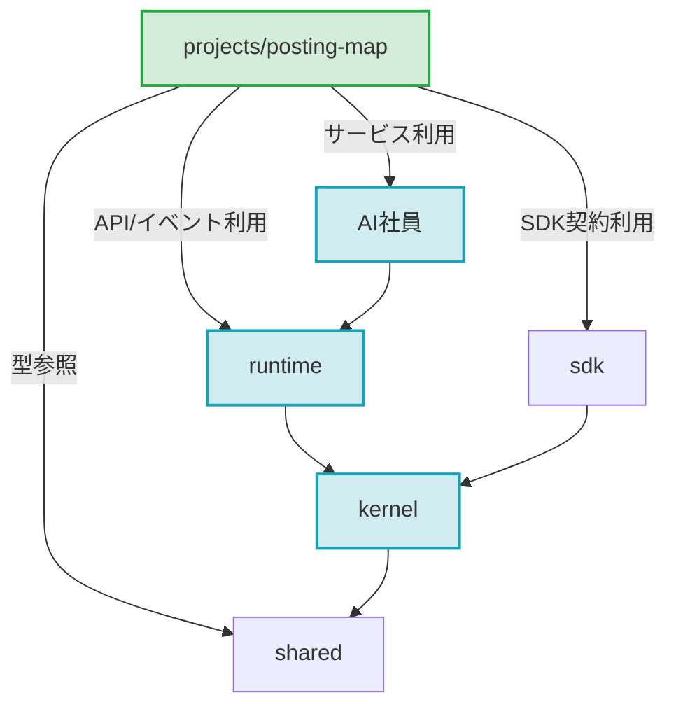

# AI Development OS 正式アーキテクチャ & 責務分離ガバナンス規定

> [!IMPORTANT]
> **Single Source of Truth (SSOT) 運用ガバナンス規定 (v5.0)**:
> 本ドキュメントは、**`AI Development OS` を唯一の親プロジェクト・親リポジトリ** とし、内部における**プラットフォーム基盤層（Kernel / Runtime / SDK / Shared / AI社員）** と **業務アプリケーション層（`projects/*`）** のレイヤリング・一方向依存モデル・開発運用ルールを定義します。

---

## 1. 正式構造 (Canonical Architecture)

```
AI Development OS/                    # 唯一の親プロジェクト (.git Root)
├── kernel/                           # AIOS マイクロカーネル
├── runtime/                          # エージェント・実行ランタイム
├── sdk/                              # プラットフォーム SDK
├── shared/                           # 共通型定義・Value Objects・スキーマ
├── AI社員/                           # AI Workforce (自律エージェント群)
├── tools/                            # アーキテクチャ検証・CI品質ゲート
└── projects/                         # 業務アプリケーション層
    ├── posting-map/                  # 最初の業務アプリ (Posting Map System)
    ├── hokusei-ch/                   # 北勢チャンネル
    ├── 80s-disco/                    # 80s Disco メディア
    └── mie-sanseito-kouhou/          # 三重参政党広報
```

---

## 2. 階層ごとの責務と一方向依存ルール



1. **一方向依存の徹底**:
   - `projects/*` はプラットフォーム層（`runtime`, `kernel`, `sdk`, `shared`, `AI社員`）を利用・参照できる。
   - プラットフォーム層は `projects/*` を**一切インポート・逆参照してはならない（参照数 0件）**。
2. **自動品質ゲートによる保護**:
   - `python3 tools/validators/product_boundary_validator.py` をCIで実行し、逆参照を自動でブロックする。

---

## 3. 開発運用 & SOP 準拠規定

1. **ワークスペースパス**:
   エディタ・開発環境で開くワークスペースのトップレベルは常に **`/Volumes/SSD_DATA/AI Development OS`** とする。
2. **Google Apps Script (GAS) SOP**:
   - `projects/posting-map` の変更時は `clasp push` を実施。
   - `gasWebAppUrl` および実機接続先エンドポイントの同期を確認する。
