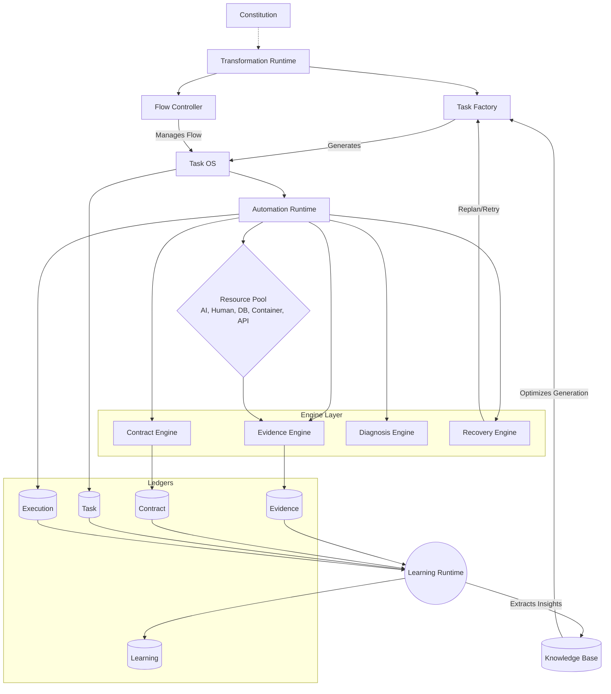

# Transformation OS: 03_OSDependency

## 1. 依存関係の基本原則 (Dependency Rules)
* **Transformation の支配**: SystemはTaskを処理するためではなく、Transformation（変換）のために存在する。
* **Learning の無限ループ**: Learning は終端ではなく、Task Factoryへの帰還（Feedback Loop）を持つ。
* **循環依存の禁止**: フローの逆流や局所的な循環参照を禁止し、常にAutomation Runtimeを経由して一方向に流れる。

## 2. 依存関係と階層 (Dependency Architecture)

---
**※本OSDependencyはBlueprintとして定義される。100%承認されるまで実装への移行は禁止する。**
