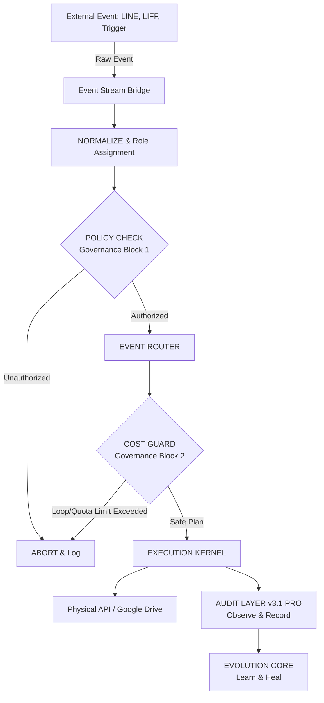

# FIELD OPERATIONS PLATFORM - Release Notes v4.0 (Governance OS)

## Overview
v4.0 marks a monumental milestone for the FIELD OPERATIONS PLATFORM. The system has successfully transitioned from a static folder management tool to a fully autonomous, self-healing, self-evolving, and self-governing Operating System (Governance OS).

This release completes the 5-layer architecture, introducing the final "Brake System" (Governance Layer) that ensures 100% operational safety by predicting and blocking destructive loops or unauthorized API usage *before* they execute.

## v4.0 Architecture Summary

The complete OS architecture is now structured into five interconnected layers, achieving full separation of concerns between Execution and Design.

1. **Event Stream OS (Input/Watch)**: Captures real-time changes via Webhooks (LINE/LIFF), GAS Triggers, and HTTP events.
2. **Governance OS (v4.0 - Control & Block)**: The "Brake System". Evaluates policies, permissions, and cost limits prior to execution.
3. **Execution Kernel (Action)**: The "Hands". Normalizes, routes, and executes physical operations strictly via the Drive Action Adapter.
4. **Audit OS (v3.1 PRO - Observe & Prove)**: The "Eyes". Non-blocking observer that records every execution, structure shift, and evolution for perfect traceability.
5. **Evolution Memory (Learn & Heal)**: The "Brain". Automatically analyzes execution failures and generates new routing rules to prevent future errors, while strictly bound by the Evolution Audit.

## Governance Rules & Safety Model

The v4.0 Governance Layer introduces hard execution blocks to ensure absolute safety.

### 1. Strict Role-Based Access Control (RBAC)
- **ADMIN**: Unrestricted access. Required for system deletion and evolution overrides.
- **SYSTEM**: Automated tasks (Webhooks, Triggers, Self-Healing).
- **OPERATOR**: Spreadsheet/Dashboard execution (Create, Update, Sync).
- **USER**: H-App / LINE interactions (Create, Update).

### 2. Pre-Execution Cost Guard
- **Infinite Loop Block**: Blocks any chained execution (e.g., recursive self-healing) if `depth > 3`.
- **API Cost Guard**: Aborts any execution plan requiring more than `20` operations to prevent API quota exhaustion.
- **Loop Storm Block (60-sec Rule)**: Scans the `EventQueue` and immediately halts execution if an identical event type fires 5 or more times within 60 seconds.

## System Flow Diagram

## Future Scope
With the Governance OS fully deployed and secured, the platform is now fully capable of handling multi-tenant interactions, real-time app connectivity (H-App / K-App), and highly dynamic field operations without the risk of system runaway.
