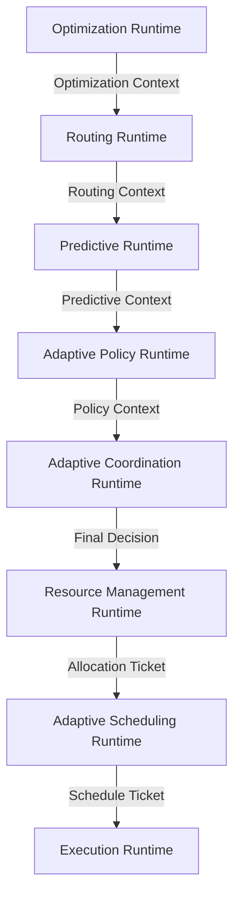

# Runtime Dependency Graph

AIOS Generation 5 における Runtime 間の依存関係、レイヤー構造、およびデータフローを定義したアーキテクチャ・グラフです。

## Runtime Layer Diagram

各 Runtime は上位から下位に向かって以下の 5 つのレイヤーに分類されます。

```text
Adaptive Layer
  ├─ Optimization Runtime (最適化)
  ├─ Routing Runtime (経路選択)
  └─ Predictive Runtime (予測)
       ↓
Decision Layer
  ├─ Policy Runtime (調停・ルール選択)
  └─ Coordination Runtime (意思決定・合意)
       ↓
Resource Layer
  └─ Resource Management Runtime (予約・確保)
       ↓
Scheduling Layer
  └─ Scheduling Runtime (順序・タイミング)
       ↓
Execution Layer
  └─ Execution Runtime (セッション・復旧)
```

## Runtime Dependency (Mermaid)

各 Runtime のデータ引き継ぎと依存関係を示すダイアグラムです。上位の Context をラップして下位へ引き渡す「Context 引き継ぎ」のフローを表しています。



## Dependency & Event Flow Matrix

各 Runtime の厳密な依存関係（Input/Output）と、システム全体へブロードキャストされるドメインイベントのフローです。

| Layer | Runtime | Input Dependency | Output / Handover | BroadCasted Events (Event Flow) |
|---|---|---|---|---|
| Adaptive | Optimization | MetricSnapshot, Goal | OptimizationContext | `OptimizationCompleted`, `GoalAdjusted` |
| Adaptive | Routing | OptimizationContext | RoutingContext | `RouteSelected`, `RouteFallback` |
| Adaptive | Predictive | RoutingContext, History | PredictiveContext | `ForecastGenerated`, `TrendDetected` |
| Decision | Policy | PredictiveContext | PolicyContext | `PolicyApplied`, `PolicyConflict` |
| Decision | Coordination | PolicyContext | FinalDecision | `DecisionProposed`, `ConsensusReached` |
| Resource | Resource | FinalDecision | AllocationTicket | `ResourceReserved`, `QuotaExhausted` |
| Scheduling | Scheduling | AllocationTicket | ScheduleTicket | `TaskDispatched`, `TaskPreempted` |
| Execution | Execution | ScheduleTicket | ExecutionResult | `SessionCreated`, `ExecutionRolledBack` |

---

## Architecture Principles

1. **Top-to-Bottom Flow (単一方向データフロー)**
   - 依存関係は上流から下流に向かってのみ発生します。下流の Runtime が上流の Runtime を同期的に呼び出すこと（循環参照）はアーキテクチャ違反として禁止されています。
2. **Event-Driven Feedback (イベント駆動フィードバック)**
   - 下流から上流へのフィードバック（例: Execution の失敗による最適化の再計算）が必要な場合は、直接メソッドを叩かず、必ず `Global EventBus` を通じた非同期イベントの発行によって行われます。
3. **Immutability (不変性)**
   - 上流から引き渡される `Context` や `Ticket` などのモデルはすべて `readonly` として扱われ、下流の Runtime が勝手に上書きすることはできません。必ず自分自身の状態（Ledger）に追記（Append-Only）する形で処理を進めます。
