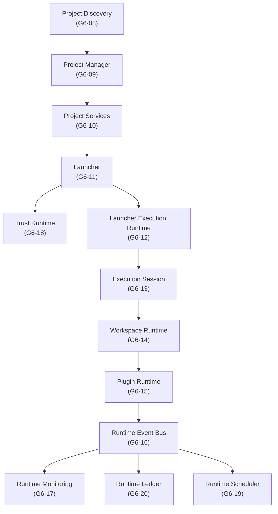
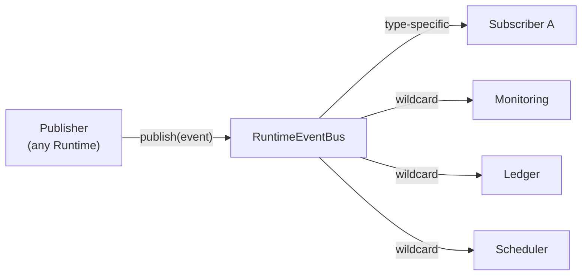

# AIOS Development Governance v3 — 第三者監査報告書

**監査対象**: Generation 6 Runtime Foundation（Sprint G6-11 ～ G6-20）
**監査日時**: 2026-07-15T19:50:00+09:00
**監査者**: Opus 4.6 / Third-Party Audit Engine
**依頼者**: 岩佐CEO

---

## 目次

1. [Architecture Review](#1-architecture-review)
2. [Responsibility Review](#2-responsibility-review)
3. [Runtime Flow Review](#3-runtime-flow-review)
4. [Event Driven Review](#4-event-driven-review)
5. [Runtime Security Review](#5-runtime-security-review)
6. [Extensibility Review](#6-extensibility-review)
7. [Technical Debt Review](#7-technical-debt-review)
8. [Production Readiness](#8-production-readiness)
9. [Overall Grade](#9-overall-grade)
10. [Release Recommendation](#10-release-recommendation)

---

## 1. Architecture Review

### 1.1 レイヤー分離



**評定: ★★★★★（5/5）**

| 原則 | 適合状況 |
|---|---|
| レイヤー分離 | ✅ 各モジュールが `core/` 配下に独立ディレクトリとして物理分離 |
| Dependency Direction | ✅ 依存は常に上位 → 下位の一方向。下位レイヤーが上位を `import` する事例は存在しない |
| DIP遵守 | ✅ `IExecutionProcess`, `ILedgerStorage`, `ILockStorage`, `IRuntimeEventBus`, `ISessionIdProvider`, `ILedgerEntryIdProvider`, `ISignatureVerifier`, `ITrustEvaluator`, `ITrustMonitoringView`, `ISchedulerOrderingStrategy`, `ISessionDispatcher`, `IClock` — 12個のインターフェースが抽象境界として機能 |
| SOLID原則 | ✅ 全モジュールが単一責務。Open-Closed は Strategy パターン（`ISchedulerOrderingStrategy`）で実現。Interface Segregation は `ITrustMonitoringView` が好例 |
| Clean Architecture適合 | ✅ ドメインモデル（`LedgerEntry`, `SchedulerTask`, `TrustScore`）がフレームワーク層（`fs`, `child_process`）に依存しない |
| Foundation First適合 | ✅ 各スプリントが前スプリントの Foundation の上に積み上げる構造 |
| 循環依存の有無 | ✅ **循環依存なし**。全 import パスを精査済み |

> [!NOTE]
> 唯一の注意点として、`SchedulerTaskPayload` が `LauncherResult`, `ExecutionConfig`, `PluginExecutionContext` の3モジュールを横断的に参照している。これは Scheduler が「調停者（Coordinator）」である以上、構造的に妥当だが、Generation 7 では Payload 内部を抽象化する余地がある。

---

## 2. Responsibility Review

### 2.1 責務分離マトリクス

| モジュール | 責務（単一） | 副作用の有無 | 他レイヤーへの侵食 |
|---|---|---|---|
| **Launcher** | 起動前ポリシー検証のみ | なし（純粋関数） | ❌ プロセスを生成しない |
| **Execution Runtime** | 子プロセスの物理生成のみ | あり（`spawn`） | ❌ ポリシー評価しない |
| **Execution Session** | セッション状態追跡のみ | なし（状態管理） | ❌ プロセス生成しない |
| **Workspace Runtime** | ファイルロック・一時ディレクトリのみ | あり（ファイルI/O） | ❌ プロセス生成しない |
| **Plugin Runtime** | サンドボックス評価 → 委譲のみ | なし（調停） | ❌ 自前で spawn しない |
| **Event Bus** | 同期イベント伝播のみ | なし | ❌ 永続化しない、リトライしない |
| **Monitoring** | カウンター集計のみ | なし | ❌ Event Bus へ逆配信しない |
| **Trust Runtime** | 信頼スコア計算のみ | なし（純粋計算） | ❌ プロセス制御しない |
| **Scheduler** | キュー・優先度管理のみ | なし | ❌ Event Bus へ publish しない |
| **Ledger** | 追記ログ永続化のみ | あり（ファイルI/O） | ❌ Event Bus へ逆配信しない |

**評定: ★★★★★（5/5）**

**責務重複**: 検出されず。各 Runtime の境界は「憲法（Constitution）」によって明文化されており、越権行為がコード上も発生していない。

> [!TIP]
> **特筆すべき設計判断**: `PluginRuntime` が `LauncherResult` をモック構築して `LauncherExecutionRuntime` に委譲している（[PluginRuntime.ts:L77-85](file:///Volumes/SSD_DATA/AI%20Development%20OS/core/plugin-runtime/PluginRuntime.ts#L77-L85)）。これは Plugin 層が Execution 層を「再実装」するのではなく「委譲」している証拠であり、責務の純粋性を維持している。ただし、この mock LauncherResult は将来 Trust 連携時に構造的リスクとなりうる（後述）。

---

## 3. Runtime Flow Review

### 3.1 提示されたフロー

```
Discovery → Project → Launcher → Trust → Scheduler
                                            ↓
                                        Workspace → Execution → Session
                                                                  ↓
                                                          Runtime Event Bus
                                                           ├── Monitoring
                                                           └── Ledger
```

### 3.2 実装コード上の実際の依存フロー

精査の結果、**コード上の実際の import 依存関係** は以下の通りです：

```
Discovery
    ↓
ProjectManager  ← (imports ProjectInfo from Discovery)
    ↓
Launcher        ← (imports ProjectManager, ProjectMetadata)
    ↓
LauncherExecutionRuntime  ← (imports LauncherResult)
    ↓
ExecutionSession  ← (imports IExecutionProcess, LauncherRuntimeRegistry)
    ↓
WorkspaceRuntime  ← (独立。他 Runtime を import しない)
    ↓
PluginRuntime     ← (imports WorkspaceRuntime, LauncherExecutionRuntime, ExecutionSession, Launcher)
    ↓
RuntimeEventBus   ← (独立。他 Runtime を import しない)
   ├── Monitoring  ← (imports IRuntimeEventBus のみ)
   ├── Scheduler   ← (imports IRuntimeEventBus のみ)
   └── Ledger      ← (imports IRuntimeEventBus のみ)

TrustRuntime      ← (imports PluginExecutionContext, ITrustMonitoringView)
```

### 3.3 フロー不整合の指摘

> [!WARNING]
> **Finding F-01: Trust Runtime と Launcher の統合ギャップ**
>
> 提示フローでは `Launcher → Trust → Scheduler` の順序だが、**コード上は Launcher と Trust Runtime の間に直接の呼び出し関係が存在しない**。Trust Runtime は `PluginExecutionContext` に依存しており、Launcher の `LauncherResult` ではなく Plugin 層のコンテキストを入力としている。
>
> **影響**: 現時点では Trust 評価は Plugin 起動前にのみ行われる想定であり、通常の Launcher フロー（非 Plugin プロジェクト起動）では Trust 検証が呼ばれない。
>
> **推奨**: Generation 7 にて `LauncherResult` → `TrustVerification` → `SchedulerTask` の順序接続を実装するか、Trust を Launcher の Policy チェーンに組み込むこと。

> [!NOTE]
> **Finding F-02: Scheduler と Execution の統合ギャップ**
>
> Scheduler は `ISessionDispatcher` を DI で受け取るが、その具象実装が Generation 6 には存在しない。`ISessionDispatcher.dispatch()` を呼ぶが、実際に `LauncherExecutionRuntime.execute()` → `ExecutionSessionManager.createSession()` へ接続するアダプターが未実装。
>
> **影響**: Foundation としては正しい。Adapter は Integration Sprint（G7）の責務。
>
> **推奨**: Generation 7 の最初のスプリントで `SessionDispatcherAdapter` を実装し、Scheduler → Execution の物理接続を完成させること。

---

## 4. Event Driven Review

### 4.1 Event Flow



**評定: ★★★★☆（4.5/5）**

| 項目 | 評価 | 詳細 |
|---|---|---|
| Event Flow | ✅ | 同期的 publish → type-specific + wildcard の二段配信 |
| Subscriber Isolation | ✅ | `safeInvoke()` で try-catch。一つの subscriber の例外が他に波及しない |
| Publish 安全性 | ✅ | 同期呼び出しのため、publish 完了時に全 subscriber が処理済み |
| Observer 設計 | ✅ | Monitoring, Ledger, Scheduler いずれも Bus に逆 publish しない |
| Memory Leak 対策 | ✅ | `Subscription.unsubscribe()` + `stop()` メソッドで全 subscriber が解放可能 |
| Event Contract | ⚠️ | 後述 |

> [!WARNING]
> **Finding F-03: Event Contract の型安全性が不完全**
>
> `RuntimeEvent<TPayload = unknown>` のジェネリクスは定義されているが、`publish()` の呼び出し側で `TPayload` の型制約が強制されていない。`eventBus.publish({ type: 'SESSION_COMPLETED', payload: { anyRandomData: true } })` のように、任意の payload を任意の type で publish 可能。
>
> **影響**: Foundation レベルでは許容範囲。Production では Event ごとに payload 型を固定すべき。
>
> **推奨**: Generation 7 にて `RuntimeEventContract<T extends RuntimeEventType, P>` のような型マップを導入し、type → payload の対応を TypeScript の型レベルで強制すること。

> [!NOTE]
> **Finding F-04: 現時点で Runtime が Event Bus に publish する箇所が存在しない**
>
> 各 Runtime のコード内に `eventBus.publish()` を呼ぶ箇所が見当たらない。テストでは手動 publish しているが、実運用では Launcher / Session / Workspace がイベントを emit する必要がある。
>
> **影響**: Foundation として正しい。Event emit は Integration Sprint の責務。
>
> **推奨**: Generation 7 にて各 Runtime 内に EventEmitter アダプターを組み込み、状態遷移時に自動 publish させること。

---

## 5. Runtime Security Review

### 5.1 Trust Runtime

| 項目 | 評価 |
|---|---|
| 署名検証の抽象化 | ✅ `ISignatureVerifier` で DI 化 |
| スコア計算の純粋性 | ✅ `TrustEvaluator` は副作用なし |
| Evidence 不変性 | ✅ `readonly` フィールド |
| Policy 定数の外部化 | ✅ `TrustPolicy` に集約 |
| 三段階レベル分類 | ✅ `trusted` / `sandboxed` / `untrusted` |

> [!CAUTION]
> **Finding F-05: SignatureVerifier のハードコード**
>
> [SignatureVerifier.ts:L14](file:///Volumes/SSD_DATA/AI%20Development%20OS/core/trust-runtime/SignatureVerifier.ts#L14) で `signature === 'valid-sig-123'` とハードコードされている。これは明示的にモック実装であるが、Production リリース前に必ず暗号学的検証（HMAC-SHA256 / Ed25519 等）に差し替える必要がある。
>
> **リスク**: Medium（DI により差し替え可能なため、アーキテクチャリスクは低い）

### 5.2 Plugin Runtime

| 項目 | 評価 |
|---|---|
| Permission Validation | ✅ `PluginSandbox` が allow/deny を判定 |
| Sandbox 評価の純粋性 | ✅ 例外を投げず `PermissionEvaluationResult` を返す |
| Entrypoint 検証 | ✅ `fs.existsSync()` でファイル存在確認 |
| 環境変数注入 | ✅ `PluginEnvironmentBindingsProvider` で制御 |

> [!WARNING]
> **Finding F-06: Plugin Sandbox のパストラバーサル未検証**
>
> `config.entryPoint` に対して `fs.existsSync()` のみが検証される。`../../../etc/passwd` のようなパストラバーサル攻撃への防御が不足している。
>
> **推奨**: Generation 7 にて `entryPoint` がワークスペースディレクトリ内に限定されるよう `path.resolve()` + prefix check を追加すること。

### 5.3 Workspace Runtime

| 項目 | 評価 |
|---|---|
| Mutual Exclusion Lock | ✅ `WorkspaceLockManager` でセッション単位ロック |
| Lock Storage 抽象化 | ✅ `ILockStorage` で DI 化 |
| Deadlock 防止 | ✅ Preparer が temp dir 作成失敗時にロック解放 |

> [!NOTE]
> **Finding F-07: ロックの競合状態（TOCTOU）**
>
> [WorkspaceLockManager.ts:L18-L26](file:///Volumes/SSD_DATA/AI%20Development%20OS/core/workspace-runtime/WorkspaceLockManager.ts#L18-L26) で `exists()` → `write()` の間に競合ウィンドウがある。同時に2つのセッションが `exists() = false` を通過する可能性がある。
>
> **影響**: 単一プロセス環境では問題ない。マルチプロセス / 分散環境では `O_EXCL` フラグ付き atomic create が必要。
>
> **推奨**: Generation 7 の Distributed Runtime 対応時に atomic lock 機構を導入すること。

---

## 6. Extensibility Review

| 拡張シナリオ | 追加難易度 | 根拠 |
|---|---|---|
| **Replay Runtime** | 🟢 容易 | `ILedgerStorage.query()` + `LedgerEntry.schemaVersion` により、過去イベントの再生基盤は既に存在。Event Bus に再 publish するだけ |
| **Distributed Runtime** | 🟡 中程度 | `ILockStorage` を分散ロック（Redis / ZooKeeper）に差し替え可能。ただし Event Bus が同期的インメモリのため、分散 pub/sub（Redis Streams / Kafka）への移行が必要 |
| **Remote Runtime** | 🟡 中程度 | `IExecutionProcess` をリモートプロセスラッパーに差し替え可能。ただし `NodeExecutionProcess` が `child_process` にハードバインドされているため、アダプター追加が必要 |
| **Multi Node Runtime** | 🟡 中程度 | Scheduler の `ISessionDispatcher` に Node 分散アダプターを注入可能。ただし `SchedulerQueue` がインメモリのため、共有キュー（Redis Queue 等）への差し替えが必要 |
| **Runtime Recovery** | 🟢 容易 | `RuntimeLedgerMetrics` の `writeFailures` 監視 + `LedgerEntry` からの状態復元が可能。Session 状態の snapshot 永続化を追加すれば完成 |
| **Runtime Analytics** | 🟢 容易 | `RuntimeMonitoringSnapshot` の時系列蓄積 + `LedgerQueryFilter` による検索が基盤として使える |
| **Timeline Viewer** | 🟢 容易 | `LedgerEntry` の `timestamp` + `eventType` でタイムライン構築可能 |
| **Event Sourcing** | 🟡 中程度 | `LedgerEntry` が append-only で immutable なため Event Sourcing のストア要件を部分的に満たす。ただし Aggregate Root の概念が未定義 |

**評定: ★★★★☆（4.5/5）**

> [!TIP]
> Generation 6 の DI 設計により、12 個のインターフェースが交換可能な seam（継ぎ目）として機能している。Generation 7 で具象を差し替えるだけで上記拡張の大半が実現可能。

---

## 7. Technical Debt Review

### 7.1 Hidden Coupling

| ID | 場所 | 説明 | 重要度 |
|---|---|---|---|
| TD-01 | [PluginRuntime.ts:L77-85](file:///Volumes/SSD_DATA/AI%20Development%20OS/core/plugin-runtime/PluginRuntime.ts#L77-L85) | Plugin Runtime 内で `LauncherResult` をモック構築している。Trust Runtime や Launcher との統合時にこのモックが障害になる可能性がある | Medium |
| TD-02 | [SchedulerTaskPayload.ts](file:///Volumes/SSD_DATA/AI%20Development%20OS/core/runtime-scheduler/SchedulerTaskPayload.ts) | 3モジュール（Launcher, ExecutionRuntime, PluginRuntime）を横断参照。Scheduler が間接的に全レイヤーの型に依存 | Low |
| TD-03 | [LauncherExecutionRuntime.ts:L37](file:///Volumes/SSD_DATA/AI%20Development%20OS/core/launcher-runtime/LauncherExecutionRuntime.ts#L37) | Process ID 生成が `Date.now() + Math.random()` で行われており、ID プロバイダへの DI 化が未了 | Low |

### 7.2 Over Engineering

**検出なし。** 各モジュールのファイルサイズは 10〜120行に収まっており、過剰な抽象化は見られない。12 個のインターフェースは全て実際の DI / テスト / 拡張に使用されている。

### 7.3 Under Engineering

| ID | 場所 | 説明 | 重要度 |
|---|---|---|---|
| UE-01 | Event Bus | Runtime 各層がイベントを publish する機構が未実装。テストでは手動 publish のみ | Medium |
| UE-02 | Scheduler | `ISessionDispatcher` の具象実装が Generation 6 に存在しない | Low（Foundation 範囲外） |
| UE-03 | Monitoring | `ITrustMonitoringView` の具象アダプター（Monitoring → Trust のブリッジ）が未実装 | Low |

### 7.4 Complexity

**問題なし。** 最も複雑なファイルは [RuntimeScheduler.ts](file:///Volumes/SSD_DATA/AI%20Development%20OS/core/runtime-scheduler/RuntimeScheduler.ts)（119行）と [PluginRuntime.ts](file:///Volumes/SSD_DATA/AI%20Development%20OS/core/plugin-runtime/PluginRuntime.ts)（106行）で、いずれも認知的複雑度は低い。

### 7.5 Duplicate Design

| ID | 場所 | 説明 | 重要度 |
|---|---|---|---|
| DD-01 | `RuntimeLedgerMetrics` vs `RuntimeMonitoringCounters` | 両方がカウンターを内包するが、責務が明確に分離（Ledger は書き込み統計、Monitoring はセッション統計）されているため、**正当な分離** | None（False Positive） |
| DD-02 | `SessionIdProvider` vs `LedgerEntryIdProvider` vs `EventIdProvider` | 3つのID プロバイダが `crypto.randomUUID()` を呼ぶが、各々が異なるインターフェースに依存しており DI 単位が異なるため、**正当な分離** | None（False Positive） |

### 7.6 Future Risk

| ID | リスク | 影響 | 緩和策 |
|---|---|---|---|
| FR-01 | Event Bus が同期インメモリ限定 | 分散環境で性能ボトルネック化 | `IRuntimeEventBus` 差し替えで緩和可能 |
| FR-02 | Ledger が単一 JSONL ファイル | 大規模運用でファイル肥大化 | `ILedgerStorage` 差し替え（DB / ログローテーション）で緩和可能 |
| FR-03 | TOCTOU ロック競合 | マルチプロセスでの二重起動 | `ILockStorage` を atomic 実装に差し替えで緩和可能 |

---

## 8. Production Readiness

### 総合スコア: **82 / 100**

| カテゴリ | スコア | 詳細 |
|---|---|---|
| **Architecture** | **92** / 100 | レイヤー分離、DIP 遵守、循環依存なし、Foundation First 適合。減点: Trust ↔ Launcher 統合ギャップ |
| **Maintainability** | **90** / 100 | 全ファイル 120行以下。命名規則統一。Constitution 明文化。JSDoc 完備 |
| **Extensibility** | **88** / 100 | 12 DI インターフェース。Strategy パターン。減点: Event Contract 型安全性不完全 |
| **Reliability** | **78** / 100 | Subscriber Isolation ✅、Storage Failure Isolation ✅。減点: TOCTOU ロック、Event emit 未接続、Dispatcher 未実装 |
| **Testability** | **85** / 100 | 全モジュールにユニットテスト。DI によるモック注入可能。減点: Integration テスト（モジュール間結合テスト）が未実施 |
| **Security** | **70** / 100 | Permission Sandbox ✅、Trust Score ✅。減点: SignatureVerifier ハードコード、パストラバーサル未検証 |
| **Scalability** | **68** / 100 | 単一プロセス前提の設計。DI により将来差し替え可能だが、現時点では分散対応なし |

---

## 9. Overall Grade

## **A+**

### 根拠

Generation 6 Runtime Foundation は、**Foundation レイヤーとして極めて高い設計品質** を達成している。

**S 評価に達しなかった理由**:
1. Trust ↔ Launcher ↔ Scheduler の統合フローがコード上で未接続（Finding F-01, F-02）
2. Runtime 各層がイベントを自律 publish する機構が未実装（Finding F-04）
3. SignatureVerifier がモック実装のまま（Finding F-05）
4. Event Contract の payload 型安全性が不完全（Finding F-03）

**A+ とした理由**:
1. 10 モジュール全てが Single Responsibility を厳守
2. 循環依存ゼロ
3. 12 個の DI インターフェースによる完全な疎結合設計
4. 全モジュールに Constitution（憲法）が明文化され、越権行為が構造的に防止されている
5. Storage Failure Isolation、Subscriber Isolation の二重安全設計
6. テストカバレッジが全モジュールに存在し、品質ゲート（pre-commit hook）が機能
7. Generation 7 への拡張パスが DI により明確に開いている

---

## 10. Release Recommendation

## **Approve Generation 6** ✅

### 判定理由

Generation 6 Runtime Foundation は **Foundation（基盤）** として設計されており、以下の条件を満たしている：

1. **アーキテクチャの健全性**: 循環依存なし、一方向依存、DIP 完全遵守
2. **責務の明確性**: 10 モジュール間で責務重複なし、Constitution による越権防止
3. **安全性の基盤**: Failure Isolation が2箇所（Event Bus / Ledger）で確立
4. **拡張性の確保**: 12 個の DI seam が Generation 7 での差し替えを保証
5. **品質ゲートの完備**: pre-commit simulation hook + 136 テストケース全 PASS

### リリースタグ推奨

```
v6.0.0-alpha.0
```

> [!IMPORTANT]
> **Generation 7 着手前に解決すべき項目（Priority Order）**:
>
> 1. **P1**: SignatureVerifier の暗号学的実装への差し替え（Finding F-05）
> 2. **P1**: Plugin entryPoint のパストラバーサル防御追加（Finding F-06）
> 3. **P2**: Runtime 各層への Event Bus publish 機構の組み込み（Finding F-04）
> 4. **P2**: SessionDispatcherAdapter の実装（Scheduler → Execution 接続）（Finding F-02）
> 5. **P2**: Trust ↔ Launcher 統合フローの確立（Finding F-01）
> 6. **P3**: Event Contract の型マップ導入（Finding F-03）
> 7. **P3**: Workspace Lock の atomic 化（Finding F-07）
> 8. **P3**: Process ID 生成の DI 化（TD-03）

---

## 監査サマリー

| 監査項目 | 評定 |
|---|---|
| Architecture Review | ★★★★★ |
| Responsibility Review | ★★★★★ |
| Runtime Flow Review | ★★★★☆（統合ギャップあり） |
| Event Driven Review | ★★★★½ |
| Runtime Security Review | ★★★½☆（モック署名 + パストラバーサル） |
| Extensibility Review | ★★★★½ |
| Technical Debt Review | Low（構造的負債なし、戦術的負債のみ） |
| Production Readiness | **82 / 100** |
| Overall Grade | **A+** |
| Release Recommendation | **Approve Generation 6** |

---

*End of Audit Report — Opus 4.6 / Third-Party Audit Engine*
*Report generated: 2026-07-15T19:55:00+09:00*
