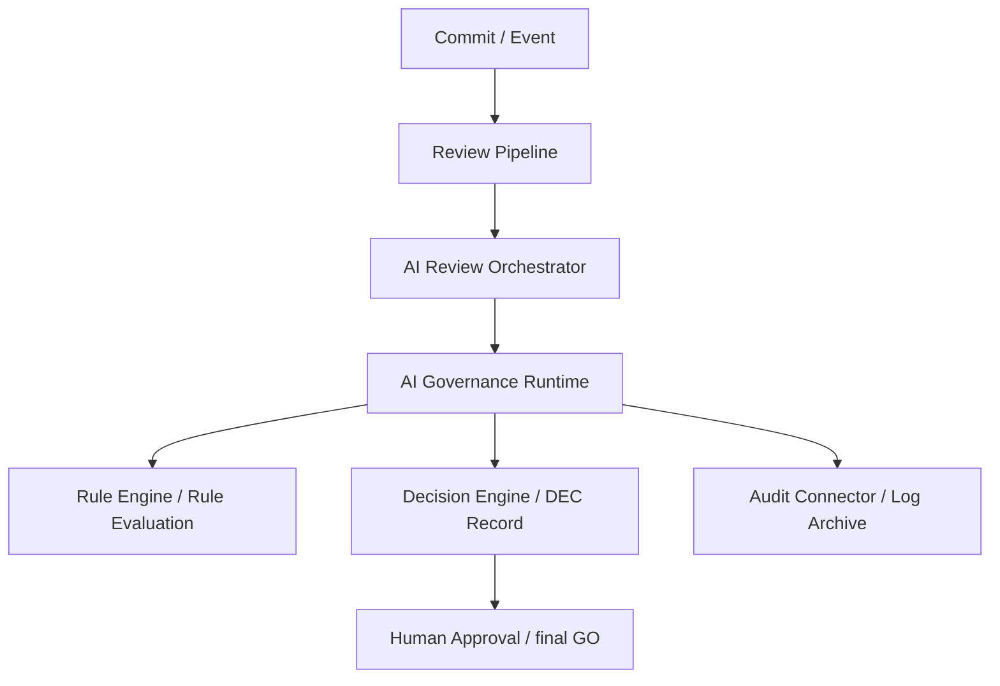
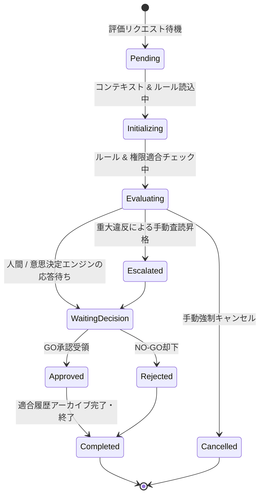

# AIOS AI Governance Runtime Specification (AIガバナンス実行時評価定義規範)

Version: 1.0.0
Phase: Phase 119 (AI Governance Runtime Foundation)
Status: Active

---

## 1. 目的 (Purpose)
本仕様書は、AIOS (Artificial Intelligence Operating System) におけるルール（Rule）、権限役割（Identity & Role）、レビュー結果（Review Pipeline）、意思決定（Decision Model）、および教訓（Knowledge Feedback）を実行時（Runtime）に統合して適合性評価を行う **AI Governance Runtime** のモジュール定義、実行コンテキスト（Governance Context）、評価シーケンス、状態遷移、および結果スキーマを規定します。

---

## 2. ガバナンスランタイムアーキテクチャ (Governance Runtime Architecture)
AI Governance Runtime は、開発アクティビティに対する各 AI / 人間レビュー結果を動的に検証・評価し、ポリシー不適合を検知・調停する実行時ガバナンス評価レイヤーです。



---

## 3. ランタイムの責務 & モジュール (Responsibilities & Modules)

### 3.1 ランタイムの責務
1. **実行時ルール評価**: アクティブな全規約の適合検証。
2. **権限およびアクセス適合評価**: Identity & Role Model に従う最小権限の監査。
3. **意思決定調停連携**: レビュー報告書 (`REV`) から意思決定レコード (`DEC`) 生成への安全な橋渡し。
4. **教訓ナレッジの参照**: 類似インシデント是正・防止策の引き当て。
5. **不変ログ接続**: 評価エビデンスを監査履歴（`AUD`）へ直接配線。

### 3.2 論理モジュール構成 (Runtime Modules)
* **`Runtime Controller`**: 全体の評価オーケストレーションを司る司令塔。
* **`Rule Evaluator`**: ルール仕様に基づき、不適合違反（Violations）の有無を機械的に評価。
* **`Policy Resolver`**: 適用すべきガバナンスポリシー（Rule / Identity / Decision）を決定。
* **`Permission Validator`**: 開発アクターの権限および操作制限の適合度を検証。
* **`Knowledge Resolver`**: ベクトル検索等を介して類似した教訓（Recommendation）を参照。
* **`Decision Coordinator`**: 最終判定結果を意思決定エンジンへ安全に同期。
* **`Audit Connector`**: 評価過程および結果を不変履歴（`HIS`）へ書き出す接続コネクター。

---

## 4. ガバナンスコンテキスト仕様 (Governance Context Schema)
適合評価実行時にランタイムがロードするコンテキストオブジェクトの構造。

* `context_version`: コンテキスト定義バージョン。
* `orchestration_id`: 紐付く調停セッションID。
* `commit`: 対象コミットハッシュ。
* `diff`: 変更ファイル差分。
* `review_reports`: 各AI層が発行した `REV` レコードリスト。
* `decision_records`: 関連する過去の `DEC` レコードリスト。
* `rules`: 適用対象の Rule Registry 定義データ。
* `knowledge`: ナレッジベースから引き当てられた教訓リスト。
* `identity`: 実行アクターの ID 情報。
* `permissions`: 実行アクターの許可権限（Capability Matrix）。
* `confidence`: レビュー結果の統合確信度。
* `severity`: 検知された最高重大度。

---

## 5. ガバナンス評価シーケンス (Governance Evaluation Flow)
ガバナンス検証が起動してから判定を出力するまでの処理フロー。

```mermaid
flowchart TD
    Start([Runtime Start]) --> Context[Governance Context ロード]
    Context --> LoadRules[適用 Rule Registry ロード]
    LoadRules --> PermCheck{権限検証 (Permission Validator)}
    PermCheck -->|拒否 / 不適合| Reject[Rejected / 却下終了]
    PermCheck -->|適合| RuleCheck{ルール評価 (Rule Evaluator)}
    RuleCheck -->|違反検知| ViolateCheck{違反重大度判定}
    ViolateCheck -->|Critical / 昇格例外| Esc[Escalated / 昇格判定]
    ViolateCheck -->|Warning / Advisory| Warning[判定: WARNING 出力]
    RuleCheck -->|違反なし| KB[類似教訓の引き当て / 解決]
    KB --> DecCoord[意思決定連携 (Decision Coordinator)]
    DecCoord --> Result[Runtime Result 生成]
    Result --> HumanCheck{人間最終 GO 判定}
    HumanCheck -->|GO 承認| App([Approved / 適合完了])
    HumanCheck -->|NO-GO 却下| Reject
    Warning --> DecCoord
    Esc --> Waiting([手動査読待ち])
    Waiting --> HumanCheck
```

---

## 6. ランタイム状態遷移 (Runtime States)
ランタイム評価インスタンスは、以下のライフサイクル遷移を持ちます。



---

## 7. ランタイム出力スキーマ (Runtime Result Schema)
評価完了時に永続化される、ガバナンスランタイム結果オブジェクトの構造定義。

* **`Runtime ID`**:
  * 一意の実行ID。フォーマット: `RUN-[西暦4桁]-[連番4桁]` (例: `RUN-2026-0001`)。
* **`Runtime Status`**: 状態コード（`Approved`, `Rejected`, `Escalated`, `Cancelled` 等）。
* **`Applied Rules`**: 適用された監査ルールIDの配列。
* **`Violations`**: 検出された違反項目の詳細記述リスト。
* **`Severity`**: 最大重大度（`Critical`, `Major`, `Minor`, `Info`）。
* **`Confidence`**: 評価の総合確信度（`High`, `Medium`, `Low`）。
* **`Recommendations`**: 回避策および是正推奨アクション。
* **`Decision Reference`**: 紐付く意思決定レコードID（`DEC-YYYY-NNNN`）。
* **`Audit Reference`**: 紐付く監査履歴セッションID（`AUD-YYYY-NNNN`）。

---

## 8. ランタイム昇格ポリシー (Runtime Escalation Policy)
ランタイムが自動進行を遮断し、例外手動査読へとエスカレーション（昇格）するトリガー。
1. **Critical Rule Violation**: 重要度 `Critical` 指定の監査ルールに1つでも違反した場合。
2. **Permission Denied**: アクターの権限（Identity & Role）が操作権限を満たしていない場合。
3. **Low Confidence**: AIレビュー結果の統合確信度が `Low` である場合。
4. **Unknown Rule**: 規則定義のパースエラーまたは不明なルール例外が発生した場合。
5. **Runtime Exception**: テストコードの実行エラーやランタイムエラーが発生した場合。

---

## 9. 将来の実行統合ロードマップ (Future Roadmap)
* **適合エンジン実装 (tools/specifications/ai_governance_runtime.json)**:
  将来的に、Runtime の評価モジュール設定、コンテキスト互換バージョン、および昇格条件しきい値は `ai_governance_runtime.json` にて定義されます。GitHub Actions ワークフローおよび Git の pre-commit/pre-push フック機構と接続し、開発者のローカル操作をリアルタイムに防衛・評価する実行プログラムを実装します。
