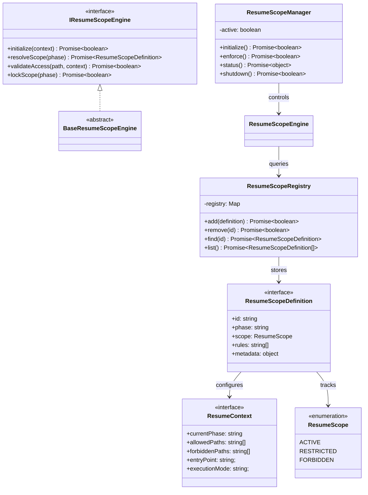

# AIOS Resume Scope Control Specification (再開時スコープ制御定義規範)

Version: 1.0.0
Phase: Phase 126 (AIOS Resume Scope Control Foundation)
Status: Active

---

## 1. 目的 (Purpose)
本仕様書は、AIOS (Artificial Intelligence Operating System) および AI Development Platform において、セッション再開時（Resume）の AI エージェントの探索・読み込み行動を OS レベルで制限・統治する **AIOS Resume Scope Control** のデータ抽象および構造インターフェースを規定します。
プロンプトのみに頼るのではなく、OS レベルの境界定義によって過去フェーズへの不必要な干渉やスキャン（過去仕様の遡行探索）を遮断し、現在フェーズのみを唯一の実行コンテキストとして強制します。

---

## 2. 関係性ダイアグラム (Relationship Diagram)
再開スコープ制御を構成する型・コントロール・エンジンコンポーネントの依存・参照マップ。

---

## 3. コア制御ルール (Core Rule Engine)

再開時の走査境界を強制するため、OS レベルで以下のポリシー規則を適用します。将来の評価評価時（`validateAccess`）には、これらの規則に従ってアクセスが検証されます。

### 3.1 Entry Rule (エントリ制限ルール)
* **規則**: AI エージェントの復帰時の状況認識は、必ず `HANDOVER.md` を起点（唯一の状態ソース）として行われなければならない。

### 3.2 Phase Lock Rule (フェーズロックルール)
* **規則**: アクセスが許可される対象は、原則として HANDOVER で指定された Current Phase のディレクトリ、およびその関連成果物のみにロック（Lock）される。

### 3.3 Single Artifact Rule (単一成果物境界ルール)
* **規則**: 1 回の実行サイクルにおいて、編集・作成対象となる仕様ドキュメントは 1 ファイルのみに限定されなければならない。

### 3.4 Dependency Blind Rule (依存スキャン非走査原則)
* **規則**: 関連性の連想による、自動的な親フォルダや過去履歴・過去仕様書への再帰的探索・遡行参照（Traversal）を禁止する。

### 3.5 Global Traversal Ban (全体スキャン禁止ルール)
* **規則**: 全リポジトリツリーのファイル全読み込み、全 docs の横断スキャンを禁止する。

---

## 4. 将来の実行統合ロードマップ (Future Roadmap)
* **アクセス制御の実行（Enforcement）統合 (Phase 126 以降)**:
  本フェーズで確立したインターフェース `IResumeScopeEngine` を基に、将来的に物理ファイルアクセス評価処理（File Filter Engine）が統合されます。これにより、エージェントがファイル読み込みツール（e.g., `view_file` や `grep_search` 等）を呼び出した際、OS の仲介レイヤー（ResumeScopeController）がこのアクセスをフックし、`validateAccess()` を通じて許可されていない過去ファイルや無関係のパスに対するスキャン要求を "deny default"（デフォルト拒否）で自動的に遮断します。
