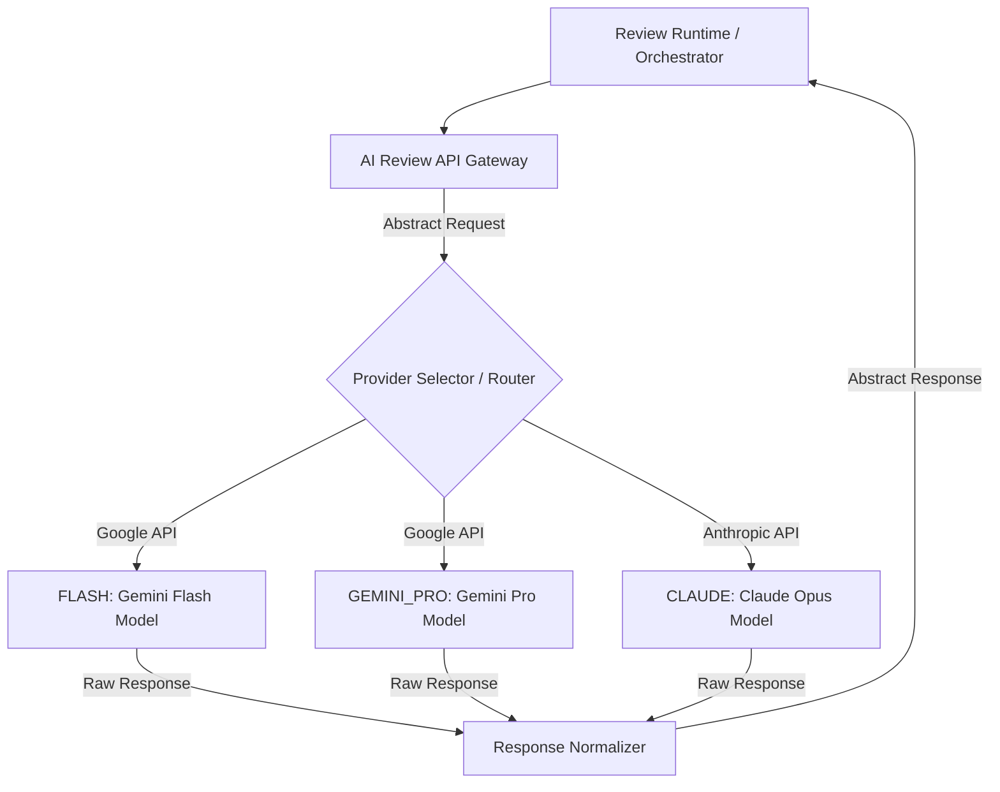
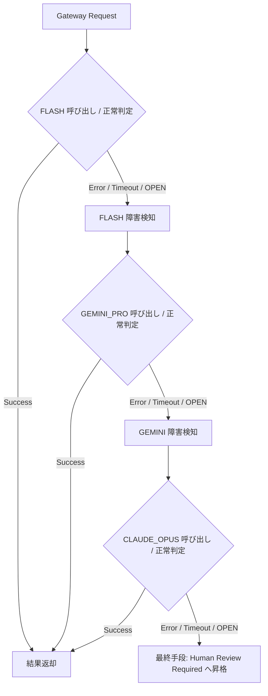

# AIOS AI Review API Gateway Specification (AIレビューAPIゲートウェイ抽象定義規範)

Version: 1.0.0
Phase: Phase 121 (AI Review API Gateway Foundation)
Status: Active

---

## 1. 目的 (Purpose)
本仕様書は、AIOS (Artificial Intelligence Operating System) における品質監査・評価システムが利用する各種 AI プロバイダー（Flash, Gemini, Claude 等）との接続インターフェースを標準抽象化する **AI Review API Gateway** のメッセージスキーマ、プロバイダーレジストリ、サーキットブレーカー（Circuit Breaker）、フェイルオーバー（Failover）、およびコスト制限ポリシーを規定します。

---

## 2. APIゲートウェイアーキテクチャ (AI Review API Gateway Architecture)
AI Review API Gateway は、Review Runtime および Orchestrator がプロバイダーの固有仕様に直接依存することを防ぐための透過的な通信プロキシ（Proxy/Abstraction Layer）として動作します。



---

## 3. プロバイダーレジストリ (Provider Registry)
利用可能なプロバイダーの構成および状態の標準定義。

### 3.1 登録プロバイダー
* **`FLASH`**: 高速・極小コストでの構文検査（モデル: `gemini-2.5-flash`）。
* **`GEMINI_PRO`**: 詳細設計・構造適合度検査（モデル: `gemini-1.5-pro` または最新プロモデル）。
* **`CLAUDE_OPUS`**: ガバナンス厳格監査・超長文脈監査（モデル: `claude-3-opus` または後継）。
* **`FUTURE_PROVIDER`**: 将来追加されるレビューエージェント（モデル定義可変）。

### 3.2 プロバイダーメタデータ属性
* `provider_id`: プロバイダー識別ID。
* `priority`: 調停優先度順位（Flashが最優先）。
* **`provider_health`**:
  * 現在の接続健全度ステータス：`Healthy` (正常応答), `Degraded` (応答遅延 / API制限警告), `Unavailable` (接続遮断 / サーバーダウン)。
* **`capability_tags`**:
  * モデル機能タグ：`Long Context` (長文), `JSON Mode` (JSONフォーマット強制), `Vision` (画像解析), `Streaming` (ストリーム応答), `Function Calling` (関数呼び出し適合)。

---

## 4. 統一データモデル (Request/Response Schemas)

### 4.1 統一リクエストスキーマ (Gateway Request)
```json
{
  "gateway_request_id": "GW-REQ-YYYY-NNNN",
  "runtime_id": "RUN-YYYY-NNNN",
  "context_version": "1.0.0",
  "provider": "FLASH | GEMINI_PRO | CLAUDE_OPUS",
  "model": "gemini-2.5-flash",
  "review_depth": "Standard",
  "prompt": "監査対象コードと要件との適合性を評価...",
  "system_prompt": "You are a quality governance auditor...",
  "context": {
    "diff": "...",
    "changed_specs": ["SIN-001"]
  },
  "timeout": 30000,
  "retry": 3,
  "priority": "Normal",
  "metadata": {}
}
```

### 4.2 統一レスポンススキーマ (Gateway Response)
```json
{
  "gateway_response_id": "GW-RES-YYYY-NNNN",
  "provider": "FLASH | GEMINI_PRO | CLAUDE_OPUS",
  "model": "gemini-2.5-flash",
  "status": "Success | Failed | Timeout | Overloaded",
  "confidence": "High | Medium | Low",
  "severity": "Critical | Major | Minor | Info",
  "tokens_input": 1250,
  "tokens_output": 320,
  "latency": 450,
  "cost": 0.000095,
  "review_result": "PASS | WARNING | FAIL",
  "recommendations": ["変数名が Data Dictionary に適合していません。"],
  "raw_reference": {
    "api_response_body": "{...}"
  }
}
```

---

## 5. 耐障害および回復ポリシー (Failover & Resilience Policies)

### 5.1 サーキットブレーカー (Circuit Breaker)
Gateway は、各プロバイダーに対して以下のサーキットブレーカーステータスを管理し、一時的なネットワークやサービス過負荷を処理します。

* **`CLOSED` (通常運転)**: すべてのリクエストを該当モデルへそのまま転送。
* **`OPEN` (遮断運転)**:
  * 短時間に同一プロバイダーで3回連続タイムアウトまたは接続失敗が発生した場合。
  * リクエストを送信せず、即座に **`Provider Failover`** をキック。
* **`HALF_OPEN` (試行運転)**:
  * 遮断から60秒経過後、限定した1つのリクエストを転送し、成功すれば `CLOSED`、失敗すれば `OPEN` に差し戻す。

### 5.2 プロバイダーフェイルオーバー (Provider Failover Policy)
API Gateway が特定のプロバイダー呼び出しに失敗（またはサーキットブレーカー `OPEN` 状態）の際、以下の経路に沿って代替モデルを動的にフォールバック起動します。



---

## 6. コストおよびキャッシュ管理 (Cost & Cache Policies)

### 6.1 コスト管理
* Gateway は、リクエストおよびレスポンス時の入力・出力トークン数を計上し、実際費用（Actual Cost）を蓄積します。
* 月間予算制限（Monthly Budget）およびセッションあたりのコスト閾値（Cost Threshold）を超過した場合、以後の API コールを `BLOCKED` (Failed) とし、それ以上のトークン消費を抑止します。

### 6.2 キャッシュポリシー (Cache Policy)
API トークン費用および応答レイテンシー削減のため、Gateway 内部で以下のキャッシュ定義を使用します。
* **`Prompt Cache`**: システムプロンプトや SIN 仕様ドキュメントなど、頻繁に変更されない大規模コンテキストに対するプロバイダ側コンテキストキャッシュ機能の強制指示。
* **`Response Cache`**: 同一コミットハッシュかつ同一コンテキストバージョンに対する再検証（No-op 検証）リクエスト時、APIを実行せずに前回の Response レコードを即時返却。

---

## 7. ゲートウェイイベント (API Gateway Events)
Gateway で発生する監査用トレースイベント。

* `GatewayRequested`: リクエスト受信。
* `GatewayStarted`: プロバイダー接続試行。
* `GatewayCompleted`: 正常レスポンス返却。
* `GatewayFailed`: 接続または変換エラー。
* `GatewayRetried`: サーキットブレーカー等による再試行実行。
* `GatewayTimeout`: 応答時間切れ検知。
* `GatewayEscalated`: フェイルオーバー終端による人間査読要求。

---

## 8. 将来の実行統合ロードマップ (Future Roadmap)
* **APIプロキシの実装 (tools/specifications/ai_review_api_gateway.json)**:
  将来的に、各プロバイダーのエンドポイント URL、API Key参照情報、レートリミット閾値（RPM/TPM）、タイムアウト制限、およびサーキットブレーカー設定は `ai_review_api_gateway.json` にて定義されます。Orchestrator からのリクエストを JSON スキーマ適合検査した上で、適切な API クライアント（Google GenAI SDK, Anthropic API等）へ安全にルーティングする Proxy モジュールを実装します。
