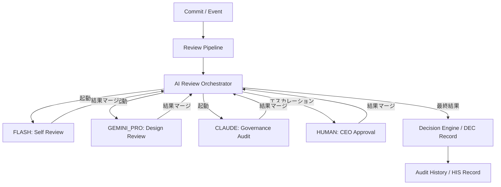
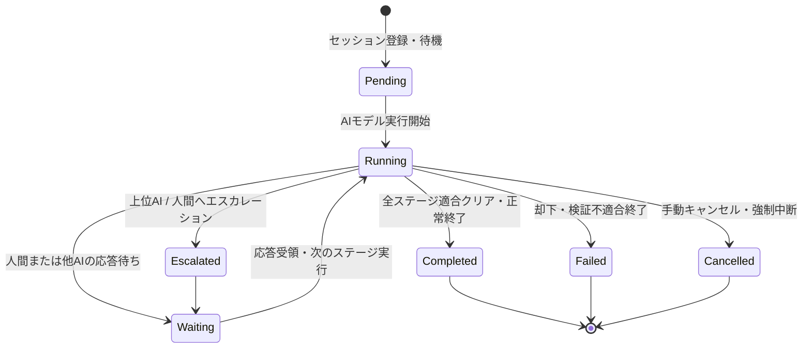

# AIOS AI Review Orchestrator Specification (AIレビュー調停実行制御定義規範)

Version: 1.0.0
Phase: Phase 117 (AI Review Orchestrator Foundation)
Status: Active

---

## 1. 目的 (Purpose)
本仕様書は、AIOS (Artificial Intelligence Operating System) における複数の AI レビューモデル（Flash, Gemini Pro, Claude Opus）および人間の管理者（Human Reviewer）の実行調停を行う **AI Review Orchestrator** の起動ルール、並行・順次制御ポリシー、実行コンテキスト（Execution Context）、状態遷移、タイムアウトハンドリング、およびイベント通信を規定します。

---

## 2. オーケストレーターアーキテクチャ (AI Review Orchestrator Architecture)
AI Review Orchestrator は、Review Pipeline からリクエストを受領し、各AIエージェントの API 呼び出しとコンテキストの伝播を以下のように制御します。

---

## 3. オーケストレーターの責務 (Orchestrator Responsibilities)
Orchestrator は、レビュー実行時に以下の調整責務を担います。

1. **AIモデル選択**: 差分規模、ルール、確信度に応じて起動するエージェントを自動決定。
2. **コンテキスト伝播**: 実行コンテキスト（成果物、先行レビュー結果、エビデンス）の同期。
3. **実行管理**: タイムアウト、並行実行、およびレビューの強制キャンセル。
4. **リトライとエラー処理**: APIエラー時の一時的リトライ、指数バックオフ管理。
5. **判定マージとエスカレーション**: 競合調停ポリシーに基づく結果合成と上位アクターへの自動昇格。
6. **結果引き渡し**: 判定が確定した段階で Decision Engine へ意思決定レコードの書き込みを要求。

---

## 4. エージェント選択・起動ポリシー (Agent Selection & Invocation Policies)

### 4.1 エージェント選択ポリシー
* **FLASH**:
  * コミットまたは計画完了イベント検知時に、常時かつ無条件で起動。
* **GEMINI_PRO**:
  * FLASH レビューで警告（`WARNING / FAIL`）が検知された場合。
  * FLASH レビュー確信度が `Medium / Low / Unknown` の場合。
  * `DTO` クラス、`Manager` クラス、または `docs/specifications/*.md` に変更が含まれる場合。
* **CLAUDE**:
  * GEMINI レビューで `FAIL` が検知された場合。
  * 共通データ辞書（Data Dictionary）への不適合警告が検出された場合。
  * ガバナンス仕様（`DevelopmentOS`, `AuditOS`）そのものの改訂が含まれる場合。
* **HUMAN**:
  * 最終リリース（mainマージ）の承認要求時。
  * CLAUDE 判定が `FAIL` である場合、または AI レビュー判定が分裂（コンフリクト）した場合。
  * `Critical` 警告に対する例外適用のバイパス申請（Emergency Override）が提出された場合。

### 4.2 起動ポリシー (Invocation Policies)
* **Sequential Invocation (順次起動)**:
  * 原則、コスト削減のため FLASH ──> Gemini ──> Claude ──> Human の順に検証を直列に繋ぎ、前段の結果を後段へ渡す。
* **Conditional Invocation (条件起動)**:
  * エスカレーション条件および起動条件を満たした場合にのみ、後続モデルの API を起動する。
* **Skip Invocation (スキップ)**:
  * 軽微な Patch 差分かつ FLASH 確信度が `High` の場合は後続 AI をバイパス。
* **Early Abort (早期終了)**:
  * 前段ステージで `FAIL` が確定した場合、後続 AI への呼び出しを行わずにレビューセッションを即時却下（Failed）終了する。

---

## 5. オーケストレーション状態遷移 (Orchestration States)
レビューセッションのオーケストレーション実行状態は、以下の遷移ライフサイクルに従います。

---

## 6. 実行コンテキスト仕様 (Execution Context Schema)
Orchestrator が各モデルの呼び出し時、および状態遷移時に受け渡し・管理する実行情報の構造定義。

* **`orchestration_id`**:
  * 1回のレビューセッション全体を一意に識別する追跡用識別ID（例: `"REV-2026-0001"` などのセッションIDに紐付く一意ハッシュ値）。
* `context_version`: パイプラインコンテキストのデータ形式互換バージョン。
* `commit`: レビュー対象のコミットハッシュ。
* `diff`: 物理ファイルの差分文字列。
* `files`: 差分対象のファイルパスリスト。
* `evidence`: 前ステージまでの検証ログ・エビデンス配列。
* `severity`: 検出された最大重大度。
* `confidence`: 判定に対する現在の統合確信度。
* `changed_specs`: 変更された仕様書SINリスト。
* `previous_reviews`: これまでの各層の個別レビュー結果 (`REV`) のリスト履歴。
* `review_depth`: レビューの監査深度レベル。

---

## 7. エラー、競合、およびキュー管理 (Error, Conflict & Queue)

### 7.1 タイムアウト & リトライ
* AI APIのタイムアウト検知時は、指数バックオフ（Exponential Backoff）により最大3回まで自動再試行（Retry）。回復しない場合は `BLOCKED` (Failed) とし、人間へ通知（Escalate）。

### 7.2 競合調停ポリシー (Conflict Resolution)
* 判定結果が AI レイヤー間で異なる場合、最も安全な判定結果を優先します（FAIL 優先）。
* 判定の不一致（PASS と FAIL の衝突など）が発生した場合は、判定ステータスを `Review Required` とし、人間（岩佐CEO）の査読キューへエスカレーションします。

### 7.3 キューポリシー (Queue Policy)
* 同時に複数のレビューリクエストが発生した場合、Orchestrator は以下の論理で処理順序を制御します。
  1. **Priority Queue**: ホットフィックス（Emergency）を最優先。
  2. **FIFO**: 定常の開発コミットは到着順に処理。
  3. **Batch Review**: 同一ファイルの複数コミットがある場合は一括集約してレビュー。

---

## 8. オーケストレーターイベント (Orchestrator Events)
Orchestrator の動作は、以下のイベントを発行し、Audit History およびログ監視システムに通知されます。

* **`ReviewRequested`**: レビューセッションの初期起票時。
* **`ReviewStarted`**: 各AIモデルの API 呼び出し開始時。
* **`ReviewCompleted`**: 全ステージをクリアし、正常適合終了した時。
* **`ReviewFailed`**: 規約違反またはビルド例外で却下（Failed）終了した時。
* **`ReviewEscalated`**: 上位AIまたは人間へ制御がエスカレーションされた時。
* **`ReviewCancelled`**: 手動またはタイムアウトにより強制中断された時。
* **`DecisionGenerated`**: 意思決定レコード（`DEC`）の書き込み完了時。

---

## 9. 将来の実行統合ロードマップ (Future Roadmap)
* **実行モジュールとの接続 (tools/specifications/ai_review_orchestrator.json)**:
  将来的に、Orchestrator の起動ポリシー、状態定義、およびタイムアウト値は `ai_review_orchestrator.json` にて定義されます。GitHub Actions や Git Hook、Scheduler などの外部実行環境と統合し、イベントドリブンで自動的に AI Review Orchestrator が起動するフック機構を実装します。
