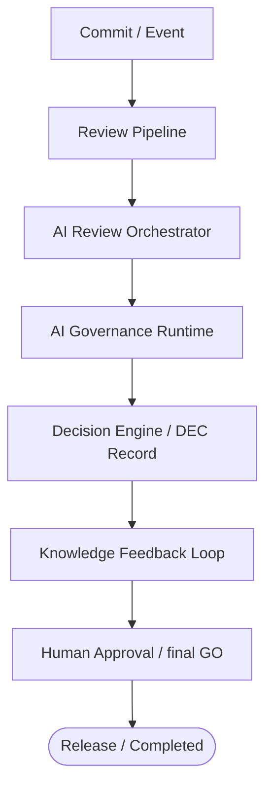
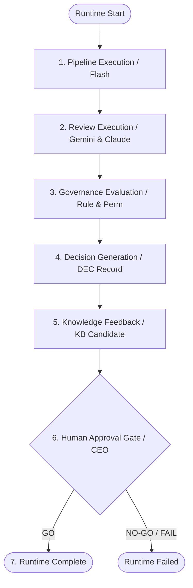
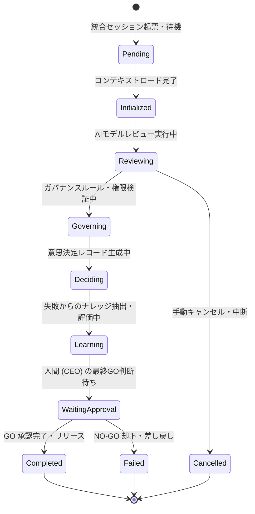
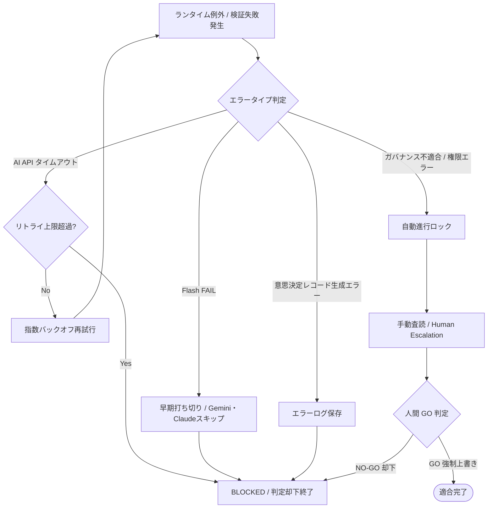

# AIOS AI Review Runtime Integration Specification (AIレビュー実行時統合定義規範)

Version: 1.0.0
Phase: Phase 120 (AI Review Runtime Integration Foundation)
Status: Active

---

## 1. 目的 (Purpose)
本仕様書は、AIOS (Artificial Intelligence Operating System) における品質検査（Review Pipeline）、実行制御（AI Review Orchestrator）、適合評価（AI Governance Runtime）、および自己改善（Knowledge Feedback）を実行サイクルとして一元的に調停・統合する **AI Review Runtime Integration** のコンポーネント構成、統合コンテキスト（Integration Context）、実行フロー、例外復旧、および追跡性を規定します。

---

## 2. ランタイム統合アーキテクチャ (Runtime Integration Architecture)
AI Review Runtime Integration は、変更の発生から人間による最終 GO/NO-GO 判定にいたるガバナンスフローを決定論的かつ一貫して接続する、AIOS の最上位実行ランタイムフレームワークです。

---

## 3. 統合コンポーネント (Integration Components)
本ランタイムが結合・統治する個別機能要素の役割定義。

1. **Review Pipeline (処理の流れ)**: ステージング検査、各AI層（Flash, Gemini, Claude）の直列実行シーケンス。
2. **AI Review Orchestrator (実行制御・調停)**: APIタイムアウト、モデル選択、確信度（Confidence）および重要度（Severity）による上位モデル自動トリガー。
3. **AI Governance Runtime (適合性評価)**: Identity 権限、および Rule Registry 監査規則に対する動的チェック。
4. **Decision Engine (意思決定レコード化)**: 判定のエビデンス記述および意思決定レコード（`DEC`）の生成。
5. **Knowledge Feedback (ナレッジフィードバック)**: FAIL や WARNING の RCA から教訓（`KB`）を自動抽出し、将来のチェックルール（`RULE`）へ再配線。

---

## 4. 統合コンテキスト仕様 (Runtime Integration Context)
モジュール間で受け渡される統合状態オブジェクト。

* `runtime_id`: 統合ランタイム全体の一意実行ID（例: `RUN-2026-0001`）。
* `orchestration_id`: 紐付く調停セッションID。
* `commit` / `diff`: 検証対象コミットハッシュおよび差分。
* `review_reports`: 収集された `REV` レコードリスト。
* `runtime_result`: ガバナンスランタイム結果 (`RUN`)。
* `decision_record`: 意思決定エンジンが生成した `DEC` レコード。
* `knowledge_candidates`: 抽出された教訓候補配列 (`KBC`)。
* `applied_rules`: 適用されたチェックルールIDリスト。
* `permissions`: アクター能力マトリクス。
* `confidence`: 統合確信度。
* `severity`: 検出された最高重大度。
* **`integration_version`**: 統合仕様定義バージョン。将来のデータ構造進化を安全に吸収する識別子。
* **`pipeline_version`**: Review Pipeline 仕様バージョン。
* **`orchestrator_version`**: AI Review Orchestrator 仕様バージョン。
* **`governance_version`**: AI Governance Runtime 仕様バージョン。

---

## 5. 統合実行フロー & ライフサイクル (Flow & Lifecycle)

### 5.1 統合実行フロー
ランタイムが起動してから終了するまでの統合フローシーケンス。

### 5.2 統合状態遷移 (Runtime Lifecycle)
統合ランタイムは、以下の遷移に従って不変監査されます。

---

## 6. 例外・失敗ハンドリングポリシー (Failure Handling Policy)
統合ランタイム実行時に異常または不適合が発生した際の制御フロー。

---

## 7. 統合追跡性 (Runtime Traceability)
すべての成果IDは、以下の参照結合モデルに従い、Audit Dashboard から一連のセッションとして完全追跡可能となります。

* **`RUN-YYYY-NNNN`** (統合ランタイムID)
  * ├── **`REV-YYYY-NNNN`** (各AI検証ID)
  * ├── **`DEC-YYYY-NNNN`** (意思決定ID)
  * ├── **`KB-YYYY-NNNN`** (教訓ID)
  * ├── **`RULE-YYYY-NNNN`** (更新ルールID)
  * └── **`AUD-YYYY-NNNN`** (監査履歴セッションID)

---

## 8. 将来の実行統合ロードマップ (Future Roadmap)
* **実行環境への統合 (tools/specifications/ai_review_runtime_integration.json)**:
  将来的に、Runtime Integration の結合設定、例外リトライ上限、およびバージョン互換スキーマは `ai_review_runtime_integration.json` にて定義されます。GitHub Actions や git-hook と統合し、ローカル開発環境およびリモートブランチに対するリアルタイムな自動ガバナンスを調停するオーケストレーションエンジンを実装します。
