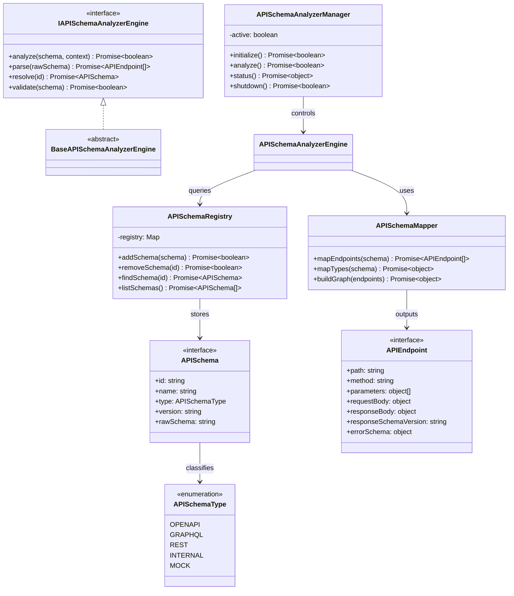

# API Schema Analyzer Specification (APIスキーマアナライザー定義規範)

Version: 1.0.0
Phase: Phase 129 (API Schema Analyzer Foundation)
Status: Active

---

## 1. 目的 (Purpose)
本仕様書は、AIOS (Artificial Intelligence Operating System) における API スキーマアナライザーの構造・契約定義（Blueprint）を規定します。
AIOSが外部サービスや内部エンドポイントと連携するにあたり、APIを実行するのではなく「構造データ」として解釈・抽象化し、エンドポイントグラフや型マッピンググラフを構築するための基礎データ表現を確立します。

---

## 2. 関係性ダイアグラム (Relationship Diagram)
APIスキーマアナライザーを構成する型・コントロール・エンジンコンポーネントの依存・参照マップ。

---

## 3. コアデータモデル (Core Data Models)

### 3.1 APISchemaType
- **OPENAPI**: OpenAPI / Swagger 規格の JSON/YAML 仕様。
- **GRAPHQL**: GraphQL スキーマ言語（SDL）。
- **REST**: OpenAPI で規定されない単純な REST API 仕様。
- **INTERNAL**: AIOS 内部コンポーネント用のインターフェース仕様。
- **MOCK**: 統合テスト・シミュレーション用の疑似スキーマ。

### 3.2 APIEndpoint
外部・内部 API の個別エンドポイント情報を定義します。岩佐CEOの改善フィードバックを反映し、Graph 構造解析の強化のため、以下の拡張フィールドを定義します。
- `responseSchemaVersion`: レスポンススキーマのバージョン管理文字列。
- `errorSchema`: 発生しうるエラーレスポンスの構造定義オブジェクト。

---

## 4. 将来の実行統合ロードマップ (Future Roadmap)
* **Execution Graph Engine との結合 (Phase 130 予定)**:
  本フェーズで確立したスキーマ情報モデルをもとに、タスクオーケストレーターとAPIスキーマ定義を紐づけた「実行フローグラフ」の構築が適用されます。
