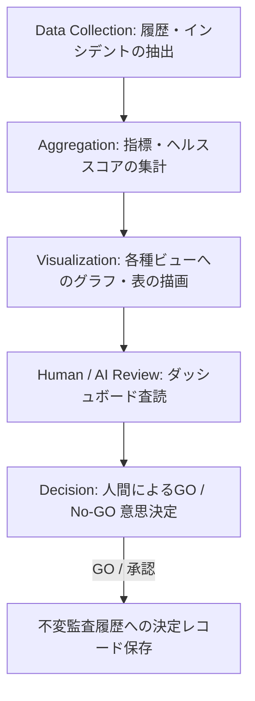
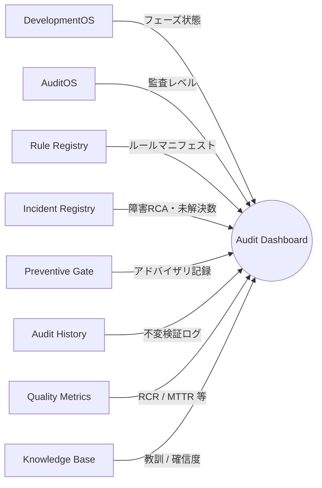

# AIOS Audit Dashboard Specification (監査ダッシュボード可視化規範)

Version: 1.0.0
Phase: Phase 109 (Audit Dashboard Foundation)
Status: Active

---

## 1. 目的 (Purpose)
本仕様書は、AIOS (Artificial Intelligence Operating System) におけるガバナンス順守状況、品質メトリクストレンド、検知されたインシデント、および蓄積された組織ナレッジを統合可視化する **Audit Dashboard** のビジュアルレイアウト、データ配線、ビューモデル、およびライフサイクルを規定します。

---

## 2. ダッシュボード概要 (Dashboard Overview)

### 2.1 概要 (Overview)
Audit Dashboard は、CIE Platform および AIOS が出力する各種レジストリ（不変データ）をリアルタイム／バッチ集計し、人間およびAIエージェントに「システム全体の健全性」を提示するインターフェースの設計仕様です。
本システムは読み取り専用（Read-Only）であり、データ書き換えなどの副作用を持ちません。

### 2.2 ダッシュボード利用者 (Dashboard Consumers)
ダッシュボードは、以下の人間の管理者およびレビューAIエージェントによって共同で消費（参照）され、開発プロセスの意思決定判断のハブとなります。

* **Human Reviewer**: 岩佐CEO等の人間管理者。最終承認判断（GO）を行うための統合ビューを参照します。
* **Flash 3.5**: 自律開発時およびコミット前のセルフチェックとして、規約順守度を迅速に確認するために参照します。
* **Gemini 3.1 Pro**: 詳細コード監査、構造不整合の自動追跡、およびレポート分析のコンテキストとして参照します。
* **Claude Opus 4.6**: アーキテクチャ統制、不変履歴の整合性確認、および総合的な品質検証の入力ソースとして参照します。
* **Future AI Review Agents**: 将来追加される自律型品質向上エージェントが、改善推奨を出力するための基礎データとして参照します。

---

## 3. 関係データフロー & ライフサイクル (Data Lifecycle)

### 3.1 ライフサイクルプロセス
ダッシュボードデータの収集から意思決定判定（GO/No-GO）に至るライフサイクルは、以下の段階を経て循環します。

### 3.2 データソースマッピング
ダッシュボードは、以下の既存 AIOS Foundation レイヤーからデータを集約して動作します。

---

## 4. ダッシュボードウィジェット (Dashboard Widgets)
ダッシュボード画面は、以下のモジュール式ウィジェットで構成されます。

1. **開発ステータス (Development Status)**:
   * 現在の実行フェーズ番号（例: `"Phase109"`）、対象ブランチ、ワークツリーのクリーン度を表示。
2. **監査ステータス (Audit Status)**:
   * 構造監査、DTO監査、シリアライズ監査等の最終合否（`PASS` / `FAIL`）を一覧表示。
3. **インシデントステータス (Incident Status)**:
   * 未解決インシデント数（`Status: Detected/Investigating`）および直近の起票履歴を表示。
4. **ルール適合性 (Rule Compliance)**:
   * ルール適合率 (`M-RCR`) を進捗バーで可視化。
5. **品質メトリクス (Quality Metrics)**:
   * `MTTR` (平均解決時間) および `IF` (インシデント頻度) の期間トレンドをグラフ表示。
6. **ナレッジ成長 (Knowledge Growth)**:
   * 蓄積された教訓 (`KB-XXXX-XXXX`) の登録総数および有効ステータス比率を表示。
7. **GO判定概要 (GO Decision Summary)**:
   * 人間の承認者による最終意思決定履歴およびオーバーライド承認理由を表示。
8. **基盤進捗率 (Foundation Progress)**:
   * AIOS 全仕様書のうち、Approved 状態の仕様書の比率をパーセンテージ表示。

---

## 5. ダッシュボードビュー (Dashboard Views)
ダッシュボードは、消費者の権限・目的に応じて以下の表示ビュー（切り替えタブ）を提供します。

* **エグゼクティブビュー (Executive View)**:
  * 岩佐CEO向けの画面。総合ガバナンスヘルススコア、未解決インシデント数、および次のGO判定対象の計画書リストを表示する最もノイズの少ないビュー。
* **アーキテクチャビュー (Architecture View)**:
  * 技術監査者・AIエージェント向け。DTO・Managerのレイヤー参照関係、Context漏洩の有無、シリアライズ Roundtrip エラーログを表示。
* **ガバナンスビュー (Governance View)**:
  * プロセス統制用。フェーズの順守状況、実装前の計画書承認日時と実装開始日時のタイムライン、GO承認率を表示。
* **監査ビュー (Audit View)**:
  * 品質管理部門向け。不適合（FAIL）となったルール、実行された `pytest / verify` の詳細ログを表示。
* **品質ビュー (Quality View)**:
  * メトリクス分析用。`RCR`, `IF`, `MTTR` の時系列グラフを表示し、品質の劣化傾向を早期検知。
* **ナレッジビュー (Knowledge View)**:
  * ナレッジマネジメント用。教訓データベース（KB）の信頼性スコア、ベストプラクティスの適用済み実績を検索表示。

---

## 6. 総合ヘルススコア (Dashboard Health Score Schema)
ダッシュボードは、システム全体の健康状態を直感的に示す4つのヘルススコア（0.0 〜 100.0% または A/B/C/F レベル）を動的に計算します。

* **全体ガバナンスヘルス (Overall Governance Health)**:
  * `M-GDR` (GO承認率) およびフェーズライフサイクルの順守率から算出。未承認開発が発生した場合は即座に F (0%) に転落する。
* **全体開発ヘルス (Overall Development Health)**:
  * ビルド成功率および `verify / doctor` チェックの合格率から算出。
* **全体品質ヘルス (Overall Quality Health)**:
  * `M-RCR` (ルール適合率) および `M-IF` (インシデント頻度) から算出。
* **全体ナレッジヘルス (Overall Knowledge Health)**:
  * インシデントの解決率、および RCA からルールレジストリへの追加反映率（再発防止カバー率）から算出。

---

## 7. タイムラインコンポーネント (Dashboard Timeline)
時系列分析を可能にするため、以下の横軸タイムラインが表示されます。

1. **フェーズタイムライン**: 各フェーズの開始・承認・完了日時のプロセス推移。
2. **インシデントタイムライン**: 障害が発生してから RCA・修正適用・クローズされるまでの追跡。
3. **監査履歴タイムライン**: 定期監査およびコミット前監査の合否結果の推移。
4. **ナレッジ登録タイムライン**: 新しい教訓（KB）の提案・有効化の歴史。

---

## 8. 将来の拡張・ロードマップ (Future Roadmap)
* **リアルタイム GUI (Phase 115+ 予定)**:
  * 本仕様に基づき、HTML5/Vanilla CSS/Javascript による漆黒ベースのガラスモーフィズムUIを実装し、実稼働環境と WebSocket でデータ同期するフロントエンド画面を構築します。
* **API 連携**:
  * `/tools/audit/dashboard/summary.json` として集計データを自動エクスポートし、外部の監視ツールと疎結合に配線できるように設計します。
