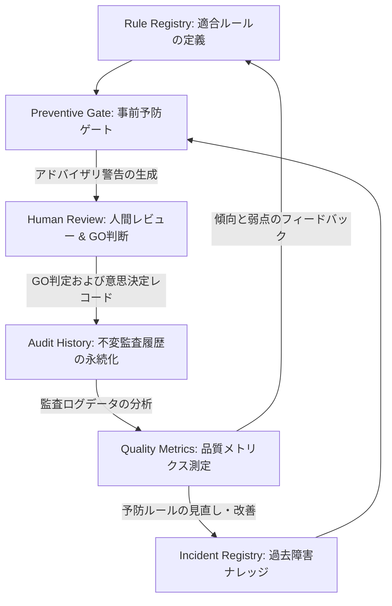
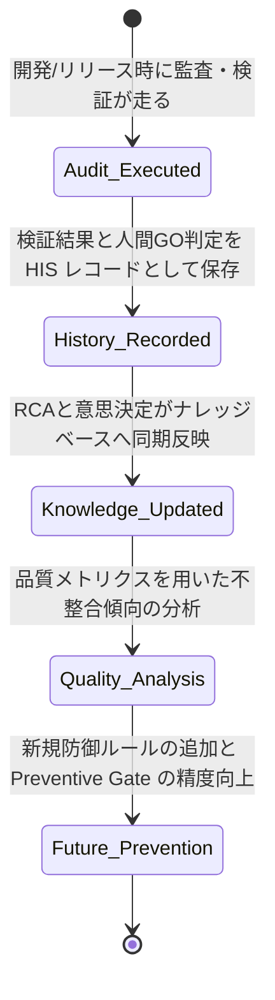

# AIOS Audit History Specification (不変監査履歴管理規範)

Version: 1.0.0
Phase: Phase 106 (Audit History Foundation)
Status: Active

---

## 1. 目的 (Purpose)
本仕様書は、AIOS (Artificial Intelligence Operating System) において実行されたすべての監査結果、規約検証プロセス、および人間によるゲート承認意思決定レコードを「不変の監査証跡 (Immutable Audit Trail)」として永続的に保管し、ライフサイクル全体のトレーサビリティを担保する **Audit History** のアーキテクチャおよびデータ構造を規定します。

---

## 2. 監査履歴分類 & ステータス (Classification & Status)

### 2.1 履歴分類 (History Classification)
記録される監査履歴は、実行されたアクティビティの目的に応じて以下のように分類されます。

* **Development (開発検証)**: 開発段階でのセルフチェックや、各開発フェーズ完了前の `verify / doctor` チェックの実行記録。
* **Audit (定常/定期監査)**: リポジトリ全体のアーキテクチャ監査や、DTO・Manager規律適合度に対する自動・手動監査の記録。
* **Release (リリースゲート監査)**: 本番環境への展開前またはマージ前に実施される、ゲートウェイ通過検証の記録。
* **Hotfix (パッチ検証)**: 緊急不具合修正時に実行された、限定的な検証チェックの証跡。
* **Emergency (緊急例外承認)**: トラブル対応などのため、通常の統制ゲートをバイパスして例外適用を行った際の意思決定記録。
* **Governance (ガバナンス改訂)**: `DevelopmentOS.md` や `AGENTS.md` などのルール改定およびその承認プロセスの歴史的記録。

### 2.2 履歴ステータス (History Status)
履歴ログレコード自体は不変（Immutable）ですが、監査プロセス上の記録データの段階として以下のステータスを管理します。

```
[Recorded (記録済)] ──> [Verified (検証済)] ──> [Archived (アーカイブ済)]
```

1. **Recorded**: 監査エンジンまたはゲートウェイが動作し、検証エビデンスおよび判定ログがファイルに書き出された初期状態。
2. **Verified**: 履歴データの整合性署名チェックが行われ、監査結果と関連コミットハッシュの対応関係が完全に検証された状態。
3. **Archived**: 不変のデータベースまたは変更不可（Read-Only）の監査ストレージディレクトリに格納され、長期保存に入った状態。

---

## 3. AIOS 全体関係構造図 (AIOS Entire Relationship Diagram)
ルール、インシデント、ゲート、不変履歴、および品質メトリクスがどのように連携して「経験から学習するOS」を構築するか、その全体設計図は以下の通り定義されます。



---

## 4. 監査履歴ライフサイクル (Audit Lifecycle)
監査アクティビティが実行され、ナレッジベースが更新される一連のライフサイクルループは以下の通りです。



---

## 5. 履歴レコードスキーマ定義 (History Record Schema)
各履歴レコードは、以下のフィールド構造に従って永続化されなければなりません。

| 属性名 (Field) | 型 (Type) | 説明 (Description) |
|---|---|---|
| `History ID` | String | 履歴の一意な識別コード。`HIS-YYYY-連番` の命名規則に従う。例: `HIS-2026-0001` |
| `Audit Phase` | String | 監査が実行されたフェーズ番号（例: `"Phase104"`）。 |
| `Audit Type` | Enum | 前述の履歴分類（`Development`, `Audit`, `Release`, `Hotfix`, `Emergency`, `Governance`）。 |
| `Rule References` | List[String] | 監査時に検証対象となったルールIDのリスト。 |
| `Incident References` | List[String] | 監査時または事前ゲートで参照・比較された過去インシデントIDのリスト。 |
| `Decision` | Enum | 最終意思決定結果（`GO` / `No-GO` / `OVERRIDDEN`）。 |
| `Decision Reason` | String | その決定に至った理由（オーバーライドした場合は技術的妥当性のある理由）。 |
| `Reviewer` | String | 承認判断を下した人間の署名（例: `岩佐CEO`）。 |
| `Review Date` | DateTime | 承認が行われた日時（ISO-8601）。 |
| `Related Commit` | String | 監査対象となったコードのコミットハッシュ。 |
| `Outcome` | Enum | 監査の最終評価ステータス（`PASS` / `FAIL` / `WARNING`）。 |
| `Lessons Learned` | String | 監査セッションおよび意思決定から抽出された、プロセス改善のための教訓。 |
| `Evidence` | List[String] | 監査時の pytest 出力、ASTチェック結果、または差分（Diff）テキストなどの客観的証拠。 |
| `References` | List[String] | 関連する仕様書、計画書、インシデントデータベースのリンク。 |

---

## 6. 具体的な履歴レコード例 (Predefined Example Record)

### HIS-2026-0001: Phase 104 Implementation Validation
* **History ID**: `HIS-2026-0001`
* **Audit Phase**: `Phase104`
* **Audit Type**: `Development`
* **Rule References**: `["SPEC-001", "CLI-001", "DOC-001"]`
* **Incident References**: `["INC-2026-0001"]`
* **Decision**: `GO`
* **Decision Reason**: `All static checks passed, including correct implementation of the incident metadata schema and Mermaid lifecycles. Git status clean.`
* **Reviewer**: `岩佐CEO`
* **Review Date**: `2026-06-30T19:40:00Z`
* **Related Commit**: `24d7504f6e6cdb38740cda320f78cc9bc37f00e5`
* **Outcome**: `PASS`
* **Lessons Learned**: 設計仕様とガバナンス（Flashスキップ規約の更新）の同時修正が整合しており、RCAフローの可視化が開発者の理解を助ける良いプラクティスとなった。
* **Evidence**: `["git status: clean", "verify: PASS", "doctor: GOOD", "pytest: 10 passed"]`
* **References**: `["ImplementationPlan-Phase104", "IncidentRegistrySpec-v1"]`

---

## 7. 将来の自動化・ストレージロードマップ (Future Roadmap)
* **不変ファイルストレージ (tools/audit/history/)**:
  本仕様に基づき、各フェーズ完了時の `git commit` 操作の直前に、CIE が自動的に監査エビデンス、関連コミット、人間レビュー情報を収集し、`tools/audit/history/` ディレクトリ配下に `HIS-YYYY-XXXX.json` の形式で不変JSONレコードを自動生成・永続化するシステムを将来フェーズで統合します。
