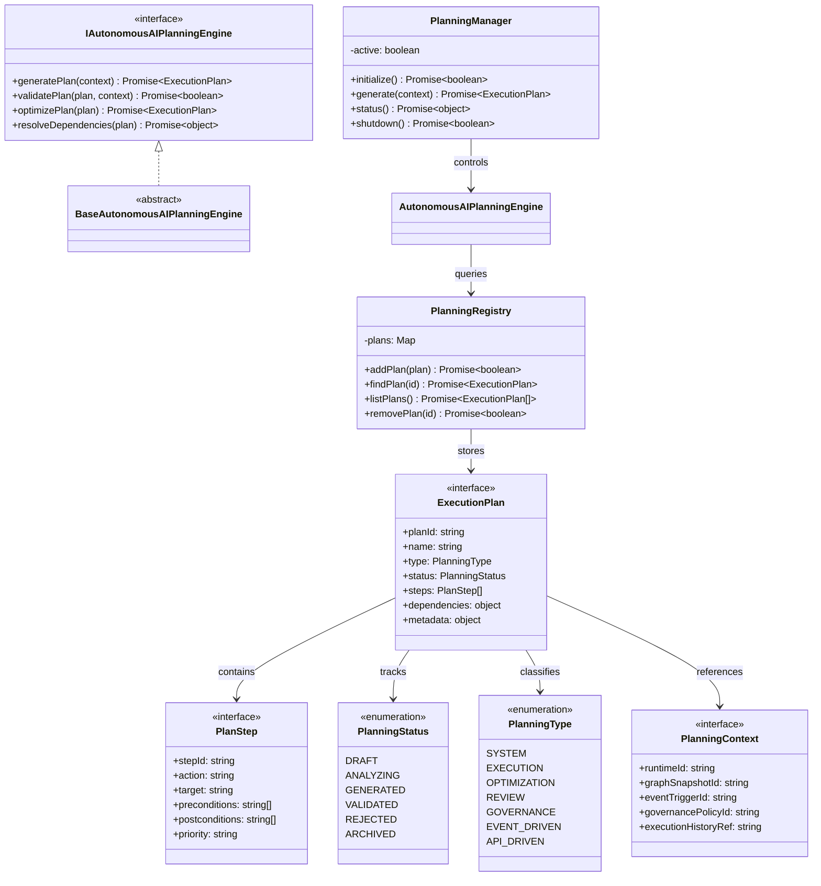

# Autonomous AI Planning Engine Specification (自律AIプランニングエンジン定義規範)

Version: 1.0.0
Phase: Phase 131 (Autonomous AI Planning Engine Foundation)
Status: Active

---

## 1. 目的 (Purpose)
本仕様書は、AIOS (Artificial Intelligence Operating System) における自律AIプランニングエンジンの構造・型・契約定義（Blueprint）を規定します。
システム実行グラフ、ガバナンスポリシー、およびイベントを基盤として、AIが実行前にどのようなタスクをどう並列/直列に実行すべきかを示す「実行計画（Execution Plan）」の生成および依存関係マッピングを行う構造定義を提供します。

---

## 2. 関係性ダイアグラム (Relationship Diagram)
AIプランニングエンジンを構成する型・コントロール・エンジンコンポーネントの依存・参照マップ。



---

## 3. プランニングライフサイクル (Plan Life Cycle)
生成された実行計画（Plan）がたどる状態遷移モデル。

```
[ DRAFT ] ──> [ ANALYZING ] ──> [ GENERATED ] ──> [ VALIDATED ] ──> [ ARCHIVED ]
                                                     │
                                                     └──> [ REJECTED ]
```

---

## 4. 各種統合モデル (Integration Model)

### 4.1 Graph Layer Integration
プランニングエンジンは、現在フェーズの `System Execution Graph` を参照して依存関係およびデータフローを評価し、破綻のない `PlanStep` 群と順序関係（`dependencies`）を構築します。

### 4.2 Orchestrator Integration
生成された `ExecutionPlan` は検証（`validatePlan`）をパスした後、中枢実行レイヤーである `Autonomous Execution Orchestrator` にシームレスに投入可能となるように定義されています。

---

## 5. 将来の実行統合ロードマップ (Future Roadmap)
* **自律監査レイヤーとの結合 (Phase 132 予定)**:
  本フェーズで確立した実行計画モデルに基づき、将来的に計画生成結果に対するポリシーおよびセキュリティ監査（Self-Auditing）処理が統合されます。
