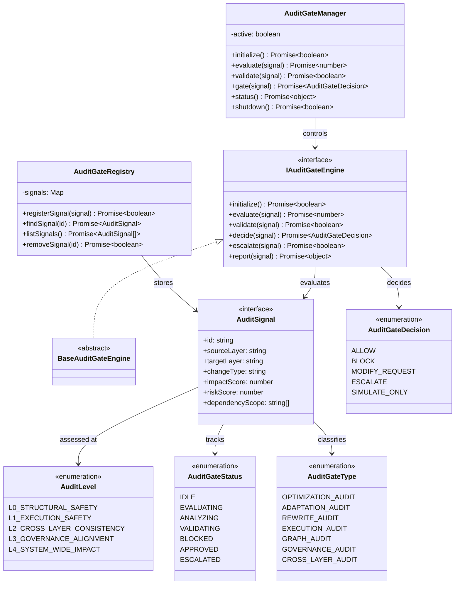

# Autonomous Audit Gate Integration Layer Specification (自律監査ゲート統合レイヤー定義規範)

Version: 1.0.0
Phase: Phase 142.5 (Autonomous Audit Gate Integration Layer)
Status: Active

---

## 1. 目的 (Purpose)
本仕様書は、AIOS (Artificial Intelligence Operating System) における自律監査ゲート統合レイヤーの構造・型・契約定義（Blueprint）を規定します。
Self-Optimization / Self-Adaptation / Self-Rewriting 等の全進化操作が実行される前に、必ず通過しなければならない「統一ゲート」として、進化要求の正当性・影響範囲・リスク・レイヤー整合性・ガバナンス準拠を事前評価し、ALLOW / BLOCK / ESCALATE の判定構造を提供します。

---

## 2. Phase132（Audit Layer）との責務分離

> ⚠️ Phase132 と Phase142.5 は明確に異なるレイヤーである。混同は禁止する。

| 項目 | Phase132: Audit Layer | Phase142.5: Audit Gate |
|---|---|---|
| **役割** | 横断的監査エンジン（事後的・評価型） | 進化操作の事前通過制御（ゲート型） |
| **タイミング** | 任意タイミングで全レイヤーを横断評価 | 進化操作の実行"直前"に必ず通過 |
| **対象** | AIOS全レイヤーの一貫性・ポリシー準拠 | Optimization / Adaptation / Rewriting の変更要求 |
| **出力** | AuditResult（監査報告） | AuditGateDecision（通過/遮断/差戻/エスカレーション） |
| **ディレクトリ** | `src/audit/` | `src/auditgate/` |
| **依存関係** | 独立（全レイヤーを横断参照） | Phase132の監査能力を"ゲート判定の入力"として参照可能 |

---

## 3. 関係性ダイアグラム (Relationship Diagram)



---

## 4. ゲートフローモデル (Gate Flow)

```
Evolution Change Request (Optimization / Adaptation / Rewriting)
   ↓
Audit Gate Evaluation
   ↓
Risk + Impact + Cross-Layer Consistency Check
   ↓
Decision Layer
   ↓
ALLOW ──> Proceed to Evolution
BLOCK ──> Reject Change
MODIFY_REQUEST ──> Return with Modification
ESCALATE ──> Forward to Governance Kernel
SIMULATE_ONLY ──> Virtual Execution Only
```

---

## 5. ゲート通過ライフサイクル (Gate Lifecycle)

```
[ IDLE ] ──> [ EVALUATING ] ──> [ ANALYZING ] ──> [ VALIDATING ]
                                                        │
                                    ┌───────────────────┼───────────────────┐
                                    ▼                   ▼                   ▼
                              [ APPROVED ]        [ BLOCKED ]        [ ESCALATED ]
```

---

## 6. Phase132 Audit Layer との統合モデル

### 6.1 参照関係（依存方向）
Audit Gate は Phase132 の `AutonomousAuditEngine` が生成する `AuditResult` を「ゲート判定の参考入力」として参照できます。ただし Audit Gate 自身が横断監査処理を直接実行することはありません。

### 6.2 責務境界の厳守
- **Phase132 (src/audit/)**: 「この状態は正しいか？」を横断的に評価する。
- **Phase142.5 (src/auditgate/)**: 「この変更を通してよいか？」を進化操作の直前に判定する。

---

## 7. 将来の統合ロードマップ (Future Roadmap)
* **Recursive Self-Rewriting Kernel Architecture (Phase 143 予定)**: Audit Gate を通過した適応計画に基づき、カーネルコードの安全な自己書き換えを行うランタイムコア。
* **Fully Autonomous Governance-Driven Evolution Core (Phase 144 予定)**: ガバナンスカーネルと Audit Gate の統合により、ポリシー駆動で進化が自律制御される統治コア。
