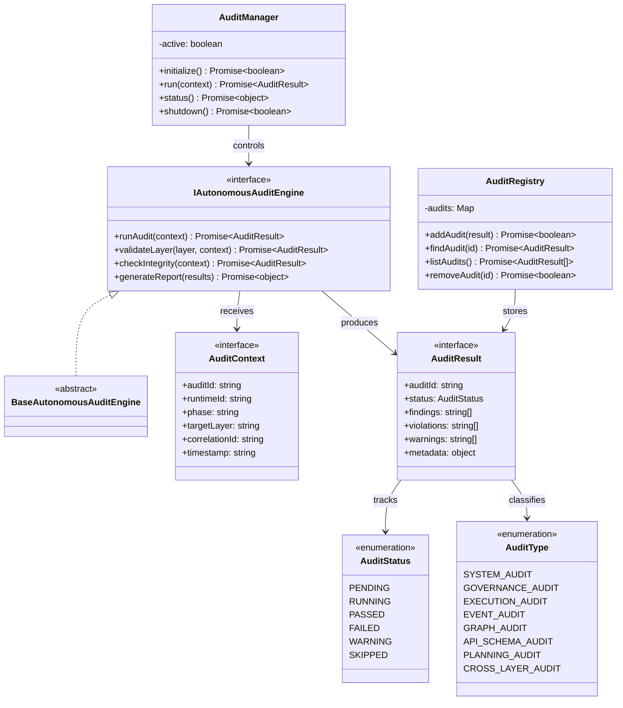

# Autonomous Audit Layer Specification (自律監査レイヤー定義規範)

Version: 1.0.0
Phase: Phase 132 (Autonomous Audit Layer Foundation)
Status: Active

---

## 1. 目的 (Purpose)
本仕様書は、AIOS (Artificial Intelligence Operating System) における自律監査レイヤーの構造・型・契約定義（Blueprint）を規定します。
Knowledge, Governance, Review, Scope, Event, Execution, API Schema, Graph, Planning の全レイヤーを横断的に検証し、整合性・準拠性・構造的正当性を定義するための監査基盤を提供します。

---

## 2. 関係性ダイアグラム (Relationship Diagram)



---

## 3. 監査フローモデル (Audit Flow Model)

```
Graph → Execution → Planning → Event → Governance
                        ↓
                  Audit Layer
                        ↓
                  Audit Report
```

---

## 4. 監査ライフサイクル (Audit Life Cycle)

```
[ PENDING ] ──> [ RUNNING ] ──> [ PASSED ]
                                [ FAILED ]
                                [ WARNING ]
                    │
                    └──> [ SKIPPED ]
```

---

## 5. Cross-Layer 監査モデル (Cross-Layer Audit Model)

### 5.1 監査対象
| レイヤー | 監査観点 |
|---|---|
| Knowledge | 知識の妥当性・整合性 |
| Governance | ポリシー準拠性 |
| Execution | 実行一貫性 |
| Event | イベントトレース整合性 |
| Graph | グラフ構造妥当性 |
| API Schema | スキーマ整合性 |
| Planning | 計画の正当性・依存関係検証 |
| Scope | スコープ強制の正当性 |

### 5.2 Governance 統合
Governance Policy Engine で定義されたポリシーが監査ルールとして機能し、各レイヤーの準拠性を構造的に検証する基盤を提供します。

### 5.3 Event 統合
Event Bus を通じて発生するイベントが監査トレースとして記録され、後方参照可能な構造を提供します。

---

## 6. 将来の実行統合ロードマップ (Future Roadmap)
* **Self-Healing Engine (Phase 133 予定)**: 監査結果に基づき、自動修復・回復処理を行うレイヤーの追加。
* **Autonomous Optimization (Phase 134 予定)**: 監査データを入力として、全レイヤーの最適化を自律実行するレイヤーの追加。
