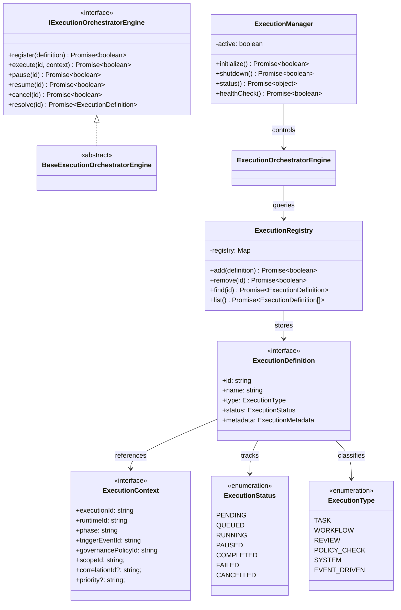

# Autonomous Execution Orchestrator Specification (自律実行オーケストレーター定義規範)

Version: 1.0.0
Phase: Phase 128 (Autonomous Execution Orchestrator Foundation)
Status: Active

---

## 1. 目的 (Purpose)
本仕様書は、AIOS (Artificial Intelligence Operating System) における実行制御の中枢レイヤーとなる **Autonomous Execution Orchestrator** の構造・契約定義（Blueprint）を規定します。
これまで構築されたAIOSの基礎構成要素であるナレッジ・ポリシー・レビュー・スコープ・イベントバスを統合し、イベントトリガーやポリシー評価に基づくタスク実行ライフサイクルを統治・決定する中枢設計を確立します。

---

## 2. 関係性ダイアグラム (Relationship Diagram)
実行オーケストレーターを構成する型・コントロール・エンジンコンポーネントの依存・参照マップ。



---

## 3. 実行状態遷移 (Execution Lifecycle Model)
実行オーケストレーターが管理するステートマシン。

```
[ PENDING ] ──> [ QUEUED ] ──> [ RUNNING ] ──> [ COMPLETED ]
                                  │   ▲
                                  ▼   │
                               [ PAUSED ]
                                  │
                                  ├──> [ CANCELLED ]
                                  │
                                  └──> [ FAILED ]
```

---

## 4. ガバナンスおよびスコープとの結合仕様 (Integration Model)

### 4.1 Policy Integration
Orchestrator はタスクの `execute()` 要求の受付時、`GovernancePolicyEngine` に問い合わせを中継し、ポリシー承認 (`execution.allow`) を得られた場合のみ状態を `RUNNING` へ遷移させます。

### 4.2 Scope Integration
`AIOSResumeScopeControl` が規定するスコープ境界（`allowedPaths` / `forbiddenPaths`）を参照し、実行中のタスクがコンテキスト外の領域へスキャン・読み込みを試みた場合に実行を `CANCELLED` もしくは `FAILED` へ強制遷移させます。

---

## 5. 将来の実行統合ロードマップ (Future Roadmap)
* **APIスキーマアナライザーとの結合 (Phase 129 予定)**:
  本フェーズで確立した実行モデルをもとに、将来的にAPI入出力の整合性チェック処理（Schema Validation）が統合されます。
