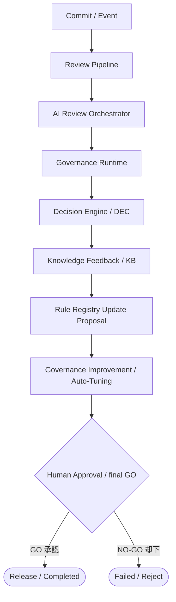
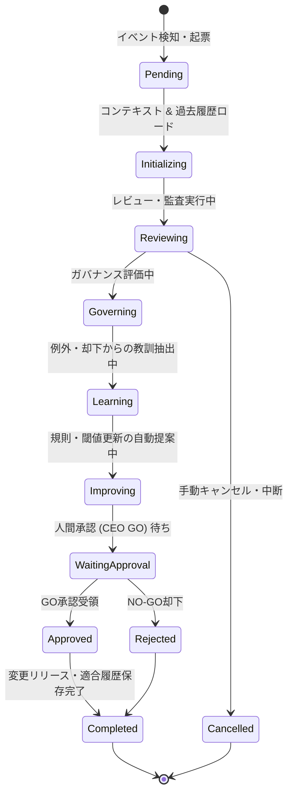
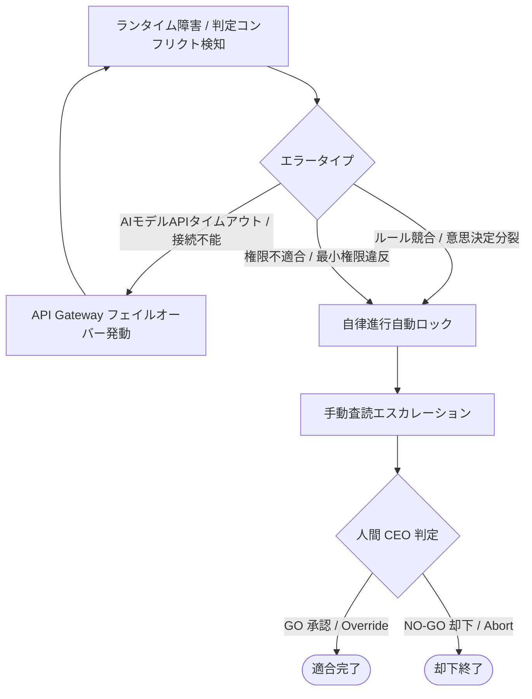

# AIOS Autonomous Governance Specification (自律ガバナンス定義規範)

Version: 1.0.0
Phase: Phase 122 (Autonomous Governance Foundation)
Status: Active

---

## 1. 目的 (Purpose)
本仕様書は、AIOS (Artificial Intelligence Operating System) における品質検査、実行制御、適合評価、APIゲートウェイ抽象、および自己改善フィードバックを結合し、人間最終承認（CEO承認）を頂点ゲートとしながら自律的かつ継続的に監査体制を自己進化させる **Autonomous Governance** の循環構造、ライフサイクル、自己改善ポリシー、および評価指標（Metrics）を規定します。

---

## 2. 自律ガバナンスアーキテクチャ (Autonomous Governance Architecture)
自律ガバナンスは、コードおよび仕様変更イベントを検知してから、適合確認、自動教訓（ナレッジ）抽出、ルール適用の更新提案、そして人間の最終「GO」承認に至る以下の自己改善循環（Self-Improvement Governance Loop）を制御します。

---

## 3. 自律ガバナンスの責務 & 論理モジュール (Responsibilities & Components)

### 3.1 自律ガバナンスの責務
1. **継続的適合評価 (Continuous Review/Governance)**: 変更差分に対するリアルタイムなポリシー監査。
2. **継続的自己改善 (Continuous Learning/Improvement)**: レビュー却下（NO-GO）の根本原因分析（RCA）から抽出した教訓ルールを、次回の検証対象へ動的組み込み提案。
3. **意思決定および監査証跡の完全同期**: すべての自律判定プロセスを Dashboard から読み取り専用で一元追跡可能に統治。

### 3.2 統合論理モジュール (Governance Components)
* **`Governance Controller`**: 自律ガバナンス循環全体の協調・進行制御。
* **`Review Coordinator`**: パイプラインおよび API ゲートウェイ呼び出しの適合確認。
* **`Decision Coordinator`**: 適合結果と意思決定レコード（`DEC`）のデータ連携。
* **`Rule Coordinator`**: 違反検証と、ナレッジからの新規監査ルール昇格の適用提案。
* **`Knowledge Coordinator`**: 重複排除された教訓ナレッジ（`KB`）の蓄積と更新管理。
* **`Runtime Coordinator`**: 実行アクターの権限および実行時適合判定ログの調整。
* **`Audit Coordinator`**: 決定証跡（`DEC`）を不変履歴（`HIS`）へ同期。
* **`Human Approval Coordinator`**: ルール昇格提案やリリース進行を人間の CEO 承認キューへ接続・通知。

---

## 4. 自律ガバナンスコンテキスト (Governance Context Schema)
自己改善ループを通じて各コーディネーターが共有・参照する状態オブジェクト。

* `governance_id`: 自律ガバナンスセッション一意ID（例: `GOV-2026-0001`）。
* `runtime_id` / `orchestration_id`: 紐付く実行・調停ID。
* `context_version`: データ互換バージョン。
* `review_reports`: 収集された `REV` レコードリスト。
* `runtime_results`: ガバナンスランタイム結果 (`RUN`)。
* `decision_records`: 意思決定レコードリスト。
* `applied_rules`: 適用された監査ルールリスト。
* `knowledge_candidates`: 抽出・承認された教訓リスト。
* `audit_records`: 不変アーカイブ履歴リスト。
* `permissions` / `confidence` / `severity`: 実行権限、確信度、および検知された最大重大度。

---

## 5. 自律ガバナンス状態遷移 (Governance Lifecycle)
自律ガバナンスセッションは以下の状態遷移ライフサイクルを持ちます。

---

## 6. 自律改善ポリシー (Autonomous Improvement Policy)
システムが自動評価し、人間に適用を提案（Improvement Proposal）する対象：
* **`Rule Update Candidate`**: 頻発する不具合や DTO 違反（RCA）を検知した際、新規監査ルールとして `Rule Registry` へ追加する提案。
* **`Knowledge Promotion Candidate`**: 評価中の教訓ナレッジの信頼度が `High` となった際、全AIOS共通のベストプラクティスへ昇格させる提案。
* **`Review Optimization Candidate`**: FLASH で十分な検証精度が得られている検査項目について、高額モデル（Gemini, Claude）の呼び出しをバイパスする構成更新の提案。
* **`Cost Optimization Candidate`**: API コストしきい値やレートリミットを自動検知し、モデルの最大割当量や呼び出し順次直列化を変更する提案。

---

## 7. 例外処理およびフォールバック (Exception Handling Policy)
検証不具合発生時のエスカレーション制御。

---

## 8. ガバナンス結果スキーマ & 評価指標 (Result Schema & Metrics)

### 8.1 自律ガバナンス結果スキーマ (Governance Result)
* `governance_id`: 自律ガバナンスセッション一意ID。
* `governance_status`: `Approved | Rejected | Escalated | Cancelled`。
* `governance_score`: 適合評価スコア（0.0 〜 100.0 の適合指数）。
* `confidence` / `severity`: 総合確信度、最高重大度。
* `recommendations`: ルール更新や設定是正の推奨アクション配列。
* 各種アクターID参照（`decision_reference`, `knowledge_reference`, `runtime_reference`, `audit_reference`）。

### 8.2 自律ガバナンス評価指標 (Governance Metrics)
* **`Governance Coverage` (M-GCO)**: 全変更コミットのうち、自律ガバナンスランタイムによる監査評価が完了している割合。
* **`Governance Success Rate` (M-GSR)**: 自動検証から差し戻し（Failed）にならずに、1発合格した適合成功率。
* **`Review Accuracy` (M-RAC)**: AI レビューの判定と、人間の最終査読判定（GO/NO-GO）の適合精度。
* **`Rule Compliance` (M-RCO)**: 各フェーズの成果物が監査ルールを遵守している割合。
* **`Knowledge Growth` (M-KGR)**: 単位期間あたりに蓄積・Published された有効ナレッジ数。
* **`Escalation Rate` (M-ESR)**: 自動検証が中断され、人間へエスカレーションされた比率。
* **`Human Override Rate` (M-HOR)**: AI 警告を人間がオーバーライドして GO 判定した割合。

---

## 9. 将来の実行統合ロードマップ (Future Roadmap)
* **自律ガバナンスコントローラー (tools/specifications/autonomous_governance.json)**:
  将来的に、自律ガバナンスモジュールの結合定義、自己改善の提案しきい値、およびガバナンス適合スコアの重み付けは `autonomous_governance.json` にて定義されます。GitHub Actions ワークフローおよび Git Hook と統合し、開発者のローカル操作をリアルタイムに防衛・評価する実行プログラムを実装します。
