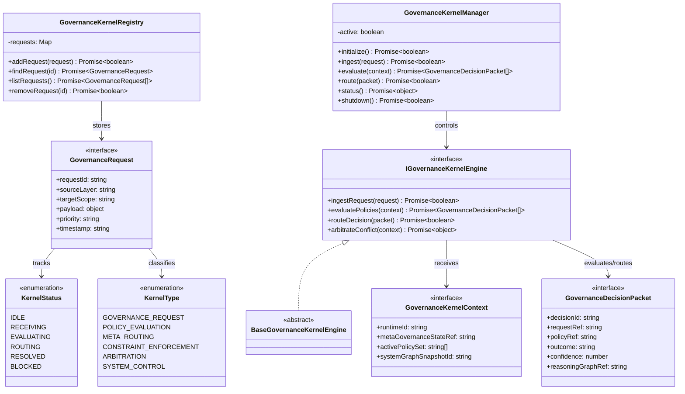

# Autonomous Governance Kernel Specification (自律ガバナンスカーネル定義規範)

Version: 1.0.0
Phase: Phase 137 (Autonomous Governance Kernel Foundation)
Status: Active

---

## 1. 目的 (Purpose)
本仕様書は、AIOS (Artificial Intelligence Operating System) における自律ガバナンスカーネルの構造・型・契約定義（Blueprint）を規定します。
Meta-Governance レイヤーによる統治ポリシーを受け付けるための Request Ingress、各レイヤーへの Decision Routing、ポリシー衝突時の Arbitration（調停）を定義し、システム全体の安全稼働を確保する実行中枢（Kernel）のモデルを提供します。

---

## 2. 関係性ダイアグラム (Relationship Diagram)



---

## 3. カーネル状態遷移モデル (Kernel State Machine)

```
[ IDLE ] ──> [ RECEIVING ] ──> [ EVALUATING ] ──> [ ROUTING ] ──> [ RESOLVED ]
                                                     │
                                                     └──> [ BLOCKED ]
```

---

## 4. 各種統合モデル (Integration Model)

### 4.1 Meta-Governance Integration
カーネルはメタガバナンスレイヤーの直下に位置し、メタガバナンスによって定義されたポリシー（`metaGovernanceStateRef`）に基づいて、リクエスト評価や意思決定の正当性を制約・チェックします。

### 4.2 Audit Integration
カーネルが生成する `GovernanceDecisionPacket` は、監査レイヤー（Audit Layer）が検証可能な監査アーティファクトとして出力されます。

### 5.3 Optimization & Evolution Integration
カーネルのルーティング設計は、最適化エンジンによる提案（シミュレーション）や、自己進化エンジンが提示する進化候補（Evolution Candidate）の情報に基づいて決定論的に評価されます。

---

## 5. 将来の統合ロードマップ (Future Roadmap)
* **Full Autonomous System Kernel Integration (Phase 138 予定)**: 決定事項を実際のファイルシステムやプロセスパーミッションレベルに同期・適用するカーネル実体の結合。
* **Self-Modifying Governance Runtime (Phase 139 予定)**: 自律的に変更適用されたガバナンスルールに則り、動的に自身のランタイムポリシーを最適化する自己変容型ガバナンス。
