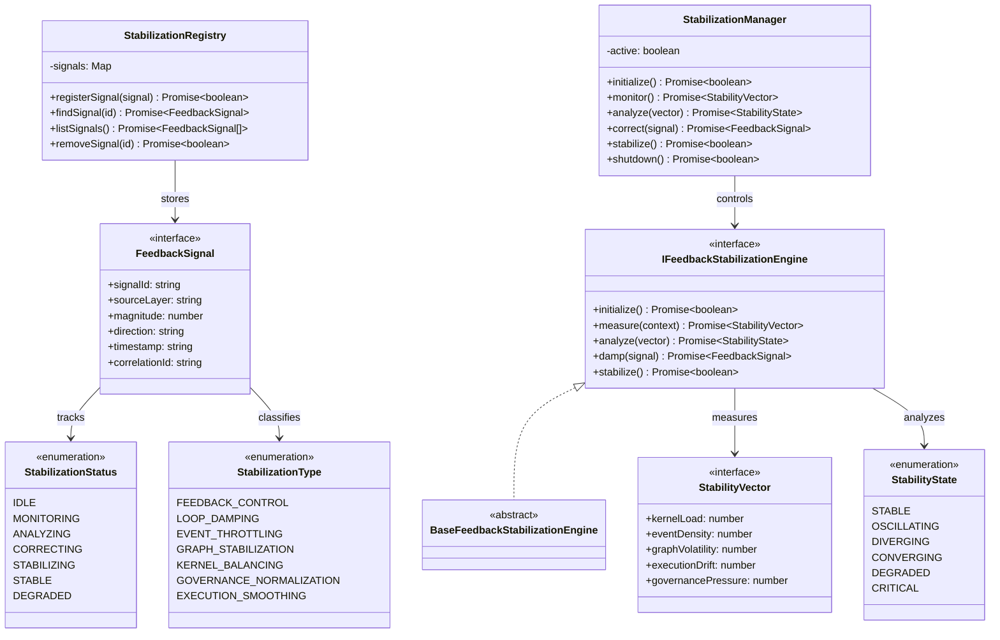

# Autonomous Kernel Feedback Stabilization Specification (自律カーネルフィードバック安定化定義規範)

Version: 1.0.0
Phase: Phase 139 (Autonomous Kernel Feedback Stabilization Engine)
Status: Active

---

## 1. 目的 (Purpose)
本仕様書は、AIOS (Artificial Intelligence Operating System) における自律カーネルフィードバック安定化エンジンの構造・型・契約定義（Blueprint）を規定します。
全15レイヤーが統合された閉ループ制御システム（System Kernel Integration Loop）において発生しうる、フィードバックの自己励起振動、状態不安定、過度なイベント負荷（Event Storm）を論理的に減衰（Damp）・抑制・平滑化し、システム全体を安定的な定常状態へと収束（Converge）させるための制御モデルを提供します。

---

## 2. 関係性ダイアグラム (Relationship Diagram)



---

## 3. フィードバック制御および安定化モデル (Stability Model)

```
System Kernel Event ──> Feedback Signal ──> Stabilization Engine 
                                                │ (Damping/Throttling)
                                                ▼
System Kernel <────────────────────────── Dampened Signal
```

---

## 4. 安定化ライフサイクル (Stabilization Lifecycle)

```
[ IDLE ] ──> [ MONITORING ] ──> [ ANALYZING ] ──> [ CORRECTING ] ──> [ STABILIZING ]
                                                                          │
                                                                          ▼
                                                                      [ STABLE ]
                                                                      [ DEGRADED ]
```

---

## 5. 各種統合モデル (Integration Model)

### 5.1 Feedback Signal Analysis (フィードバックシグナル分析)
カーネルから送られてくるシステム全体の負荷やイベントフロー情報を `FeedbackSignal` および `StabilityVector` として収集し、現在のループ状態が安定域内にあるか（振幅が増幅していないか）を測定（`measure`）します。

### 5.2 Volatility Damping & Throttling (揮発性減衰・流量調整)
* **イベント流量制限（Event Throttling）**: 発生密度が高すぎるイベントメッセージの流量を論理的に平滑化します。
* **グラフ揮発性減衰（Graph Volatility Damping）**: 実行グラフの頻繁すぎる接続構造変化を抑制します。
* **実行平滑化（Execution Smoothing）**: プロセス制御の激しい切り替え周期を緩和します。

### 5.3 安定化シグナル適用 (Dampened Signals)
減衰されたシグナルを統合カーネル（System Kernel）へフィードバックすることで、状態遷移ループ全体が発散（Diverging）するのを防ぎ、システムを安定コンバージさせます（論理設計のみで、実際の適用処理は含みません）。

---

## 6. 将来の統合ロードマップ (Future Roadmap)
* **Autonomous Self-Regulating Kernel Runtime (Phase 140 予定)**: 安定化エンジンが定義した減衰量・流量制御ポリシーに従い、物理リソースやメッセージキューの稼働状態を動的・自己調整するランタイム実装。
* **Self-Converging AIOS Architecture (Phase 141 予定)**: 異なる AI エージェント群が協調して動作する際の動的スケジューリングの自律収束最適化レイヤー。
