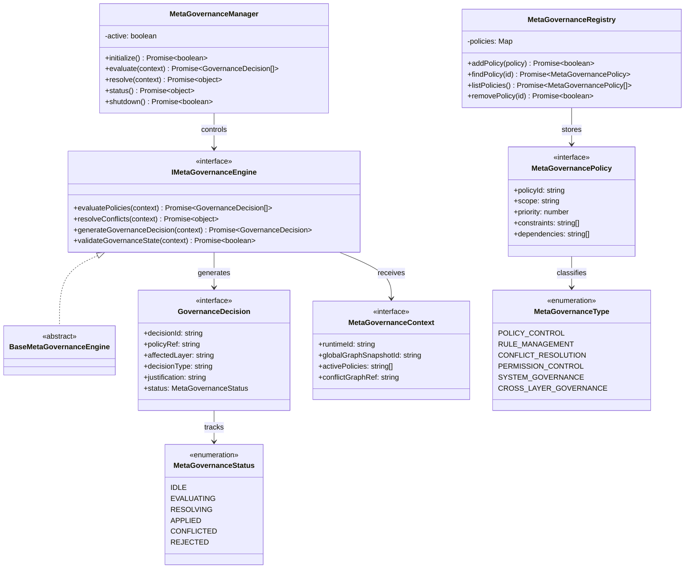

# Autonomous Meta-Governance Engine Specification (自律メタガバナンスエンジン定義規範)

Version: 1.0.0
Phase: Phase 136 (Autonomous Meta-Governance Engine Foundation)
Status: Active

---

## 1. 目的 (Purpose)
本仕様書は、AIOS (Artificial Intelligence Operating System) における自律メタガバナンスエンジンの構造・型・契約定義（Blueprint）を規定します。
ガバナンスポリシー、監査ルール、進化制約、最適化ルール、および実行パーミッションそのものを管理し、ルール同士の衝突回避・優先決定を行うための「統治の統治（Meta-Governance）」モデルを提供します。

---

## 2. 関係性ダイアグラム (Relationship Diagram)



---

## 3. メタガバナンス制御フロー (Meta-Governance Control Flow)

```
       Governance Layer
              ↓
    Meta-Governance Layer (Overrides/Coordinates)
              ↓
      All System Layers
```

---

## 4. 競合・意思決定ライフサイクル (Decision Lifecycle)

```
[ IDLE ] ──> [ EVALUATING ] ──> [ RESOLVING ] ──> [ APPLIED ]
                                                    ├──> [ CONFLICTED ]
                                                    └──> [ REJECTED ]
```

---

## 5. 各種統合モデル (Integration Model)

### 5.1 Governance Layer Overrides (ガバナンスレイヤー制御)
メタガバナンスレイヤーは、標準ガバナンスルールそのものを調整・変更するポリシーを統括し、ルール間の優先度を定義します（論理定義のみでランタイム強制は行いません）。

### 5.2 Audit & Optimization Integration
* **監査との連携**: 監査検出された不整合シグナルをもとに、ポリシー適用競合を検出し（`resolveConflicts`）、意思決定案（`GovernanceDecision`）を策定します。
* **最適化制約**: 最適化計画がメタポリシーに反しないか検証します。

### 5.3 Evolution Integration (自己進化検証)
自己進化によって提示される進化候補（Evolution Proposal）の実行可否判断基準を定義します。

---

## 6. 将来の統合ロードマップ (Future Roadmap)
* **Full Autonomous Governance Kernel (Phase 137 予定)**: 決定されたメタガバナンス決定案を実システムおよび実ポリシー定義ファイルにコミットするカーネル設計。
* **Self-Modifying Policy Simulation (Phase 138 予定)**: 進化・メタガバナンスに基づいたポリシー改変の自動シミュレーション。
