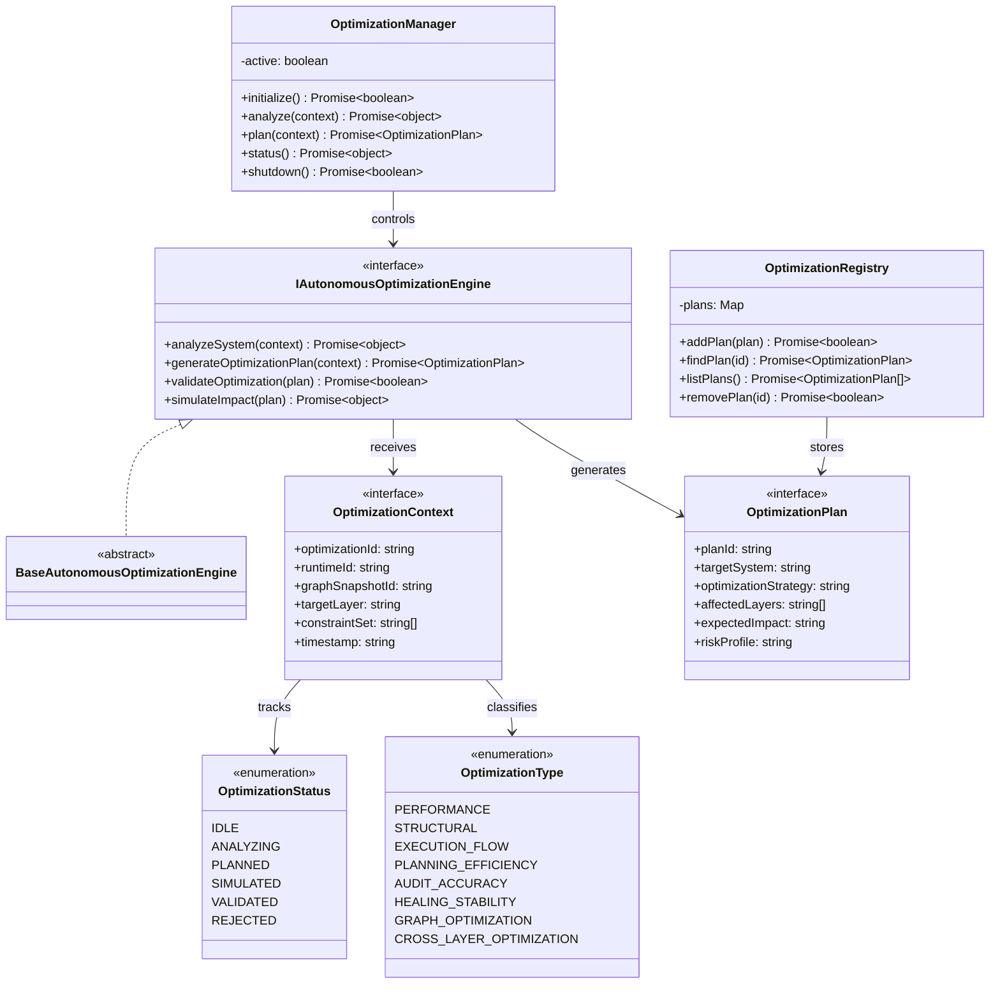

# Autonomous Optimization Engine Specification (自律最適化エンジン定義規範)

Version: 1.0.0
Phase: Phase 134 (Autonomous Optimization Engine Foundation)
Status: Active

---

## 1. 目的 (Purpose)
本仕様書は、AIOS (Artificial Intelligence Operating System) における自律最適化エンジンの構造・型・契約定義（Blueprint）を規定します。
Audit, Healing, Planning, Execution, Graph, Event, Governance などの全レイヤーの出力を対象に、システム全体（実行効率、計画品質、監査精度、修復安定性など）を最適化するための構造定義モデルを提供します。

---

## 2. 関係性ダイアグラム (Relationship Diagram)



---

## 3. 最適化フローモデル (Optimization Flow Model)

```
Graph → Execution → Planning → Audit → Healing → Optimization Layer → (No Execution)
```

---

## 4. 最適化ライフサイクル (Optimization Lifecycle)

```
[ IDLE ] ──> [ ANALYZING ] ──> [ PLANNED ] ──> [ SIMULATED ] ──> [ VALIDATED ]
                                                    │
                                                    └──> [ REJECTED ]
```

---

## 5. 統合モデル (Integration Model)

### 5.1 Cross-layer Optimization
システム上のすべてのレイヤー（データ構造、実行フロー、監査ルール等）が最適化対象（Optimization Target）として抽象化され、一貫したアプローチで分析されます。

### 5.2 Graph Integration (グラフ統合)
System Execution Graph に定義されたノードの重み・依存エッジの組み換え候補を論理的に算出（`OptimizationTargetGraph`）するための設計を提供します。

### 5.3 Audit & Healing Integration
* **監査との連携**: 最適化計画は Audit の制約（`constraintSet`）に基づいて定義され、ポリシー違反を引き起こさないように設計されます。
* **自己修復との連携**: 過去の修復履歴を分析し、修復プランの有効性を向上させるための最適化方針を定義します。

---

## 6. 将来の統合ロードマップ (Future Roadmap)
* **Self-Evolving AIOS Core (Phase 135 予定)**: 概念実証された最適化・修復構造に基づき、実行環境自身がその構造や仕様を自律的に書き換えるコアアーキテクチャ。
* **Autonomous Governance Closure Loop (Phase 136 予定)**: ガバナンスによる自己フィードバックループ。
