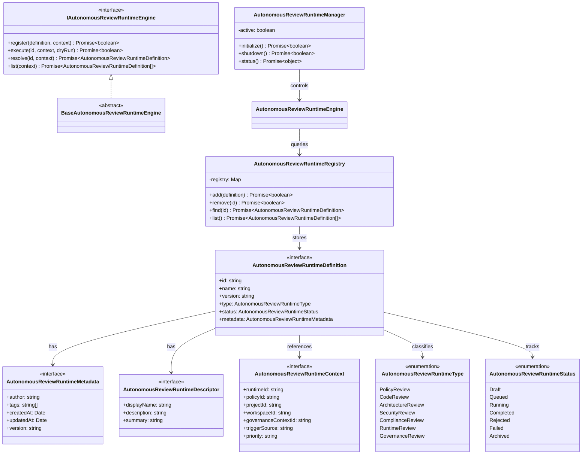

# AIOS Autonomous Review Runtime Specification (自律レビューランタイム定義規範)

Version: 1.0.0
Phase: Phase 125 (Autonomous Review Runtime Foundation)
Status: Active

---

## 1. 目的 (Purpose)
本仕様書は、AIOS (Artificial Intelligence Operating System) における自律レビュー処理を統治する **Autonomous Review Runtime** のデータ抽象および構造インターフェースを規定します。
本設計は将来、AI レビュアーの呼び出し、ポリシーエンジン（Governance Policy Engine）による評価チェック、および最終判断（Decision Engine）への接続を統合するための論理ランタイム適合規約を提供します。

---

## 2. 関係性ダイアグラム (Relationship Diagram)
自律レビューランタイムを構成する型・コントロール・エンジンコンポーネントの依存・参照マップ。

---

## 3. コンポーネント定義 (Component Overview)

### 3.1 IAutonomousReviewRuntimeEngine & BaseAutonomousReviewRuntimeEngine
* **概要**: レビューランタイムのエントリーポイント。`register`, `execute`, `resolve`, `list` の各インターフェースシグネチャを規定し、レビューの起動および検索のための統一手段を提供します。
* **ドライラン対応**: 将来のレビュー結果評価のシミュレーション用に、`execute` メソッドは引数として `dryRun?: boolean` オプションを受け入れる契約を持ちます。

### 3.2 AutonomousReviewRuntimeRegistry
* **概要**: レビュー定義（AutonomousReviewRuntimeDefinition）をインメモリ保持し、追加・削除・照会を実行するインデックスレジストリ。

### 3.3 AutonomousReviewRuntimeManager
* **概要**: レビュープロセスのサービス初期化、破棄、ステータス監視を実行するライフサイクルコントローラー。

### 3.4 AutonomousReviewRuntimeDefinition
* **概要**: レビューの主要定義構造。ID、名前、バージョン、およびメタデータを包含した基本データスキーマ。

### 3.5 AutonomousReviewRuntimeContext
* **概要**: レビュー時に参照・バインドされる環境条件を表すコンテキストモデル。実行時の起動トリガー元（`triggerSource`）や優先度（`priority`）などのパラメータをサポートします。

---

## 4. 将来の実行統合ロードマップ (Future Roadmap)
* **AI レビューオーケストレーションの統合 (Phase 125 以降)**:
  本フェーズで確立したレビュー定義契約に基づき、将来的に `AutonomousReviewRuntimeEngine` が拡張されます。これにより、コードコミットやシステムイベントの検出時にポリシー適合エンジン（Governance Policy Engine）をロードし、複数の AI レビュアー（Flash、Gemini、Claude 等）を協調評価（Orchestration）させるための実行フローが統合されます。
