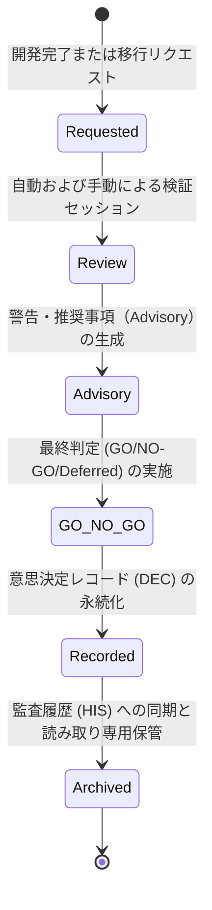

# AIOS Decision Model Specification (意思決定プロセス・レコード定義規範)

Version: 1.0.0
Phase: Phase 111 (Decision Model Foundation)
Status: Active

---

## 1. 目的 (Purpose)
本仕様書は、AIOS (Artificial Intelligence Operating System) における開発フェーズ進行、規約監査、インシデント是正、および本番適用のすべてのフェーズで利用される意思決定（Decision）の分類、プロセスフロー、レコードスキーマ、およびアクター（人間・AI）ごとの承認権限を規定します。これにより、意思決定の完全な追跡性（Decision Traceability）を担保します。

---

## 2. 意思決定種別 (Decision Types)
AIOS で生成・処理される意思決定判定は、以下の種別に分類されます。

* **`GO` (承認・進行許可)**:
  * 計画、変更、またはリリース適用を許可します。実装ステージや本番展開への進行が可能となります。
* **`NO-GO` (却下・進行不可)**:
  * 不適合や重大な違反が検知され、却下された状態。直ちに差分を破棄し、前段フェーズ（計画・設計）へ差し戻します。
* **`Review Required` (要手動査読)**:
  * 自動検証では可否が判定しきれず、または警告項目（Warning）が検出され、追加の人間または上位AIによる監査が必要な状態。
* **`Deferred` (保留)**:
  * 必要情報が不足しているため判断を保留し、後続タスクや追加エビデンスの提出を待つ状態。
* **`Advisory` (助言提示)**:
  * 警告やブロックは行わず、実装に向けたガイダンスやベストプラクティスの推奨事項のみを提示する状態。

---

## 3. 意思決定ライフサイクル (Decision Lifecycle)
意思決定レコードが生成され、評価、判定、記録、アーカイブされるまでのライフサイクル状態遷移は以下の通り規定されます。



1. **Requested (申請中)**: 開発AIが実装計画書の完了、または実装の検証合格を受け、次フェーズへの移行を申請した初期状態。
2. **Review (レビュー中)**: 各種監査AI（Flash, Gemini, Claude）および人間が、検証データ・計画書を査読している状態。
3. **Advisory (助言出力)**: ルールに照らして検出されたリスクや推奨事項（アドバイザリ）が生成された状態。
4. **GO/NO-GO (判定確定)**: レビュアーの署名を伴って、最終的な判定が確定した状態。
5. **Recorded (記録済)**: `DEC-YYYY-NNNN` のIDで意思決定レコードがファイルに書き出された状態。
6. **Archived (アーカイブ済)**: 監査履歴 (`HIS-YYYY-NNNN`) に連携され、不変の過去レコードとして長期保管に入った状態。

---

## 4. 意思決定レコードスキーマ (Decision Record Schema)
永続化されるすべての意思決定データは、以下のプロパティ定義に完全に従って記録されます。

| 属性名 (Field) | 型 (Type) | 説明 (Description) |
|---|---|---|
| `Decision ID` | String | 意思決定の一意な不変識別ID。`DEC-YYYY-NNNN` の命名規則に従う。例: `DEC-2026-0001` |
| `Decision Type` | Enum | 判定種別（`GO`, `NO-GO`, `Review Required`, `Deferred`, `Advisory`）。 |
| `Decision Status` | Enum | オブジェクトの状態（`Proposed`, `Waiting Review`, `Approved`, `Active`, `Archived`）。 |
| `Reviewer` | String | 最終判定を行った人間の署名、または承認システム名（例: `岩佐CEO`）。 |
| `Review Agent` | Enum | レビューを支援・実行したAIエージェントID（`FLASH`, `GEMINI_PRO`, `OPUS`, `HUMAN`, `SYSTEM`）。 |
| `Decision Reason` | String | その判定（または却下・オーバーライド）に至った詳細な技術的理由。 |
| `Evidence` | List[String] | 判定の根拠となった検証ログ、テスト適合率、または差分チェック結果。 |
| `Related Rule IDs` | List[String] | 意思決定に影響を与えた `RuleRegistry.md` 内のルールIDリスト。 |
| `Related Incident IDs` | List[String] | 意思決定で解決・参照された `IncidentRegistry.md` 内のインシデントIDリスト。 |
| `Related History IDs` | List[String] | 本決定に関連する `AuditHistory.md` 内の履歴IDリスト。 |
| `Related Knowledge IDs` | List[String] | 参照された、または本決定から抽出されるナレッジIDリスト。 |
| `Timestamp` | DateTime | 意思決定が確定した日時（ISO-8601 UTC形式）。例: `2026-07-01T05:20:00Z` |
| `References` | List[String] | 計画書、仕様書、または関連チケットへのリンク。 |

---

## 5. 承認権限マトリクス (Decision Authority Matrix)
各アクター（人間およびAI）が実行できる意思決定判定の境界を定義します。

| アクター (Actor) | Advisory | GO (Normal) | GO (Critical Override) | NO-GO | Deferred |
|---|---|---|---|---|---|
| **Human Reviewer** (岩佐CEO) | ◯ (可能) | ◯ (可能) | ◯ (可能) | ◯ (可能) | ◯ (可能) |
| **Claude Opus 4.6** (CIE Auditor) | ◯ (可能) | ◯ (可能) | ✕ (禁止) | ◯ (可能) | ◯ (可能) |
| **Gemini 3.1 Pro** (Design Reviewer) | ◯ (可能) | ◯ (可能) | ✕ (禁止) | ◯ (可能) | ◯ (可能) |
| **Flash 3.5** (Self Reviewer) | ◯ (可能) | ✕ (禁止) | ✕ (禁止) | ◯ (可能) | ✕ (禁止) |

* **人間最優先の原則 (Human Final Approval First)**:
  * AIOS における重大な設計変更、リリース判定、および `Critical` 警告が発生している場合のオーバーライド承認は、常に人間（Human Reviewer）の最終承認（GO）を必須とし、AIのみでの進行は一切許可されません。
* **Flashの権限制限**:
  * Flash 3.5 はセルフチェックおよび警告（NO-GO/Advisory）の出力のみを権限とし、フェーズの「GO」判定を単独で下すことは禁止されます。

---

## 6. 意思決定確信度 (Decision Confidence)
収集された検証証拠（エビデンス）の網羅性に基づき、意思決定に対する確信度レベルが自動評価されます。

* **High (高確信度)**:
  * 必要な静的解析、DTO整合性、シリアライズ検証、および pytest ユニットテストがすべて 100% PASS しており、警告が一件もない状態。
* **Medium (中確信度)**:
  * 検証テストはPASSしているが、一部ドキュメントの記述漏れや非推奨（Deprecated）ルールの警告（Warning）が含まれている状態。
* **Low (低確信度)**:
  * 重大なインシデント（Critical）が現在も未解決であるか、あるいは手動検証がスキップされている暫定状態。
* **Unknown (未確定)**:
  * 検証エビデンスが不足しており、適合性が未判定の状態。

---

## 7. 双方向トレーサビリティ (Decision Traceability)
すべての意思決定レコードは、以下の図のように他の AIOS 成果物データベースとIDベースで相互参照可能に構成されます。

```
                    Rule Registry (Rule ID)
                             ▲
                             │
  Incident Registry ◄───► Decision Record ◄───► Audit History (History ID)
    (Incident ID)        (Decision ID)
                             ▲
                             │
                             ▼
                    Knowledge Base (Knowledge ID)
```

このトレーサビリティにより、ある意思決定（`DEC-2026-0001`）が「どのルール（`CLI-001`）に基づき」、「どの障害（`INC-2026-0001`）を考慮して」、「どの監査証跡（`HIS-2026-0001`）と紐付き」、「どの教訓（`KB-2026-0001`）を生み出したか」を瞬時に逆引きすることが可能になります。

---

## 8. 将来の自動化ロードマップ (Future Automation)
* **意思決定の自動登録 (tools/specifications/decision_model.json)**:
  将来的に、意思決定モデルのスキーマおよび各アクターの承認判定スキーマは `decision_model.json` としてエクスポートされます。これにより、CIE 実行プラットフォームがコミット時やフェーズ完了時に、承認データ（JSON）のフォーマットとレビュアー署名を自動検証し、承認なきプッシュを水際で弾くフック処理を実装します。
