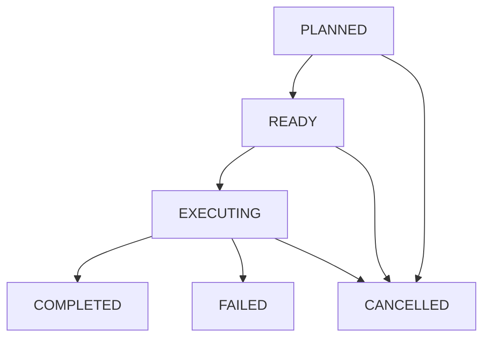

# Development Execution Ledger Specification

## 1. Overview
Execution Ledger は、Development OS におけるすべての開発活動（Capability, Skill, Pipeline）の計画、遷移状態、および実行結果を管理する不変な監査台帳（Ledger）です。  
Execution Ledger は監査の Single Source of Truth (SSOT) として機能し、後続の Quality Gate (Phase 200-7) による自動品質評価の唯一のインプット情報源となります。

---

## 2. Core Concepts & Enums

### 2.1 ExecutionState (Enum)
開発活動のフェーズ遷移状態を定義します。
* `PLANNED`: 実行計画段階。
* `READY`: 実行準備完了。
* `EXECUTING`: 実行中。
* `COMPLETED`: 正常終了（成功）。
* `FAILED`: 異常終了（失敗）。
* `CANCELLED`: 実行キャンセル。

### 2.2 State Transition Validation (状態遷移の整合性規則)
状態遷移は一方通行かつ論理的な遷移規則に従わなければなりません。

不正な状態遷移（例: `COMPLETED` から `EXECUTING` や `PLANNED` から直接 `COMPLETED`）が検出された場合、バリデータは `INVALID_EXECUTION_STATE_TRANSITION` エラーをスローします。

---

## 3. Data Structure & Metadata

### 3.1 ExecutionRecord (監査レコード)
* **`executionId`**: `ledger-1`, `ledger-2` 等の単調増加ID。
* **`ledgerVersion`**: レコード自身のメタデータバージョン。
* **`description`**: 実行の概要説明。
* **`capabilityId`**: 親 Capability の ID。
* **`pipelineId`**: 関連付けられた SkillPipeline の ID。
* **`skillIds`**: 実行される Skill ID のリスト。
* **`executionState`**: `ExecutionState` の Enum 値。
* **`timestamp`**: ISO8601形式の基準タイムスタンプ。
* **`version`**: 仕様バージョン。
* **`createdAt`**: レコード生成日時（ISO8601形式）。
* **`updatedAt`**: レコード最終更新日時（ISO8601形式）。
* **`auditTrail`**: 監査イベント履歴（`string[]`）。

### 3.2 Immutability (不変性の確保)
* 生成された `ExecutionRecord` は、`Object.freeze()` によって全体および `skillIds` / `auditTrail` の各配列要素を含めて完全に凍結されます。
* 状態の遷移（State Transition）は、古い不変オブジェクトから、状態と `updatedAt`、`auditTrail` が更新された新しい不変オブジェクトを生成し、レジストリ内のエントリーを完全置換（Re-create）する形でのみ行われます。
