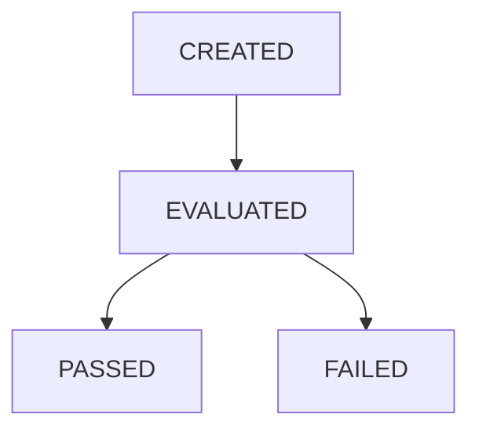

# Development Quality Gate Specification

## 1. Overview
Quality Gate は、Execution Ledger (Phase 200-6) の監査証跡を入力として、Development OS 全体の品質条件の適否を決定論的に評価および保持する不変な品質評価基盤です。  
Quality Gate は品質ステータスの Single Source of Truth (SSOT) として機能し、後続の具象ツールアダプターやリリースプロセスが参照する唯一の基準ゲートとなります。

---

## 2. Core Concepts & Enums

### 2.1 QualityGateState (Enum)
品質判定のフェーズ遷移状態を定義します。
* `CREATED`: 初期作成段階（評価未実施）。
* `EVALUATED`: 評価完了（適否判定の途中状態）。
* `PASSED`: 品質合格。
* `FAILED`: 品質不合格。

### 2.2 State Transition Validation (状態遷移規則)
品質評価状態は以下の遷移順序に厳格に従わなければなりません。

逆方向の遷移（例: `PASSED` から `CREATED`）や不正な状態スキップ（例: `CREATED` から直接 `PASSED`）が検知された場合、バリデータは `INVALID_GATE_STATE_TRANSITION` エラーをスローします。

### 2.3 Evaluation Criteria (品質適合評価規則)
評価段階で集計された違反（Violation）数に基づき、passed フィールドの適否を評価します。
* **Critical > 0 または Major > 0**: 品質不合格となり、`passed = false` となり `FAILED` 状態へ遷移。
* **Critical = 0 かつ Major = 0**: 品質合格となり、`passed = true` となり `PASSED` 状態へ遷移。
* **Minor > 0**: Minor 違反は記録されるのみであり、合格判定には直接影響しません。

---

## 3. Data Structure & Metadata

### 3.1 QualityGateRecord (品質判定レコード)
* **`gateId`**: `gate-1`, `gate-2` 等の単調増加ID。
* **`gateVersion`**: ゲートの内部スキーマバージョン。
* **`description`**: 判定フローの説明。
* **`ledgerId`**: 参照先 `ExecutionRecord` の ID。
* **`criticalCount`**: 重大違反検出数。
* **`majorCount`**: 主要違反検出数。
* **`minorCount`**: 軽微違反検出数。
* **`passed`**: 合否フラグ（Boolean）。
* **`evaluationState`**: `QualityGateState` の Enum 値。
* **`evaluationSummary`**: 集計の文字列表現（例: `"0 Critical / 0 Major / 2 Minor"`）。
* **`ruleVersion`**: 適用された品質評価ルールのバージョン（例: `"1.0.0"`）。
* **`auditSource`**: 品質評価の対象監査元（デフォルトは `"EXECUTION_LEDGER"`）。
* **`createdAt`**: レコード生成日時（ISO8601形式）。
* **`updatedAt`**: レコード最終更新日時（ISO8601形式）。
* **`version`**: 仕様バージョン。
