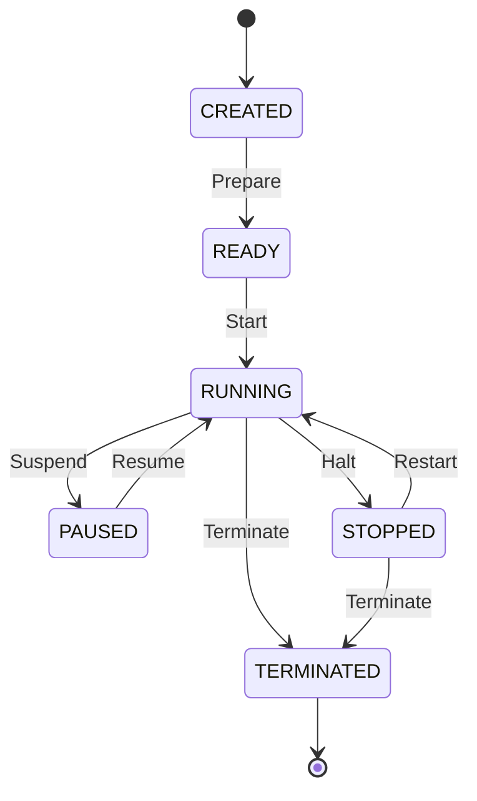

# Development Runtime Foundation Specification

This document defines the core architecture, data schemas, validation rules, and structural boundaries for the **Development Runtime Foundation** within the AIOS (Advanced Agentic Operating System).

---

## 1. Overview & Core Philosophy

The **Development Runtime** represents the logical execution context and state of tasks running within the Development OS. It acts as the structural foundation for context preservation, runtime safety, and telemetry.

At this foundation phase:
* **No Code Execution**: The Runtime does not execute code, handle LLM calls, run shell commands, or manage active processes. It strictly defines the data structures and lifecycle states of execution environments.
* **Immutability (Object.freeze)**: All registry records and view models are strictly immutable.
* **Determinism**: Runtime IDs are assigned sequentially and deterministically (`runtime-1`, `runtime-2`).
* **Zero External Dependencies**: The foundation has no external runtime dependencies.

---

## 2. Data Models & Schemas

### 2.1 RuntimeState
The operational lifecycle state of the runtime environment.

```typescript
export enum RuntimeState {
  CREATED    = 'CREATED',     // Created context
  READY      = 'READY',       // Ready to execute
  RUNNING    = 'RUNNING',     // Actively executing processes
  PAUSED     = 'PAUSED',      // Temporarily suspended, state preserved
  STOPPED    = 'STOPPED',     // Stalled or manually halted
  TERMINATED = 'TERMINATED'   // Gracefully ended/cleaned up
}
```

### 2.2 RuntimeMode
The configuration mode of the execution environment.

```typescript
export enum RuntimeMode {
  MANUAL    = 'MANUAL',     // Manual interactive environment
  AUTOMATIC = 'AUTOMATIC',  // Autonomous scheduler execution
  SANDBOX   = 'SANDBOX'    // Safe simulation environment
}
```

### 2.3 RuntimeRecord
The core immutable configuration and state record for a runtime context.

```typescript
export interface RuntimeRecord {
  readonly runtimeId: string;                     // Unique identifier (runtime-\d+)
  readonly runtimeName: string;                   // Human-readable name
  readonly runtimeState: RuntimeState;             // Lifecycle state
  readonly runtimeMode: RuntimeMode;               // Execution mode
  readonly description: string;                   // Description of the runtime context
  readonly version: string;                       // Semantic version of the runtime spec
  readonly createdAt: string;                     // ISO8601 creation timestamp
  readonly updatedAt: string;                     // ISO8601 update timestamp
}
```

### 2.4 RegistryMetadata
Metadata describing the registry itself.

```typescript
export interface RegistryMetadata {
  readonly registryId: string;
  readonly registryVersion: string;
  readonly createdAt: string;
  readonly updatedAt: string;
}
```

---

## 3. Structural Integrity & Validation Rules

To prevent corrupted states, the `RuntimeValidator` enforces the following validation checks:

1. **ID Format**: `runtimeId` must match the regular expression `/^runtime-\d+$/`.
2. **State Validation**: `runtimeState` must be a valid member of the `RuntimeState` Enum.
3. **Mode Validation**: `runtimeMode` must be a valid member of the `RuntimeMode` Enum.
4. **Version Semantics**: `version` must be a non-empty string matching standard semantic version formats.
5. **Date Semantics**: `createdAt` and `updatedAt` must be valid ISO8601 date-time strings.
6. **No Duplicates**: `RuntimeRegistry` rejects registrations with duplicate `runtimeId` values.

---

## 4. Lifecycle Transitions

Runtimes must transition logically through their lifecycle states:



---

## 5. Dependency Boundary & Rules

* **Strict GET Layering**: Higher-level operations query runtime status solely via the `RuntimeRegistry`.
* **No Autonomous Evolution**: Runtimes are configured strictly by definition files or explicit control inputs. Auto-tuning, AI-driven state shifting, or direct process hooks are prohibited in this layer.
* **Separation of Concerns**: Actual execution mechanisms (Schedules, Queues, Contexts) are handled in downstream Phase 202 sub-phases.

