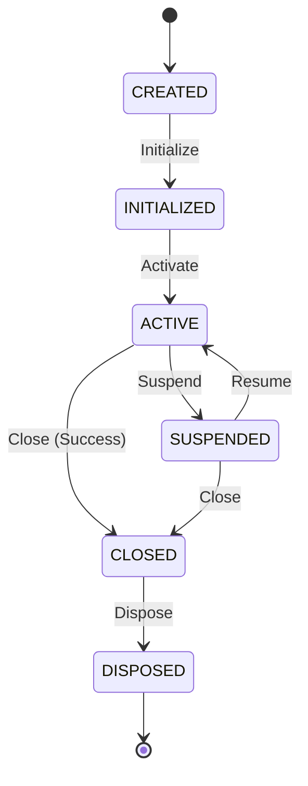

# Development Runtime Context Foundation Specification

This document defines the core architecture, data schemas, validation rules, and structural boundaries for the **Development Runtime Context Foundation** within the AIOS (Advanced Agentic Operating System).

---

## 1. Overview & Core Philosophy

The **Development Runtime Context** represents the logical operational state (context) of a task execution context associated with a Runtime Session. It encapsulates context lifecycle status, metadata, and referential integrity links back to the parent session.

At this foundation phase:
* **No Process Control**: The Runtime Context does not manage session execution, execute commands, run tools, or handle active AI agent states. It strictly represents data models and validation constraints.
* **Immutability (Object.freeze)**: All context records and view models are strictly immutable.
* **Determinism**: Context IDs are assigned sequentially and deterministically (`context-1`, `context-2`).
* **Zero External Dependencies**: The foundation has no external runtime dependencies.

---

## 2. Data Models & Schemas

### 2.1 RuntimeContextState
The logical operational state of a runtime context.

```typescript
export enum RuntimeContextState {
  CREATED     = 'CREATED',     // Context instantiated
  INITIALIZED = 'INITIALIZED', // Context initialized, ready for activation
  ACTIVE      = 'ACTIVE',      // Active operational state
  SUSPENDED   = 'SUSPENDED',   // Execution paused, context preserved
  CLOSED      = 'CLOSED',      // Cleanly finalized
  DISPOSED    = 'DISPOSED'     // Garbage collected or removed
}
```

### 2.2 Context (Record)
The core immutable configuration and state record for a logical execution context.

```typescript
export interface Context {
  readonly contextId: string;                     // Unique identifier (context-\d+)
  readonly contextName: string;                   // Human-readable name
  readonly sessionId: string;                     // Parent Session ID (session-\d+)
  readonly description: string;                   // Description of the context
  readonly contextVersion: string;                // Context-specific specification version
  readonly state: RuntimeContextState;            // Current context lifecycle state
  readonly createdAt: string;                     // ISO8601 creation timestamp
  readonly updatedAt: string;                     // ISO8601 update timestamp
  readonly version: string;                       // Semantic version of the context spec
}
```

### 2.3 RegistryMetadata
Metadata describing the registry itself.

```typescript
export interface RegistryMetadata {
  readonly registryId: string;
  readonly registryVersion: string;
  readonly createdAt: string;
  readonly updatedAt: string;
}
```

---

## 3. Structural Integrity & Validation Rules

To prevent corrupted states, the `RuntimeContextValidator` enforces the following validation checks:

1. **ID Format**: `contextId` must match the regular expression `/^context-\d+$/`.
2. **State Validation**: `state` must be a valid member of the `RuntimeContextState` Enum.
3. **Referential Integrity**: `sessionId` must refer to an existing session registered in the `RuntimeSessionRegistry` (`INVALID_SESSION_REFERENCE`).
4. **Time Semantics**: `createdAt` and `updatedAt` must be valid ISO8601 date-time strings, and `createdAt <= updatedAt` (`INVALID_CONTEXT_DATE`).
5. **Version Semantics**: `version` and `contextVersion` must be non-empty strings matching standard semantic version formats (`INVALID_CONTEXT_VERSION`).
6. **No Duplicates**: `RuntimeContextRegistry` rejects registrations with duplicate `contextId` or `contextName` values (`DUPLICATE_CONTEXT`).

---

## 4. Lifecycle Transitions

Contexts must transition logically through their lifecycle states:



---

## 5. Dependency Boundary & Rules

* **Strict GET Layering**: Higher-level operations query context status solely via the `RuntimeContextRegistry`.
* **No Autonomous Evolution**: Contexts are configured strictly by control inputs or configuration definitions. Auto-tuning, AI-driven state shifting, or process overrides are prohibited in this layer.
* **Separation of Concerns**: Actual execution orchestrations (Queues, Schedulers, Context state changes) are handled in downstream Phase 202 sub-phases.
