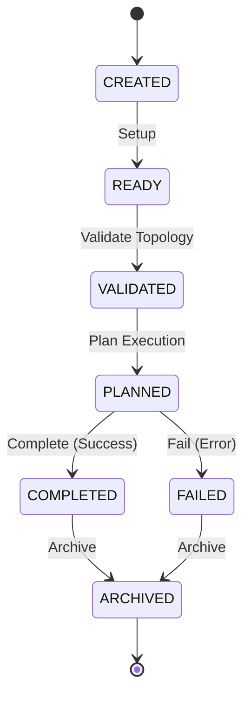

# Development Runtime Execution Graph Specification

This document defines the core architecture, data schemas, validation rules, and structural boundaries for the **Development Runtime Execution Graph Foundation** within the AIOS (Advanced Agentic Operating System).

---

## 1. Overview & Core Philosophy

The **Development Runtime Execution Graph** represents the logical sequential/parallel execution flow and plan relationships associated with the runtime environment. It models graph structure via registered Plan ID references, lifecycle state, and topological verification.

At this foundation phase:
* **No Dynamic Execution**: The Execution Graph does not schedule, dispatch, run processes, parallelize runs, optimize paths, or run tasks. It strictly models execution graph schemas, states, and validation constraints.
* **Immutability (Object.freeze)**: All graph records and view models are strictly immutable.
* **Determinism**: Graph IDs are assigned sequentially and deterministically (`graph-1`, `graph-2`).
* **Zero External Dependencies**: The foundation has no external runtime dependencies.

---

## 2. Data Models & Schemas

### 2.1 RuntimeExecutionGraphState
The logical state of an execution graph.

```typescript
export enum RuntimeExecutionGraphState {
  CREATED   = 'CREATED',   // Graph instantiated
  READY     = 'READY',     // Prepared for scheduling
  VALIDATED = 'VALIDATED', // Validated topology structure
  PLANNED   = 'PLANNED',   // Plans scheduled / resolved
  COMPLETED = 'COMPLETED', // Graph execution completed successfully
  FAILED    = 'FAILED',    // Graph execution failed
  ARCHIVED  = 'ARCHIVED'   // Graph archived/disposed
}
```

### 2.2 ExecutionGraph (Record)
The core immutable configuration and state record for a logical execution graph.

```typescript
export interface ExecutionGraph {
  readonly graphId: string;                        // Unique identifier (graph-\d+)
  readonly graphName: string;                      // Human-readable name
  readonly planIds: readonly string[];             // Plan IDs in dependency order (plan-\d+)
  readonly graphState: RuntimeExecutionGraphState; // Lifecycle state
  readonly description: string;                   // Description of the graph context
  readonly createdAt: string;                     // ISO8601 creation timestamp
  readonly updatedAt: string;                     // ISO8601 update timestamp
  readonly version: string;                       // Semantic version of the graph spec
}
```

### 2.3 RegistryMetadata
Metadata describing the registry itself.

```typescript
export interface RegistryMetadata {
  readonly registryId: string;
  readonly registryVersion: string;
  readonly createdAt: string;
  readonly updatedAt: string;
}
```

---

## 3. Structural Integrity & Validation Rules

To prevent corrupted states, the `RuntimeExecutionGraphValidator` enforces the following validation checks:

1. **ID Format**: `graphId` must match the regular expression `/^graph-\d+$/`.
2. **State Validation**: `graphState` must be a valid member of the `RuntimeExecutionGraphState` Enum.
3. **Empty Graph Check**: `planIds` must contain at least 1 plan ID (`EMPTY_EXECUTION_GRAPH` / `INVALID_PLAN_COUNT`).
4. **Duplicate Plan Check**: Each element of `planIds` must be unique (`DUPLICATE_PLAN_REFERENCE`).
5. **Plan Order Check**: `planIds` must be sorted in correct logical order (alphabetically/numerically ordered by ID) to ensure deterministic validation (`INVALID_PLAN_ORDER`).
6. **Referential Integrity**: Every Plan ID in `planIds` must refer to an existing plan registered in `RuntimeExecutionPlanRegistry` (`INVALID_PLAN_REFERENCE`).
7. **Time Semantics**: `createdAt` and `updatedAt` must be valid ISO8601 date-time strings, and `createdAt <= updatedAt` (`INVALID_GRAPH_DATE`).
8. **Version Semantics**: `version` must be a non-empty string matching standard semantic version formats (`INVALID_GRAPH_VERSION`).
9. **No Duplicates**: `RuntimeExecutionGraphRegistry` rejects registrations with duplicate `graphId` or `graphName` values (`DUPLICATE_GRAPH`).

---

## 4. Lifecycle Transitions

Graphs must transition logically through their lifecycle states:



---

## 5. Dependency Boundary & Rules

* **Strict GET Layering**: Higher-level operations query graph status solely via the `RuntimeExecutionGraphRegistry`.
* **No Autonomous Evolution**: Graphs are configured strictly by control inputs or configuration definitions. Auto-tuning, AI-driven topology changes, or process overrides are prohibited in this layer.
* **Separation of Concerns**: Actual graph engines, DAG traversal, parallel job execution, retry policies, and optimization metrics are handled in downstream Phase 202 sub-phases.
