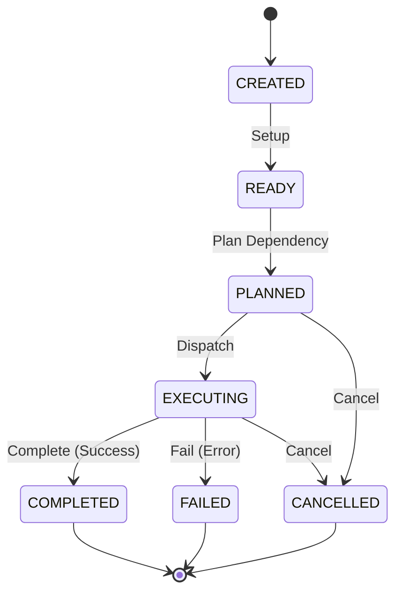

# Development Runtime Execution Plan Specification

This document defines the core architecture, data schemas, validation rules, and structural boundaries for the **Development Runtime Execution Plan Foundation** within the AIOS (Advanced Agentic Operating System).

---

## 1. Overview & Core Philosophy

The **Development Runtime Execution Plan** represents the logical sequential/parallel planning structure for executing a Runtime Task. It models plan execution strategies, lifecycle state, and referential verification.

At this foundation phase:
* **No Process Execution**: The Execution Plan does not run tasks, schedule jobs, invoke executors, manage threads, or coordinate AI runs. It strictly models execution strategy options and validation constraints.
* **Immutability (Object.freeze)**: All plan records and view models are strictly immutable.
* **Determinism**: Plan IDs are assigned sequentially and deterministically (`plan-1`, `plan-2`).
* **Zero External Dependencies**: The foundation has no external runtime dependencies.

---

## 2. Data Models & Schemas

### 2.1 RuntimeExecutionPlanState
The logical lifecycle state of an execution plan.

```typescript
export enum RuntimeExecutionPlanState {
  CREATED   = 'CREATED',   // Plan instantiated
  READY     = 'READY',     // Prepared for scheduling
  PLANNED   = 'PLANNED',   // Plan structure resolved and mapped
  EXECUTING = 'EXECUTING', // Task/Plan is actively running
  COMPLETED = 'COMPLETED', // Execution successfully finished
  FAILED    = 'FAILED',    // Execution stopped due to failure
  CANCELLED = 'CANCELLED'  // Execution aborted
}
```

### 2.2 ExecutionStrategy
The strategy used to resolve/execute tasks associated with the plan.

```typescript
export enum ExecutionStrategy {
  SEQUENTIAL  = 'SEQUENTIAL',   // Linear order execution
  PARALLEL    = 'PARALLEL',     // Multi-task concurrent execution
  CONDITIONAL = 'CONDITIONAL',  // Branching/routing logic based on criteria
  MANUAL      = 'MANUAL'        // Interactive execution requiring human/external trigger
}
```

### 2.3 ExecutionPlan (Record)
The core immutable configuration and state record for a logical execution plan.

```typescript
export interface ExecutionPlan {
  readonly planId: string;                        // Unique identifier (plan-\d+)
  readonly planName: string;                      // Human-readable name
  readonly taskId: string;                        // Parent Task ID (task-\d+)
  readonly executionStrategy: ExecutionStrategy;  // Execution strategy policy
  readonly planState: RuntimeExecutionPlanState;  // Lifecycle state
  readonly description: string;                   // Description of the plan context
  readonly planVersion: string;                   // Plan-specific specification version
  readonly createdAt: string;                     // ISO8601 creation timestamp
  readonly updatedAt: string;                     // ISO8601 update timestamp
  readonly version: string;                       // Semantic version of the plan spec
}
```

### 2.4 RegistryMetadata
Metadata describing the registry itself.

```typescript
export interface RegistryMetadata {
  readonly registryId: string;
  readonly registryVersion: string;
  readonly createdAt: string;
  readonly updatedAt: string;
}
```

---

## 3. Structural Integrity & Validation Rules

To prevent corrupted states, the `RuntimeExecutionPlanValidator` enforces the following validation checks:

1. **ID Format**: `planId` must match the regular expression `/^plan-\d+$/`.
2. **State Validation**: `planState` must be a valid member of the `RuntimeExecutionPlanState` Enum.
3. **Strategy Validation**: `executionStrategy` must be a valid member of the `ExecutionStrategy` Enum.
4. **Referential Integrity**: `taskId` must refer to an existing task registered in the `RuntimeTaskRegistry` (`INVALID_TASK_REFERENCE`).
5. **Time Semantics**: `createdAt` and `updatedAt` must be valid ISO8601 date-time strings, and `createdAt <= updatedAt` (`INVALID_PLAN_DATE`).
6. **Version Semantics**: `version` and `planVersion` must be non-empty strings matching standard semantic version formats (`INVALID_PLAN_VERSION`).
7. **No Duplicates**: `RuntimeExecutionPlanRegistry` rejects registrations with duplicate `planId` or `planName` values (`DUPLICATE_PLAN`).

---

## 4. Lifecycle Transitions

Plans must transition logically through their lifecycle states:



---

## 5. Dependency Boundary & Rules

* **Strict GET Layering**: Higher-level operations query plan status solely via the `RuntimeExecutionPlanRegistry`.
* **No Autonomous Evolution**: Plans are configured strictly by control inputs or configuration definitions. Auto-tuning, AI-driven strategy shifting, or process overrides are prohibited in this layer.
* **Separation of Concerns**: Actual plan executors, run orchestrators, retry policies, and timeouts are handled in downstream Phase 202 sub-phases.
