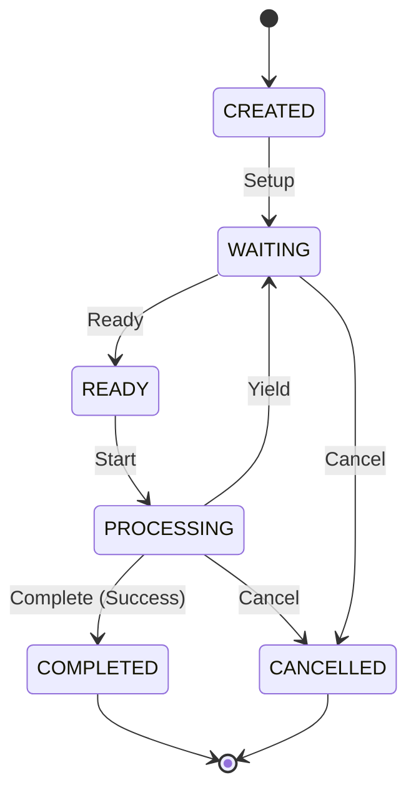

# Development Runtime Queue Foundation Specification

This document defines the core architecture, data schemas, validation rules, and structural boundaries for the **Development Runtime Queue Foundation** within the AIOS (Advanced Agentic Operating System).

---

## 1. Overview & Core Philosophy

The **Development Runtime Queue** represents a logical processing queue associated with a Runtime Context. It models the queue state, processing priorities, and referential verification.

At this foundation phase:
* **No Job Processing**: The Queue does not execute tasks, prioritize jobs dynamically, manage worker threads, or interface with runtime executors. It strictly models queue metadata, priority definitions, and validation constraints.
* **Immutability (Object.freeze)**: All queue records and view models are strictly immutable.
* **Determinism**: Queue IDs are assigned sequentially and deterministically (`queue-1`, `queue-2`).
* **Zero External Dependencies**: The foundation has no external runtime dependencies.

---

## 2. Data Models & Schemas

### 2.1 RuntimeQueueState
The logical state of a processing queue.

```typescript
export enum RuntimeQueueState {
  CREATED    = 'CREATED',     // Queue instantiated
  WAITING    = 'WAITING',     // Waiting for tasks/jobs
  READY      = 'READY',       // Active and ready to accept/process entries
  PROCESSING = 'PROCESSING',  // Queue actively processing tasks
  COMPLETED  = 'COMPLETED',   // Tasks finished execution successfully
  CANCELLED  = 'CANCELLED'    // Queue aborted or halted
}
```

### 2.2 QueuePriority
The logical priority level of the processing queue.

```typescript
export enum QueuePriority {
  LOW      = 'LOW',
  NORMAL   = 'NORMAL',
  HIGH     = 'HIGH',
  CRITICAL = 'CRITICAL'
}
```

### 2.3 Queue (Record)
The core immutable configuration and state record for a logical execution queue.

```typescript
export interface Queue {
  readonly queueId: string;                       // Unique identifier (queue-\d+)
  readonly queueName: string;                     // Human-readable name
  readonly contextId: string;                     // Parent Context ID (context-\d+)
  readonly description: string;                   // Description of the queue
  readonly queueVersion: string;                  // Queue-specific specification version
  readonly state: RuntimeQueueState;              // Current queue lifecycle state
  readonly priority: QueuePriority;               // Priority level
  readonly createdAt: string;                     // ISO8601 creation timestamp
  readonly updatedAt: string;                     // ISO8601 update timestamp
  readonly version: string;                       // Semantic version of the queue spec
}
```

### 2.3 RegistryMetadata
Metadata describing the registry itself.

```typescript
export interface RegistryMetadata {
  readonly registryId: string;
  readonly registryVersion: string;
  readonly createdAt: string;
  readonly updatedAt: string;
}
```

---

## 3. Structural Integrity & Validation Rules

To prevent corrupted states, the `RuntimeQueueValidator` enforces the following validation checks:

1. **ID Format**: `queueId` must match the regular expression `/^queue-\d+$/`.
2. **State Validation**: `state` must be a valid member of the `RuntimeQueueState` Enum.
3. **Priority Validation**: `priority` must be a valid member of the `QueuePriority` Enum.
4. **Referential Integrity**: `contextId` must refer to an existing context registered in the `RuntimeContextRegistry` (`INVALID_CONTEXT_REFERENCE`).
5. **Time Semantics**: `createdAt` and `updatedAt` must be valid ISO8601 date-time strings, and `createdAt <= updatedAt` (`INVALID_QUEUE_DATE`).
6. **Version Semantics**: `version` and `queueVersion` must be non-empty strings matching standard semantic version formats (`INVALID_QUEUE_VERSION`).
7. **No Duplicates**: `RuntimeQueueRegistry` rejects registrations with duplicate `queueId` or `queueName` values (`DUPLICATE_QUEUE`).

---

## 4. Lifecycle Transitions

Queues must transition logically through their lifecycle states:



---

## 5. Dependency Boundary & Rules

* **Strict GET Layering**: Higher-level operations query queue status solely via the `RuntimeQueueRegistry`.
* **No Autonomous Evolution**: Queues are configured strictly by control inputs or configuration definitions. Auto-tuning, AI-driven priority adjustments, or process overrides are prohibited in this layer.
* **Separation of Concerns**: Actual queue processing mechanics (Workers, Thread Pools, Event Loops) are handled in downstream Phase 202 sub-phases.
