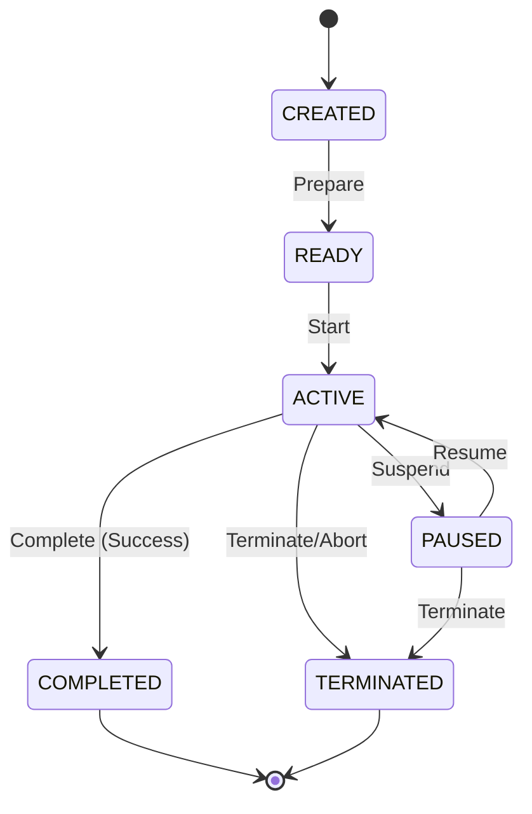

# Development Runtime Session Foundation Specification

This document defines the core architecture, data schemas, validation rules, and structural boundaries for the **Development Runtime Session Foundation** within the AIOS (Advanced Agentic Operating System).

---

## 1. Overview & Core Philosophy

The **Development Runtime Session** represents a logical execution session running on top of a Development Runtime context. It encapsulates the session lifecycle, state tracking, and referential validation.

At this foundation phase:
* **No Session Execution**: The Session does not execute code, coordinate tasks, manage runtime queues, or trigger AI agents. It strictly models session data, state transitions, and referential verification.
* **Immutability (Object.freeze)**: All session records and view models are strictly immutable.
* **Determinism**: Session IDs are assigned sequentially and deterministically (`session-1`, `session-2`).
* **Zero External Dependencies**: The foundation has no external runtime dependencies.

---

## 2. Data Models & Schemas

### 2.1 RuntimeSessionState
The logical operational state of a runtime session.

```typescript
export enum RuntimeSessionState {
  CREATED    = 'CREATED',     // Session instantiated
  READY      = 'READY',       // Prepared for execution
  ACTIVE     = 'ACTIVE',      // Actively running agent/tool operations
  PAUSED     = 'PAUSED',      // Suspended context
  COMPLETED  = 'COMPLETED',   // Finished execution successfully
  TERMINATED = 'TERMINATED'   // Aborted or stopped forcefully
}
```

### 2.2 Session (Record)
The core immutable configuration and state record for a logical session.

```typescript
export interface Session {
  readonly sessionId: string;                     // Unique identifier (session-\d+)
  readonly sessionName: string;                   // Human-readable name
  readonly runtimeId: string;                     // Target Runtime ID (runtime-\d+)
  readonly description: string;                   // Description of the session context
  readonly sessionVersion: string;                // Session-specific specification version
  readonly state: RuntimeSessionState;            // Current session lifecycle state
  readonly createdAt: string;                     // ISO8601 creation timestamp
  readonly updatedAt: string;                     // ISO8601 update timestamp
  readonly version: string;                       // Semantic version of the session spec
}
```

### 2.3 RegistryMetadata
Metadata describing the registry itself.

```typescript
export interface RegistryMetadata {
  readonly registryId: string;
  readonly registryVersion: string;
  readonly createdAt: string;
  readonly updatedAt: string;
}
```

---

## 3. Structural Integrity & Validation Rules

To prevent corrupted states, the `RuntimeSessionValidator` enforces the following validation checks:

1. **ID Format**: `sessionId` must match the regular expression `/^session-\d+$/`.
2. **State Validation**: `state` must be a valid member of the `RuntimeSessionState` Enum.
3. **Referential Integrity**: `runtimeId` must refer to an existing runtime registered in the `RuntimeRegistry` (`INVALID_RUNTIME_REFERENCE`).
4. **Time Semantics**: `createdAt` and `updatedAt` must be valid ISO8601 date-time strings, and `createdAt <= updatedAt` (`INVALID_SESSION_DATE`).
5. **Version Semantics**: `version` and `sessionVersion` must be non-empty strings matching standard semantic version formats (`INVALID_SESSION_VERSION`).
6. **No Duplicates**: `RuntimeSessionRegistry` rejects registrations with duplicate `sessionId` or `sessionName` values (`DUPLICATE_SESSION`).

---

## 4. Lifecycle Transitions

Sessions must transition logically through their lifecycle states:



---

## 5. Dependency Boundary & Rules

* **Strict GET Layering**: Higher-level operations query session status solely via the `RuntimeSessionRegistry`.
* **No Autonomous Evolution**: Sessions are configured strictly by control inputs or configuration definitions. Auto-tuning, AI-driven state shifting, or process overrides are prohibited in this layer.
* **Separation of Concerns**: Actual execution orchestrations (Queues, Schedulers, Contexts) are handled in downstream Phase 202 sub-phases.
