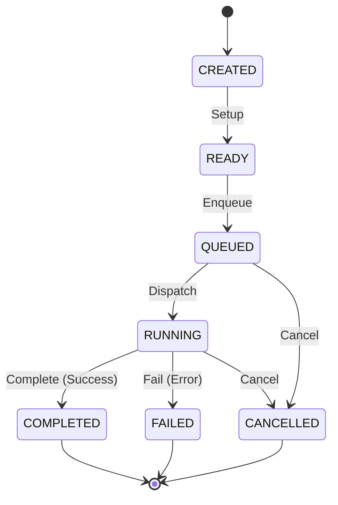

# Development Runtime Task Specification

This document defines the core architecture, data schemas, validation rules, and structural boundaries for the **Development Runtime Task Foundation** within the AIOS (Advanced Agentic Operating System).

---

## 1. Overview & Core Philosophy

The **Development Runtime Task** represents the logical operational task context associated with a Runtime Queue. It models the task state, task type, and referential verification.

At this foundation phase:
* **No Dynamic Execution**: The Task does not invoke AI engines, trigger Tool Adapters, interface with Git/Shell runners, run processes, or schedule execution. It strictly models task data structures, types, and validation constraints.
* **Immutability (Object.freeze)**: All task records and view models are strictly immutable.
* **Determinism**: Task IDs are assigned sequentially and deterministically (`task-1`, `task-2`).
* **Zero External Dependencies**: The foundation has no external runtime dependencies.

---

## 2. Data Models & Schemas

### 2.1 RuntimeTaskState
The logical state of a task.

```typescript
export enum RuntimeTaskState {
  CREATED   = 'CREATED',   // Task instantiated
  READY     = 'READY',     // Prepared for queue dispatch
  QUEUED    = 'QUEUED',    // Task is waiting inside processing queue
  RUNNING   = 'RUNNING',   // Task is actively executing
  COMPLETED = 'COMPLETED', // Task executed successfully
  FAILED    = 'FAILED',    // Task execution failed with errors
  CANCELLED = 'CANCELLED'  // Task aborted/cancelled
}
```

### 2.2 RuntimeTaskType
The logical type/category of the executing task.

```typescript
export enum RuntimeTaskType {
  CAPABILITY    = 'CAPABILITY',
  PIPELINE      = 'PIPELINE',
  VALIDATION    = 'VALIDATION',
  AUDIT         = 'AUDIT',
  DOCUMENTATION = 'DOCUMENTATION',
  UTILITY       = 'UTILITY'
}
```

### 2.3 Task (Record)
The core immutable configuration and state record for a logical task.

```typescript
export interface Task {
  readonly taskId: string;                        // Unique identifier (task-\d+)
  readonly taskName: string;                      // Human-readable name
  readonly queueId: string;                       // Parent Queue ID (queue-\d+)
  readonly taskType: RuntimeTaskType;             // Category/Type of task
  readonly taskState: RuntimeTaskState;           // Lifecycle state
  readonly description: string;                   // Description of the task context
  readonly taskVersion: string;                   // Task-specific specification version
  readonly createdAt: string;                     // ISO8601 creation timestamp
  readonly updatedAt: string;                     // ISO8601 update timestamp
  readonly version: string;                       // Semantic version of the task spec
}
```

### 2.4 RegistryMetadata
Metadata describing the registry itself.

```typescript
export interface RegistryMetadata {
  readonly registryId: string;
  readonly registryVersion: string;
  readonly createdAt: string;
  readonly updatedAt: string;
}
```

---

## 3. Structural Integrity & Validation Rules

To prevent corrupted states, the `RuntimeTaskValidator` enforces the following validation checks:

1. **ID Format**: `taskId` must match the regular expression `/^task-\d+$/`.
2. **State Validation**: `taskState` must be a valid member of the `RuntimeTaskState` Enum.
3. **Type Validation**: `taskType` must be a valid member of the `RuntimeTaskType` Enum.
4. **Referential Integrity**: `queueId` must refer to an existing queue registered in the `RuntimeQueueRegistry` (`INVALID_QUEUE_REFERENCE`).
5. **Time Semantics**: `createdAt` and `updatedAt` must be valid ISO8601 date-time strings, and `createdAt <= updatedAt` (`INVALID_TASK_DATE`).
6. **Version Semantics**: `version` and `taskVersion` must be non-empty strings matching standard semantic version formats (`INVALID_TASK_VERSION`).
7. **No Duplicates**: `RuntimeTaskRegistry` rejects registrations with duplicate `taskId` or `taskName` values (`DUPLICATE_TASK`).

---

## 4. Lifecycle Transitions

Tasks must transition logically through their lifecycle states:



---

## 5. Dependency Boundary & Rules

* **Strict GET Layering**: Higher-level operations query task status solely via the `RuntimeTaskRegistry`.
* **No Autonomous Evolution**: Tasks are configured strictly by control inputs or configuration definitions. Auto-tuning, AI-driven state transitions, or process overrides are prohibited in this layer.
* **Separation of Concerns**: Actual execution schedulers, dispatches, executors, and tool invocations are handled in downstream Phase 202 sub-phases.
