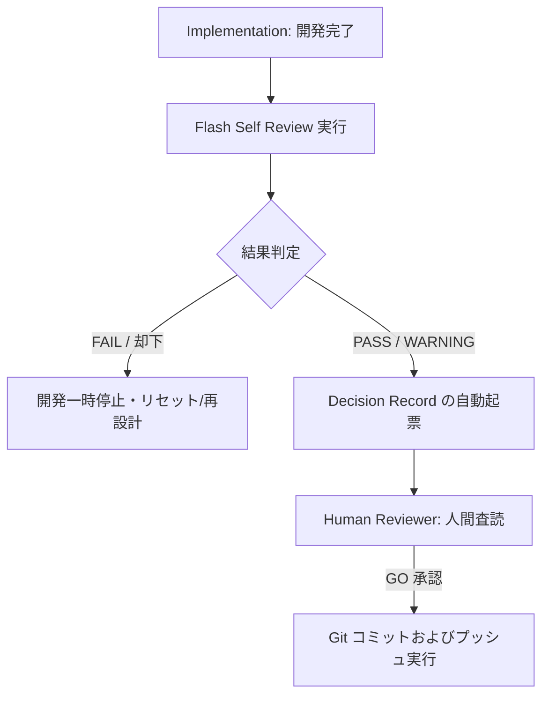
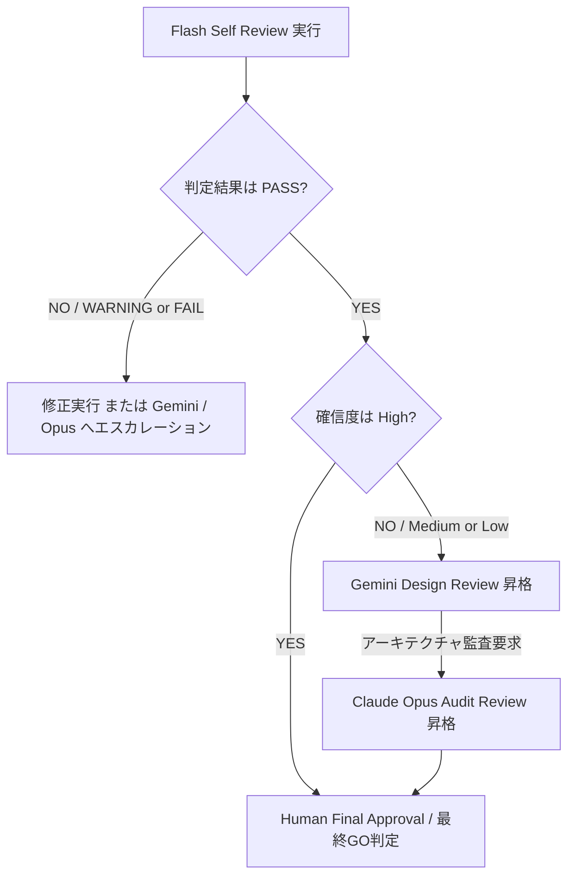

# AIOS Flash Self Review Specification (自己レビュープロセス定義規範)

Version: 1.0.0
Phase: Phase 114 (Flash Self Review Foundation)
Status: Active

---

## 1. 目的 (Purpose)
本仕様書は、AIOS (Artificial Intelligence Operating System) における品質統制の第一防衛ライン (First Line of Defense) として、開発AI (主に Flash 3.5 モデル) がコード生成、ドキュメント改定、コミット実行の直前に自らの成果物を高速・低コストでセルフチェックする **Flash Self Review** のパイプライン、検証チェックリスト、報告書スキーマ、およびエスカレーションルールを規定します。

---

## 2. 自己レビューアーキテクチャ (Self Review Architecture)

### 2.1 目的と範囲
セルフレビューは、開発速度を犠牲にせずに「低コストかつ即時」に軽微な構文エラー、ルール違反、記述漏れを水際で是正することを目的とします。

* **レビュー対象**:
  * 追加・変更されたすべてのソースコードファイル（Python, Javascript 等）。
  * 更新された仕様ドキュメント（Markdown）、HANDOVER.md、walkthrough.md、task.md。
  * 変更された構成ファイル（Git設定、JSON メタデータ等）。
* **レビュー範囲 (チェック深度)**:
  * 機械的なチェック（変数名規則、インポート規律、ファイル実在性、構文エラー、 doctor 判定等）。
  * ドキュメント間の記述同期状態の確認。
* **レビュー対象外領域**:
  * 高次元の設計妥当性、全体アーキテクチャの整合性、およびセキュリティポリシーの厳格評価。これらは上位エージェント（Gemini, Claude）のレビューに委ねられます。

---

## 3. レビューパイプライン (Review Pipeline)

実装完了からコミット判定に至るセルフレビューフローは以下の通り規定されます。

---

## 4. レビューカテゴリ (Review Categories)
セルフレビューは、以下の5つの検証カテゴリに分類して実行されます。

1. **Architecture (構造検証)**:
   * レイヤー参照関係の順守（DTO/Managerの分離）、`Context` という予約語の漏洩チェック。
2. **Coding (実装規律検証)**:
   * デッドコード、コピペ重複コードの排除、インポート規則、命名規約への適合。
3. **Documentation (ドキュメント検証)**:
   * `walkthrough.md`, `HANDOVER.md`, `task.md` の記述漏れチェック、および現在地のフェーズ番号が同期してインクリメントされているかの確認。
4. **Governance (ガバナンス検証)**:
   * `Rule Registry`、`DevelopmentOS`、`AuditOS`、`Decision Model` の規定チェック（特に承認GOなしのランタイム変更がないか）。
5. **Consistency (一貫性検証)**:
   * 共通データ辞書（`Data Dictionary`）で定められたID命名規則（例: `INC-2026-0001`）およびタイムスタンプ形式（ISO-8601 UTC）の順守。

---

## 5. レビュー結果 & レビュー確信度 (Result & Confidence)

### 5.1 レビュー結果 (Review Result)
* **`PASS` (適合)**: ルールに完全適合しており、警告なし。
* **`PASS_WITH_COMMENT` (注記付き適合)**: 適合しているが、将来の改善や軽微な推奨リファクタリング情報あり。
* **`WARNING` (警告適合)**: 非推奨ルールの使用、一部ドキュメントの記述の不十分さなどの改善推奨がある状態（手動確認を要求）。
* **`FAIL` (不適合)**: ビルド失敗、テスト失敗、コアルール違反等の不整合を検知。

### 5.2 レビュー確信度 (Review Confidence)
レビュー判定の信頼性を評価する指標です。

* **`High` (高確信度)**:
  * 全検証エビデンスが網羅されており、テストが 100% 成功している、客観的に明白な状態。
* **`Medium` (中確信度)**:
  * 警告や手動確認を要する曖昧な定義が存在するが、基本ビルドはパスしている状態。
* **`Low` (低確信度)**:
  * 検証テストが一部しか走っていないか、または非決定的なエラーログが存在する状態。
* **`Unknown` (未確定)**:
  * レビューエラーにより適合性が判定できない状態。
* *エスカレーション連携*: `PASS` 判定であっても、確信度が `Low / Unknown` の場合は、自動的に `Gemini Design Review` へエスカレーションされます。

---

## 6. レビュー報告書スキーマ (Review Report Schema)

| 属性名 (Field) | 型 (Type) | 説明 (Description) |
|---|---|---|
| `Review ID` | String | レビューセッションの一意なID。`REV-YYYY-NNNN` の規則に従う。 |
| `Target` | String | レビュー対象となったコミットハッシュ、またはファイルパス。 |
| `Review Agent` | Enum | 実行したエージェント ID (`FLASH`)。 |
| `Timestamp` | DateTime | 実行された日時（ISO-8601 UTC形式）。 |
| `Severity` | Enum | 検出されたリスクの最高重大度（`Critical` / `Warning` 等）。 |
| `Result` | Enum | レビュー結果（`PASS`, `WARNING`, `FAIL` 等）。 |
| `Confidence` | Enum | レビュー確信度（`High`, `Medium`, `Low`, `Unknown`）。 |
| `Evidence` | List[String] | 判定の根拠（verifyコマンド出力、pytest結果、git diff等）。 |
| `Recommendations` | List[String] | 改善のための推奨是正アクション。 |
| `Related Rules` | List[String] | 関連する `RuleRegistry.md` 内のルールIDリスト。 |
| `Related Incidents` | List[String] | 関連する `IncidentRegistry.md` 内のインシデントIDリスト。 |
| `Related Knowledge` | List[String] | 参照されたナレッジID（`KB-YYYY-NNNN`）リスト。 |
| `Decision Reference` | String | 本レビューに関連する意思決定ID（`DEC-YYYY-NNNN`）。 |

---

## 7. セルフレビューチェックリスト (Self Review Checklist)
開発AIがコミットを試みる際に、自律的にチェックすべき項目です。

* **[ ] Foundation First**: 既存の仕様基盤と完全に適合し、ランタイムに破壊的変更を与えていないか。
* **[ ] No Runtime Mutation**: 計画で明記されていないランタイムコードの修正が一切ないか。
* **[ ] DTO/Manager Consistency**: 新規および既存のデータクラス命名規律、 Context という語の漏洩がないか。
* **[ ] Document Sync**: `walkthrough.md`, `HANDOVER.md`, `task.md` のフェーズ番号および完了ステータスが同期更新されているか。
* **[ ] Standard Formatting**: ファイル名が kebab-case/snake_case に従っており、タイムスタンプが ISO-8601 UTC 形式になっているか。
* **[ ] CLI Validation**: `python3 tools/cie.py verify` コマンドが PASS しているか。
* **[ ] System Health**: `python3 tools/cie.py doctor` コマンドの結果が GOOD であるか。
* **[ ] Working Tree Cleanliness**: `git status` を実行し、デバッグ用の一時ファイルや不要な差分が含まれていないか。

---

## 8. エスカレーションポリシー (Escalation Policy)
セルフレビューの結果に基づき、追加検証を要求するエスカレーションフローは以下の通り規定されます。

---

## 9. 将来の自動化ロードマップ (Future Roadmap)
* **自動セルフレビューエンジン (tools/specifications/flash_self_review.json)**:
  将来的に、セルフレビューのチェック項目、カテゴリマッピング、および判定エビデンスの出力スキーマは `flash_self_review.json` にて定義されます。コミットフック時に CIE プラットフォームが自動で Flash を呼び出し、チェックリストに沿った自己検証結果ログを `REV-YYYY-NNNN.json` として自動出力・永続化するシステムを統合します。
