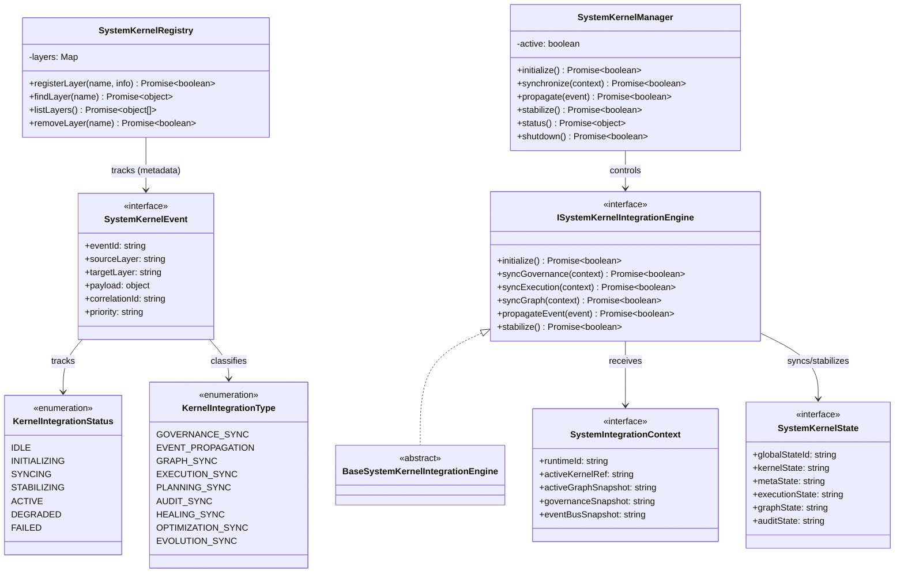

# Full System Kernel Integration Specification (フルシステムカーネル統合定義規範)

Version: 1.0.0
Phase: Phase 138 (Full Autonomous System Kernel Integration)
Status: Active

---

## 1. 目的 (Purpose)
本仕様書は、AIOS (Artificial Intelligence Operating System) におけるフルシステムカーネル統合レイヤーの構造・型・契約定義（Blueprint）を規定します。
これまで積層構造（Layered Architecture）として定義された全15レイヤーを、相互フィードバックを行う「閉ループ構造（Closed-loop Architecture）」へと変革し、単一の制御ループとして協調・同期・安定化（Stabilization）させるための統合インターフェースを提供します。

---

## 2. 関係性ダイアグラム (Relationship Diagram)



---

## 3. 自律循環・フィードバックループモデル (Closed-Loop System)

```
   ┌────────────────────────────────────────────────────────┐
   │                                                        │
   ▼                                                        │
Governance Kernel ──> Meta-Governance ──> Execution Graph   │
                                                │           │
                                                ▼           │
Kernel Feedback <── Event Bus <── Audit <── Planning        │
   │                                                        │
   └────────────────────────────────────────────────────────┘
```

---

## 4. 状態同期・安定化サイクル (Stabilization Cycle)

```
[ IDLE ] ──> [ INITIALIZING ] ──> [ SYNCING ] ──> [ STABILIZING ] ──> [ ACTIVE ]
                                                       │
                                                       ├──> [ DEGRADED ]
                                                       └──> [ FAILED ]
```

---

## 5. 各種統合モデル (Integration Model)

### 5.1 循環フィードバックループ (Feedback Loop)
* 各レイヤー（実行、監査、最適化など）は自身の状態変更シグナルを `SystemKernelEvent` として発行します。
* 統合バスがこれを集約し、メタガバナンスでの検証（`syncGovernance`）を経て、実行グラフや各エージェントの挙動を決定論的に安定（`stabilize`）させます。

### 5.2 グラフ同期モデル (Graph Synchronization)
レイヤーの構造変化および実行状態が System Execution Graph に遅滞なく同期され、全体状態がコンバージ（収束）する基盤を定義します（論理スナップショット上での同期モデル）。

---

## 6. 将来の統合ロードマップ (Future Roadmap)
* **Autonomous Kernel Feedback Stabilization Engine (Phase 139 予定)**: 閉ループフィードバックにおけるオーバーシュートや無限ループを防止し、状態の収束安定性を保証する数理的スタビライザーの定義。
* **Self-Modifying OS Runtime Layer (Phase 140 予定)**: 自律循環ルールに基づき、実際のシステムランタイム自身をセーフティかつダイナミックに適合変形させるランタイム層の統合。
