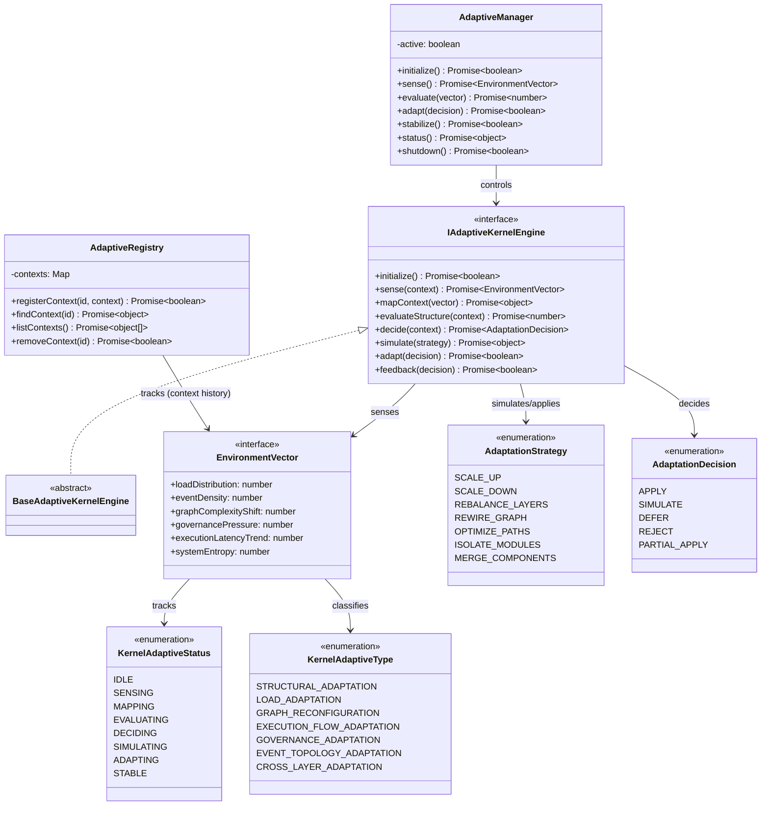

# Fully Autonomous Adaptive Kernel Loop Specification (完全自律適応型カーネルループ定義規範)

Version: 1.0.0
Phase: Phase 142 (Fully Autonomous Adaptive Kernel Loop)
Status: Active

---

## 1. 目的 (Purpose)
本仕様書は、AIOS (Artificial Intelligence Operating System) における完全自律適応型カーネルループの構造・型・契約定義（Blueprint）を規定します。
カーネル自体が環境変化（負荷分散、イベント密度、グラフ構造変化、ガバナンス遅延など）を検知し、自身を「スケールアップ／ダウン」「レイヤー再配置」「グラフ再接続（Rewire）」「モジュール隔離（Isolate）」等へ適応（Adaptation）させるための論理適合性評価および仮想リコンフィグ設計モデルを提供します。

---

## 2. 関係性ダイアグラム (Relationship Diagram)



---

## 3. 自己適応フィードバックループモデル (Adaptation Loop Flow)

```
Environment ──> Sensing ──> Context Mapping ──> Structural Evaluation
                                                     │
                                                     ▼
New State <── Feedback <── Simulation <── Adaptation Decision
```

---

## 4. 構造適応ライフサイクル (Adaptation Lifecycle)

```
[ IDLE ] ──> [ SENSING ] ──> [ MAPPING ] ──> [ EVALUATING ] ──> [ DECIDING ]
                                                                     │
                                                                     ▼
                                                                [ SIMULATING ]
                                                                [ ADAPTING ]
                                                                [ STABLE ]
```

---

## 5. 各種統合モデル (Integration Model)

### 5.1 Environmental Vector Sensing (環境要因測定)
負荷の偏り、イベント密度、およびグラフ構造の複雑度の推移を `EnvironmentVector` を通じて測定し、システムのエントロピー（Entropy）をコントロール範囲内に維持するための入力シグナルとします。

### 5.2 Dynamic Structural Reconfiguration (仮想構造再配置)
* **適応戦略（AdaptationStrategy）**: 負荷高騰時のレイヤー再配置（REBALANCE_LAYERS）やモジュール隔離（ISOLATE_MODULES）の意図を論理定義します。
* **仮想シミュレーション**: 適応決定（AdaptationDecision）を下す前に、仮想リコンフィグ後の状態遷移をシミュレーション評価します。

### 5.3 Feedback Integration
決定された適応内容は、フィードバックとしてカーネルランタイム構造メタデータに記録されますが、実稼働中のプログラムコードの自動リファクタリングや実行クラスの動的着脱は一切行いません（論理定義）。

---

## 6. 将来の統合ロードマップ (Future Roadmap)
* **Recursive Self-Rewriting Kernel Architecture (Phase 143 予定)**: シミュレーションおよび検証された適応計画に基づき、実カーネルクラスやルーティングコードを安全に再コンパイル・動的自己書き換え（Self-Rewriting）するランタイムコア。
* **Fully Autonomous Kernel Conscious Loop (Phase 144 予定)**: 自身の状態変容プロセスとガバナンス履歴から、論理的な自己認識（OS Conscious Loop）を確立するメタ論理制御層。
