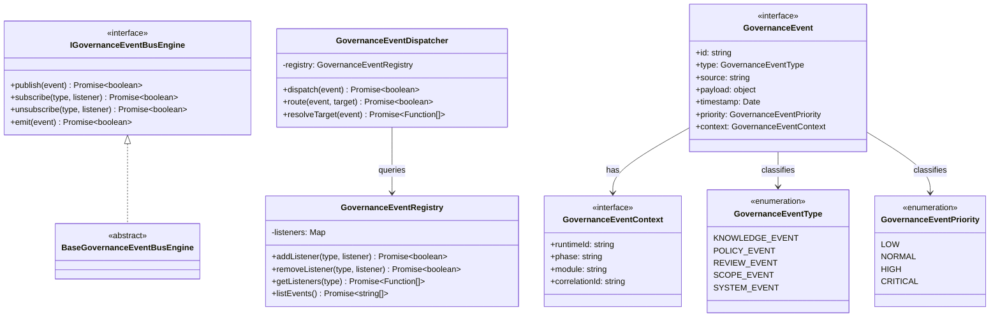

# Governance Event Bus Specification (ガバナンスイベントバス定義規範)

Version: 1.0.0
Phase: Phase 127 (Governance Event Bus Foundation)
Status: Active

---

## 1. 目的 (Purpose)
本仕様書は、AIOS (Artificial Intelligence Operating System) におけるガバナンスイベント駆動アーキテクチャの構造定義（Blueprint）を規定します。
プラットフォーム内の主要な自律エージェントレイヤー（Knowledge, Policy, Review, Scope）を疎結合に接続するための標準メッセージコントラクトおよび配送インターフェースを定義し、将来のオーケストレーション拡張のための基盤を提供します。

---

## 2. 関係性ダイアグラム (Relationship Diagram)
ガバナンスイベントバスを構成する型・コントロール・エンジンコンポーネントの依存・参照マップ。

---

## 3. コアデータモデル (Core Data Models)

### 3.1 GovernanceEventType
- **KNOWLEDGE_EVENT**: 組織ナレッジ・教訓・学習の変更や更新イベント。
- **POLICY_EVENT**: ポリシー変更・ガバナンスチェック判定イベント。
- **REVIEW_EVENT**: 自律AIレビューの実行要求・完了イベント。
- **SCOPE_EVENT**: 実行スコープ・再開制限ロック適用イベント。
- **SYSTEM_EVENT**: システム内部およびOS管理用のライフサイクルイベント。

### 3.2 GovernanceEventPriority
- **LOW**: 通常の監査・履歴収集用。
- **NORMAL**: 標準的な自律実行イベント。
- **HIGH**: 同期的に判定が求められるガバナンスイベント。
- **CRITICAL**: セキュリティ例外・システム停止判定などの最高優先度イベント。

---

## 4. 統合イベントソースモデル (Integration Model)
各コアラグインエンジンから発生する標準的なイベント契約。

* **Governance Policy Engine**: `policy.change`
* **Autonomous Review Runtime**: `review.completed`
* **AIOS Resume Scope Control**: `scope.locked`
* **Knowledge Engine**: `knowledge.updated`

---

## 5. 将来の実行統合ロードマップ (Future Roadmap)
* **イベント配送の具現化 (Phase 130 予定)**:
  本フェーズで定義したスケルトン定義（TypeScript Blueprint）に基づき、将来的に非同期イベントディスパッチングおよびマルチキャスト配信（Orchestration）の実装が適用されます。
