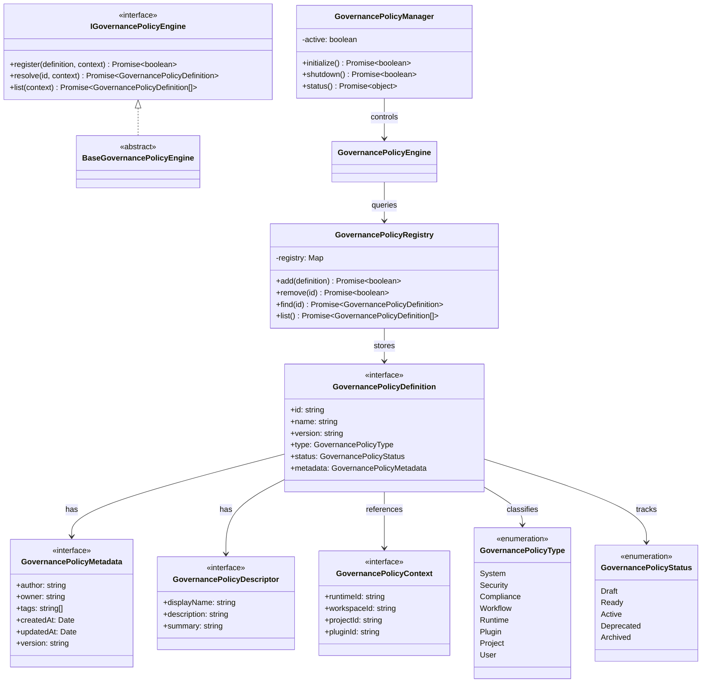

# AIOS Governance Policy Engine Specification (ガバナンスポリシーエンジン定義規範)

Version: 1.0.0
Phase: Phase 124 (Governance Policy Engine Foundation)
Status: Active

---

## 1. 目的 (Purpose)
本仕様書は、AIOS (Artificial Intelligence Operating System) におけるガバナンスポリシー（定義、ライフサイクル、適合カテゴリー、監査適用条件）を統治する **Governance Policy Engine** のデータ抽象および構造インターフェースを規定します。
本設計は将来、自動ポリシー評価（Evaluation）、アクセス権限コントロール（Access Control/RBAC）、コンプライアンス適合監視などの実行レイヤーを結合するための論理適合規約を提供します。

---

## 2. 関係性ダイアグラム (Relationship Diagram)
ガバナンスポリシーを構成する型・コントロール・エンジンコンポーネントの依存・参照マップ。

---

## 3. コンポーネント定義 (Component Overview)

### 3.1 IGovernancePolicyEngine & BaseGovernancePolicyEngine
* **概要**: ガバナンスポリシーレイヤーの基本操作インターフェースおよびその抽象実装。`register`, `resolve`, `list` によるポリシー解決処理の契約を提供します。

### 3.2 GovernancePolicyRegistry
* **概要**: ポリシー定義（GovernancePolicyDefinition）のインメモリ保持、登録削除、および照会（find, list）を隠蔽して管理するレジストリ。

### 3.3 GovernancePolicyManager
* **概要**: 実行時ガバナンス評価プロセス開始前のポリシー初期化、破棄、サービスステータス監視を司るライフサイクルコントローラー。

### 3.4 GovernancePolicyDefinition
* **概要**: ポリシーの主要モデル。識別 ID、名前、バージョン、タイプ、ステータス、およびメタデータを包含した基本データスキーマ。

### 3.5 GovernancePolicyContext
* **概要**: ポリシーの評価解決を行う際に必要となる、対象のランタイム ID、プロジェクト ID、ワークスペース ID、およびプラグイン ID 等を特定するコンテキスト情報。

---

## 4. 将来の実行統合ロードマップ (Future Roadmap)
* **ポリシー評価エンジンの実装 (Phase 124 以降)**:
  本フェーズで確立した `IGovernancePolicyEngine` および `GovernancePolicyRegistry` に基づき、将来的なポリシー評価エンジン（Policy Evaluation Engine）が構築されます。このエンジンは、ユーザー操作やデプロイイベント時に登録されたアクティブポリシーをロード・評価し、アクセス制限（RBAC/ABAC）および規則遵守（Compliance Enforcement）を実行時適合判定する役割を担います。
