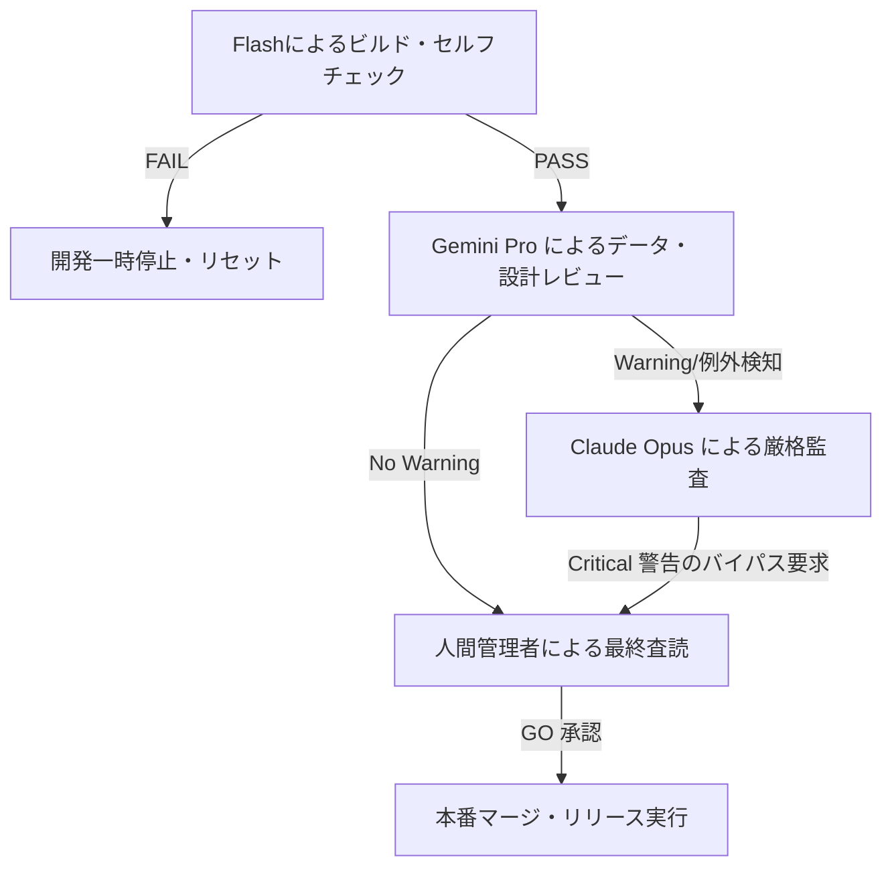

# AIOS Identity & Role Model Specification (権限・役割・責任モデル定義規範)

Version: 1.0.0
Phase: Phase 112 (Identity & Role Model Foundation)
Status: Active

---

## 1. 目的 (Purpose)
本仕様書は、AIOS (Artificial Intelligence Operating System) における開発および品質管理を統制するため、意思決定や各種プロセスに関与するアクター（人間、AIエージェント、実行システム）の識別体系、役割（Roles）、権限レベル（Permissions）、および責任範囲（Responsibilities）を一元的に定義し、プロセスの最小権限の原則 (Least Privilege) と多層防御を確立します。

---

## 2. 識別子アーキテクチャ (Identity Architecture)
AIOS で認識される主体は、以下の3つのレイヤーに分類されます。

### 2.1 Human (人間アクター)
* **`CEO`** (岩佐CEO): システム全体の最高決定権を持ち、すべての重大な変更やリリースの最終承認権（Human Final Approval）を保有します。
* **`Architect`**: プラットフォームの基盤仕様を策定・設計する役割。
* **`Reviewer`**: 設計書や実装、テストの妥当性を検証する役割。
* **`Developer`**: 開発計画に沿ってソースコードや仕様書を記述する役割。
* **`Operator`**: システムの運用監視、インシデントのトリアージを行う役割。

### 2.2 AI Agents (AIエージェントアクター)
* **`FLASH`**: 迅速な初期ビルド検証や、計画書を伴わないセルフチェックを行う軽量AIエージェント。
* **`GEMINI_PRO`**: 詳細なコード適合度検証、依存関係の追跡などを行う中核推論AIエージェント。
* **`OPUS`**: アーキテクチャ統制、不変データの整合性確認、および全体監査を行う最上位AIエージェント。
* **`SYSTEM`**: CI/CDパイプライン、Git Hook、ビルド自動化機構などの自動処理実行システム。
* **`FUTURE_AGENT`**: 将来追加される自律型改善提案などの追加エージェントの定義枠。

### 2.3 Runtime Components (システムコンポーネント)
* **`Runtime`** (実行ランタイム)
* **`Scheduler`** (タスク・スケジュール管理エンジン)
* **`Audit Engine`** (静的/動的コード監査エンジン)
* **`Review Engine`** (計画書および意思決定検証エンジン)
* **`Dashboard`** (可視化ビューイングシステム)
* **`Knowledge Engine`** (ナレッジベース構築および推薦エンジン)

---

## 3. 役割定義 (Role Definitions)
各アクターには以下の目的、責任、および制限が割り当てられます。

### 3.1 AI Agent (FLASH)
* **Purpose**: 高速な開発推進および実装段階における即時的な自己検証。
* **Responsibilities**: 承認された計画に沿ったドキュメントの記述、高速ビルド確認、および自己検証ログの出力。
* **Allowed Actions**: `docs/` およびソースコードの編集、`verify` チェックの実行、一時ブランチへのコミット。
* **Forbidden Actions**: `main` ブランチへの未承認プッシュ、承認判定（`GO`）の単独決定、リリース実行。

### 3.2 AI Agent (GEMINI_PRO)
* **Purpose**: 設計一貫性およびデータ構造の整合性レビュー。
* **Responsibilities**: クラスのレイヤー境界、DTO設計規律、Context漏洩の有無、およびスキーマ定義の妥当性監査。
* **Allowed Actions**: 設計書の査読、違反に対する `Review Required` または `NO-GO` の警告、ナレッジオブジェクトの妥当性検証。
* **Forbidden Actions**: 例外適用の最終オーバーライド、および本番リリースの実行。

### 3.3 AI Agent (OPUS)
* **Purpose**: 最上位のアーキテクチャ監査およびガバナンス整合性検証。
* **Responsibilities**: システム全体の不整合検知、不変履歴の完全性監査、および最終的な品質・リスク評価。
* **Allowed Actions**: 全仕様書の索引依存性の評価、重大な違反検知時の `NO-GO / BLOCKED` 判定。
* **Forbidden Actions**: 人間の関与なしでの `Critical` 警告のバイパス。

---

## 4. 責任・機能能力マトリクス (Responsibility & Capability Matrices)

### 4.1 責任範囲 (Responsibility Matrix)
各アクターが主たる責任（主担当：◯、補助：△、対象外：✕）を持つ開発フェーズの定義。

| アクター | Flash実装 | 高速セルフレビュー | 設計レビュー | アーキテクチャ監査 | 最終承認(GO) |
|---|---|---|---|---|---|
| **Human** | △ | △ | ◯ | ◯ | ◯ |
| **Opus** | ✕ | △ | △ | ◯ | ✕ |
| **Gemini Pro**| ✕ | △ | ◯ | △ | ✕ |
| **Flash** | ◯ | ◯ | ✕ | ✕ | ✕ |

### 4.2 機能能力マトリクス (Capability Matrix)
各アクターがシステム的に実行可能なアクションの適合マッピング。

| 主体 (Actor) | Build (ビルド) | Review (レビュー) | Audit (監査) | Approve (承認) | Release (リリース) | Learn (学習登録) |
|---|---|---|---|---|---|---|
| **Human** (人間) | ◯ | ◯ | ◯ | ◯ | ◯ | ◯ |
| **Opus** (監査AI) | ✕ | △ | ◯ | ✕ | ✕ | ◯ |
| **Gemini Pro** (設計AI) | ✕ | ◯ | △ | ✕ | ✕ | ◯ |
| **Flash** (開発AI) | ◯ | ◯ | ✕ | ✕ | ✕ | ◯ |

---

## 5. 権限マトリクス & 信頼レベル (Permission & Trust Levels)

### 5.1 権限レベル (Permission Matrix)
アクターに付与されるアクセス制御レベル。

* **`Read`**: 仕様書、コード、履歴、インシデントの読み取り（全アクターにデフォルト付与）。
* **`Write`**: ソースコードおよびドキュメントの編集（Human, Flashのみ付与）。
* **`Review`**: レビュー結果およびアドバイザリ警告の出力（Human, Gemini, Opusのみ付与）。
* **`Approve`**: 計画やフェーズの「GO」承認（Human, Gemini, Opusがその境界に応じて付与）。
* **`Deploy`**: 開発・テスト環境へのコード配置（System, Humanのみ付与）。
* **`Release`**: 本番環境（`main` ブランチ）へのマージおよびタグ付け（Humanのみ付与）。
* **`Emergency Override`**: 警告をバイパスして例外処理を適用する権限（Humanのみ付与）。

### 5.2 信頼レベル (Trust Levels)
アクターごとの認証・検証された信頼段階。

* **`Level 0 (Unknown)`**: 未検証の外部エージェントまたは外部連携元。
* **`Level 1 (Verified)`**: コミット検証をパスした開発用軽量エージェント（Flashなど）。
* **`Level 2 (Trusted)`**: プラットフォームの整合性を保証する推論エージェント（Gemini Proなど）。
* **`Level 3 (Critical)`**: システム全体の品質と不変性を担保する最上位の監査主体（Human, Opus）。

---

## 6. エスカレーションモデル (Escalation Model)
監査時においてリスクが検知された場合、以下のプロセスを経て上位アクターに承認判定がエスカレーションされます。

* **人間最終承認の原則 (Human Final Approval Priority)**:
  * 警告の有無に関わらず、すべてのフェーズ移行の最終判定およびリリース実行は、人間（Human Reviewer）の「GO」指示が常に最優先かつ必須の要件となります。

---

## 7. 将来のエージェントプロファイル拡張 (Future Agent Profiles)
将来のマルチAIレビュー推進に向けて、各AIモデルのプロファイル定義フィールドを以下のように準備します（本フェーズではプレースホルダーのみ）。

### 7.1 Agent Profile Fields
* `Agent ID` (例: `FLASH`, `GEMINI_PRO`, `OPUS`)
* `Agent Version` (対象モデルのバージョン)
* `Supported Models` (基礎となる LLM モデル名)
* `Context Window` (モデルのコンテキスト制限トークン数)
* `Primary Responsibility` (主たる責任領域)
* `Review Priority` (検証優先順位：自己検証、設計検証、品質監査、最終承認)

---

## 8. 将来の自動化ロードマップ (Future Roadmap)
* **権限モデルの自動ロード (tools/specifications/identity_role_model.json)**:
  将来的に、本仕様に定義された各アクターの Capability Matrix および権限定義は `identity_role_model.json` としてエクスポートされます。これにより、CIE Orhcestrator が実行アクターの ID に応じたアクセス権限チェックを動的に行い、未承認のコマンド実行をセキュリティフックで防止します。
