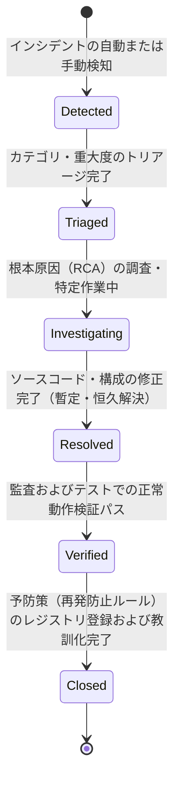
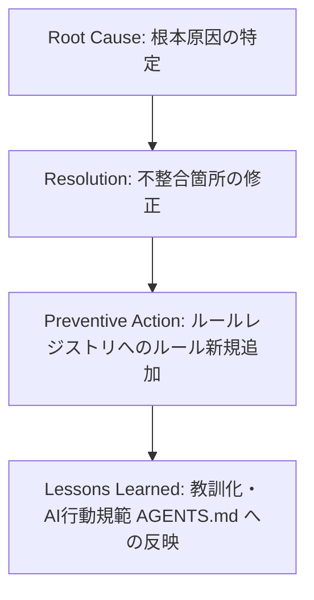

# AIOS Incident Registry Specification (例外・インシデントナレッジ管理規範)

Version: 1.0.0
Phase: Phase 104 (Incident Registry Foundation)
Status: Active

---

## 1. 目的 (Purpose)
本仕様書は、AIOS (Artificial Intelligence Operating System) の開発および運用中に発生した不整合、ビルド例外、テスト失敗、および監査違反（以下「インシデント」と呼ぶ）をナレッジベースとして登録し、根本原因の分析（RCA）から恒久的な予防策（ルールレジストリへの追記等）までを一元管理する **Incident Registry** の仕様およびメタデータ構造を規定します。

---

## 2. インシデントメタデータスキーマ (Incident Metadata Schema)
すべてのインシデントレコードは、将来的に `incident_registry.json` へダイレクトにマッピング可能な以下のプロパティ定義を完全に保持して記録されなければなりません。

| 属性名 (Field) | 型 (Type) | 説明 (Description) |
|---|---|---|
| `Incident ID` | String | インシデントの一意な識別コード。`INC-YYYY-連番` の命名規則に従う。例: `INC-2026-0001` |
| `Title` | String | インシデント事象の簡潔な要約。 |
| `Category` | Enum | インシデントの発生領域（`Build`, `Test`, `Audit`, `Process`, `Release`）。 |
| `Severity` | Enum | インシデントの重大度。`Blocker`（全開発ブロック） / `Critical`（ゲート遮断） / `Major` / `Minor`（警告のみ）。 |
| `Status` | Enum | インシデントの現在のステータス。後述のライフサイクルに従う。 |
| `Detected Phase` | String | インシデントが検出された開発フェーズ番号（例: `"Phase103"`）。 |
| `Detected By` | String | インシデントを検出した主体（例: `CIE Auditor`, `Quality Manager`）。 |
| `Related Rule IDs` | List[String] | `RuleRegistry.md` 内で違反となったルールIDのリスト。該当がない場合は空配列。 |
| `Root Cause` | String | なぜその不整合やビルド失敗が発生したのかに関する根本原因分析 (RCA) の記述。 |
| `Impact` | String | インシデント発生によるシステム、開発スケジュール、または機能動作への影響範囲。 |
| `Resolution` | String | インシデントを暫定／恒久解決するために施された修正内容。 |
| `Preventive Action` | String | 同種インシデントの再発を防止するために、ルールレジストリや監査エンジンに追加・更新したポリシーの記述。 |
| `Lessons Learned` | String | 本インシデントから得られた開発チームおよびAI向けの教訓・改善提言。 |
| `Owner` | String | インシデントの調査・解決・検証を担当したオーナー（例: `QA Department`）。 |
| `Created` | DateTime | インシデント発生・検出日時 (ISO-8601)。 |
| `Closed` | DateTime | インシデントが検証・解決されクローズされた日時 (ISO-8601)。 |
| `Related Commit` | String | インシデントに関連するコードコミットハッシュ（検出時または解決時）。 |
| `References` | List[String] | 関連するバグチケット、Slackスレッド、ドキュメントのリンク。 |

---

## 3. インシデント・ライフサイクル (Incident Lifecycle)
インシデントは、検出から恒久対策適用によるクローズに至るまで以下のライフサイクル状態を辿ります。

1. **Detected (検知済)**: 監査エンジンまたは開発者が例外や失敗を検知した初期状態。
2. **Triaged (トリアージ済)**: 重大度と影響範囲が分類され、担当オーナーが割り当てられた状態。
3. **Investigating (調査中)**: 根本原因の特定および修正案の作成を行っている状態。
4. **Resolved (解決済)**: エラーの直接原因となる箇所への修正コードが適用され、ビルド・テストがパスする状態。
5. **Verified (検証済)**: 監査エンジンによる検証プロセスを完全にクリアし、回帰がないことを確認した状態。
6. **Closed (完了)**: RCA から得られた予防策を `RuleRegistry.md` に新規追加し、教訓ドキュメントを永続化してクローズした状態。

---

## 4. 根本原因分析（RCA）から再発防止（予防策）への解決ループ
AIOS では、インシデントを「ただ解決する」のではなく、将来の自律的な品質維持に昇華させるために、以下の **RCA ループ** を強制適用します。

* **分析の義務化**: 単なる「タイポ修正」で終わらせず、「なぜタイポが発生したか（例: CLIパーサー定義と定数マニフェストが独立した配列だったため）」まで掘り下げて RCA を記述します。
* **ルール登録による水際阻止のコード化**: 恒久防止のため、新しい静的チェックルール（例: `CLI-001`）を `RuleRegistry.md` に追加し、次回以降コミット時に自動遮断できるようにフィードバックをループさせます。

---

## 5. 初期インシデントデータ定義 (Initial Incident Structure / Example)

### INC-2026-0001: Duplicate argparse Subparser Registration
* **Incident ID**: `INC-2026-0001`
* **Title**: Duplicate argparse Subparser Registration
* **Category**: `Build`
* **Severity**: `Critical`
* **Status**: `Closed`
* **Detected Phase**: `Phase100`
* **Detected By**: `CIE CLI Builder`
* **Related Rule IDs**: `CLI-001`
* **Root Cause**: CIE プラットフォームの CLI スクリプト `tools/cie.py` に新規のサブコマンドパーサーを追加する際、既存のコマンドパーサー定義コードをコピペして追加したため、パーサーの登録名（引数変数名など）が重複し、argparse が `ArgumentError`（サブパーサー競合）を投げてCLI全体のビルドがクラッシュした。
* **Impact**: CLIツール `python3 tools/cie.py` が一切起動しなくなり、全フェーズの開発・健全性検証（doctor/verify）およびコミット前の検証フローが全面的に停止した。
* **Resolution**: 重複していた変数名 `runtime_event_execution_log_executor_parser` を新サブコマンド用の変数名に適切に修正し、パーサーインスタンスの登録を一意化した。
* **Preventive Action**: コミット時の `tools/cie.py` の AST 解析による自動重複・構文チェックの仕組みを構築した。また、新規サブコマンド追加時は `COMMANDS` の定数マニフェストと定義インスタンスの一対一の不変照合チェックを実行するルール `CLI-001` を策定し、`RuleRegistry.md` に追加した。
* **Lessons Learned**: コードのコピペによる重複登録は、ビルドを致命的に破壊する。追加の際は必ず変数名および登録シンボルが完全に一意であることを確認し、CLIパーサーの登録は動的なマッピング定義からの自動生成に寄せていくべきである。
* **Owner**: `Quality Control`
* **Created**: `2026-06-30T10:00:00Z`
* **Closed**: `2026-06-30T12:00:00Z`
* **Related Commit**: `7f4bd0cd6aee857300be397e655a9f82f122c946`
* **References**: None

---

## 6. 将来の自動化ポイント (Future Automation Points)
* **自動起票・トラッキング (tools/audit/incident_registry.json)**:
  ビルドエラーや pytest の失敗、あるいは AuditOS による Critical なゲート遮断が発生した際、CIE が自動的にエラー内容、発生フェーズ、関連コミットハッシュを取得し、`incident_registry.json` に未解決インシデント（`Status: Detected`）として自動起票する仕組みを将来フェーズで統合します。
