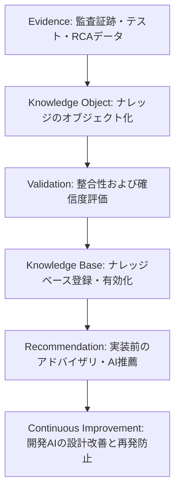

# AIOS Knowledge Base Specification (統合ナレッジベース管理規範)

Version: 1.0.0
Phase: Phase 108 (Knowledge Base Foundation)
Status: Active

---

## 1. 目的 (Purpose)
本仕様書は、AIOS (Artificial Intelligence Operating System) におけるガバナンス、開発規約、監査ログ、障害インシデント、およびメトリクスから得られたすべての組織的な知見・知恵を統合し、AIおよび開発者が再利用可能な形式で永続化する **Knowledge Base** のアーキテクチャ、オブジェクトモデル、および学習ライフサイクルを規定します。

---

## 2. ナレッジガバナンス規則 (Knowledge Governance Rules)

### 2.1 不変 ID ポリシー (Stable Knowledge IDs Policy)
* ナレッジオブジェクトに一度割り当てられた `KB-YYYY-NNNN` (例: `KB-2026-0001`) の識別IDは不変（Stable）であり、ドキュメントや内容が更新されてもID自体は変更されません。
* 新しい独立したナレッジ（教訓、プラクティス）が追加される場合は、常に新規の一意なナレッジIDを採番します。

### 2.2 ナレッジソースの限定 (Knowledge Sources Enum)
表記ゆれを防ぎ、情報の系統（トレーサビリティ）を保証するため、ナレッジオブジェクトの `Source` フィールドは以下の定義されたモジュール列挙型に制限されます。

* `DevelopmentOS` (開発ライフサイクルプロセス知見)
* `AuditOS` (水際・リリース検証知見)
* `Rule Registry` (静的ルール適合・適合知見)
* `Incident Registry` (障害・例外RCA知見)
* `Preventive Gate` (事前予防アドバイザリ知見)
* `Audit History` (不変監査履歴知見)
* `Quality Metrics` (定量メトリクス分析知見)

### 2.3 ナレッジステータスライフサイクル (Knowledge Status Lifecycle)
各ナレッジオブジェクトは、ナレッジベース内での有効性および進化段階を管理するため、以下のステータスを辿ります。

```
[Proposed (提案中)]
      │
      ▼
[Validated (検証済)]
      │
      ▼
[Active (有効)] ──> [Deprecated (非推奨)] ──> [Archived (アーカイブ済)]
```

* **Proposed**: 教訓やベストプラクティスが起票され、検証を待っている状態。
* **Validated**: データ整合性やルールの妥当性が検証された状態。
* **Active**: 現在の開発プロセスや Preventive Gate の分析クエリで積極的に参照される状態。
* **Deprecated**: ルールの改訂やアーキテクチャ変更により、参照対象から外れた状態。
* **Archived**: 歴史的ナレッジ証跡として、変更不可の状態でアーカイブ保存された状態。

---

## 3. ナレッジライフサイクル (Knowledge Lifecycle)
証拠データの抽出から、ナレッジベース登録、および再利用による継続的改善に至るライフサイクルは以下の通り規定されます。



---

## 4. ナレッジオブジェクトモデル (Knowledge Object Model Schema)
ナレッジベースに永続化される各レコードは、以下のプロパティを保持する必要があります。

| 属性名 (Field) | 型 (Type) | 説明 (Description) |
|---|---|---|
| `Knowledge ID` | String | ナレッジの一意な不変識別ID。`KB-YYYY-NNNN` の規則に従う。 |
| `Title` | String | ナレッジの簡潔なタイトル。 |
| `Category` | Enum | カテゴリ（`Governance`, `Development`, `Audit`, `Incident`, `Prevention`, `Metrics`, `Best Practice`, `Architecture`, `Lessons Learned`）。 |
| `Source` | Enum | 情報のソースモジュール（前述の `Knowledge Sources Enum` に制限）。 |
| `Source Phase` | String | 該当ナレッジが生成されるきっかけとなったフェーズ（例: `"Phase100"`）。 |
| `Confidence` | Float | ナレッジの確信度（0.0 〜 1.0）。関連するインシデントの再発率やテスト検証成功頻度から算出。 |
| `Related Rules` | List[String] | 関連する `RuleRegistry.md` 内のルールIDリスト。 |
| `Related Incidents` | List[String] | 関連する `IncidentRegistry.md` 内のインシデントIDリスト。 |
| `Related History` | List[String] | 関連する `AuditHistory.md` 内の履歴IDリスト。 |
| `Related Metrics` | List[String] | 関連する品質メトリクスIDリスト。 |
| `Lessons Learned` | String | 本事象から得られた詳細な教訓。 |
| `Best Practices` | String | 開発AIや開発者が従うべき、適合する実装のサンプルコードや構成方法。 |
| `References` | List[String] | 関連資料へのリンク。 |
| `Version` | String | ナレッジ自体の改訂バージョン。 |
| `Status` | Enum | 前述の `Knowledge Status Lifecycle` 列挙型に制限。 |

---

## 5. ナレッジオブジェクト例 (Example Knowledge Object)

### KB-2026-0001: CLI Subcommand Parser Implementation Standard
* **Knowledge ID**: `KB-2026-0001`
* **Title**: CLI Subcommand Parser Implementation Standard
* **Category**: `Best Practice`
* **Source**: `Incident Registry`
* **Source Phase**: `Phase100`
* **Confidence**: `0.95`
* **Related Rules**: `["CLI-001"]`
* **Related Incidents**: `["INC-2026-0001"]`
* **Related History**: `["HIS-2026-0001"]`
* **Related Metrics**: `["M-RCR"]`
* **Lessons Learned**: `tools/cie.py` に新しいサブコマンドパーサーを追加する際、定義マニフェストとの同期を検証せずコピペで追加すると、argparse の登録名競合による起動クラッシュを招く。
* **Best Practices**: 新規サブコマンドを登録する際は、パーサーのインスタンス変数を決定論的かつ一意に定義し、`COMMANDS` リストマニフェストとの間で 1対1 のマッピング検証（`CLI-001`）をパスしなければならない。
* **References**: `["Duplicate argparse subparser Incident (INC-2026-0001)"]`
* **Version**: `1.0.0`
* **Status**: `Active`

---

## 6. 将来の検索および AI 連携ロードマップ (Future Roadmap)
* **ナレッジストレージ (tools/audit/knowledge/)**:
  将来的に、作成されたナレッジは `tools/audit/knowledge/kb.json` にて永続化されます。
* **ベクトル検索と AI 推薦 (Phase 111 予定)**:
  開発エージェントが新規フェーズの `implementation_plan.md` を作成する際、CIE が自動的に計画内容をパースし、KBデータベースから関連する教訓（`KB-XXXX-XXXX`）を類似検索（Semantic Search/Embedding）して、実装時の注意点やベストプラクティスをプロンプトに動的に注入する推薦システムを配備します。
