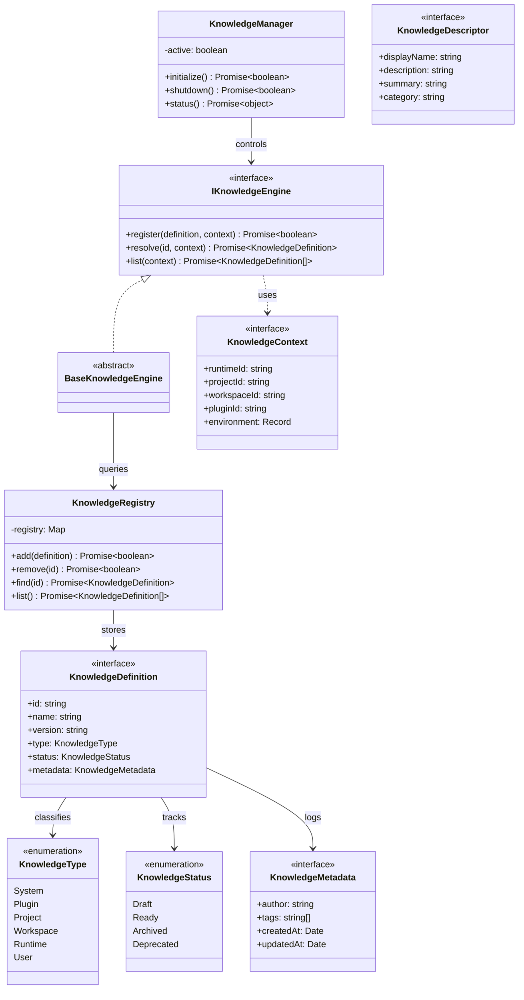

# AIOS Knowledge Engine Foundation Specification (ナレッジエンジン定義規範)

Version: 1.0.0
Phase: Phase 123 (Knowledge Engine Foundation)
Status: Active

---

## 1. 目的 (Purpose)
本仕様書は、AIOS (Artificial Intelligence Operating System) および AI Development Platform における知識処理レイヤー（Knowledge Layer）の土台となる **Knowledge Engine** の基本構造、抽象インターフェース、メタデータ分類、およびライフサイクル制御を規定します。
本仕様および Blueprint 実装は将来の Vector DB、セマンティック検索（RAG）、学習システム等を安全に統合するためのインターフェース契約として機能します。

---

## 2. 関係性ダイアグラム (Relationship Diagram)
Knowledge Layer における各抽象化コンポーネントおよびエンティティの相互参照・依存関係モデル。

---

## 3. コンポーネント責務定義 (Component Responsibilities)

### 3.1 IKnowledgeEngine (インターフェース) & BaseKnowledgeEngine (抽象クラス)
* **責務**: ナレッジエンジンの機能操作定義。具現化された検索ロジックや API を隠蔽し、クライアントへ対して同一の `register` / `resolve` / `list` 操作を公開します。

### 3.2 KnowledgeRegistry (レジストリ)
* **責務**: 知識定義（KnowledgeDefinition）のメモリ上における追加、削除、検索、一覧管理を担うデータストレージの抽象化。

### 3.3 KnowledgeManager (ライフサイクル管理者)
* **責務**: 知識エンジンの起動（`initialize`）、停止（`shutdown`）、および監視（`status`）を実行するサービスコントローラー。

### 3.4 KnowledgeDefinition (型定義)
* **責務**: 知識オブジェクトそのものを一意に識別するための共通データスキーマ（ID, Name, Version, Type, Status 等）。

### 3.5 KnowledgeDescriptor (概要表現)
* **責務**: ダッシュボードやヒューマンレビューで用いる表示情報（DisplayName, Description）の構造を保持。

### 3.6 KnowledgeContext (環境コンテキスト)
* **責務**: 知識が作成・評価された際のランタイム ID、プロジェクト ID、プラグイン ID 等をトレース・バインドするための状態オブジェクト。

---

## 4. 将来の実行統合ロードマップ (Future Roadmap)
* **RAG & セマンティック検索統合 (Phase 123 以降)**:
  将来的に `BaseKnowledgeEngine` を拡張する `SemanticKnowledgeEngine` クラスが作成されます。この拡張クラスは、本フェーズで策定した `IKnowledgeEngine` 規約に従いながら、内部的に Vector DB クライアント（Embedding 変換処理を含む）と接続され、RAG および類似度に基づいた意味論的ナレッジ検索（Retrieval）を提供します。
