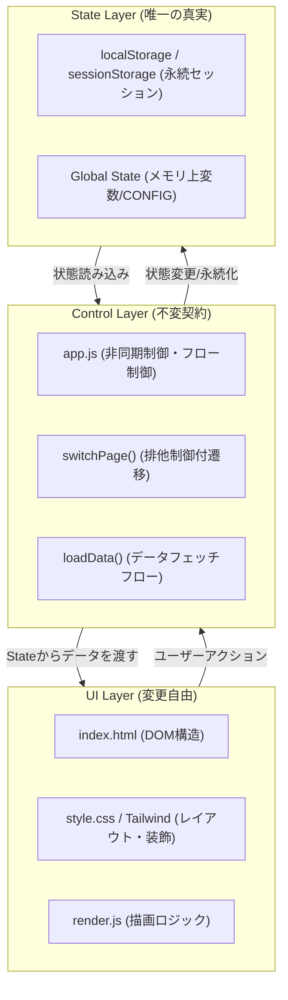

# Mobile Frontend Architecture Specification (モバイルフロントエンド 3層アーキテクチャ設計契約)

Version: 1.0.0
Status: Active (正式設計契約として固定)

---

## 1. アーキテクチャ図式 (3-Layer Architecture Diagram)

---

## 2. 各レイヤーの責務定義 (Layer Responsibility Matrix)

### ① UI Layer (変更自由・ロジックなし)
*   **ファイル群**: `active/mobile/index.html`, `render.js`, `style.css`
*   **役割**: DOMの骨組み定義、CSSによるプレミアム漆黒UIデザイン、および状態に応じたHTML文字列生成。
*   **絶対制約**:
    *   **状態（State）を自ら保持・判断しない。**
    *   UIを変更したこと（CSSクラスの変更やIDの軽微な変更）によって、Control Layer の動作が絶対に壊れてはならない。
    *   DOM上の状態（例：`classList.contains('hidden')`）をロジックの判断基準にしない。

### ② Control Layer (不変契約・排他制御)
*   **ファイル群**: `active/mobile/app.js` (およびその中の `switchPage`, `loadData` 等の制御フロー関数)
*   **役割**: イベントハンドリング、APIとの通信、非同期フロー制御、および画面遷移のアニメーション処理。
*   **絶対制約**:
    *   **UI（CSSクラスやデザイン）に依存しない。**
    *   非同期処理の実行競合（レースコンディション）を防ぐため、`switchPage` のような遷移制御は必ず **排他制御（Mutex/Lock）** を持つ。
    *   データのフェッチ（Data Retrieval）とレンダリング（UI Rendering）を明確に分離し、非同期通信の解決を待ってからUIを構築する。

### ③ State Layer (唯一の真実・単一責任)
*   **要素**: `localStorage` (ユーザー情報等), `sessionStorage`, グローバル変数 (`RUNTIME_CONFIG` 等)
*   **役割**: アプリケーションのすべての動作の「判断基準」となる単一状態の保持。
*   **絶対制約**:
    *   UIおよび制御が何かを判断する際は、DOMではなく必ずこの State Layer の状態値を正とする。
    *   状態の更新は Control Layer が一元管理し、UI Layer は状態値を受け取って描画に徹する。

---

## 3. 絶対開発ルール (Guardrails)

1.  **DOM直接判断の絶対禁止**:
    *   ❌ `if (document.getElementById('page-areas').classList.contains('hidden'))` のようなDOMの状態に依存した分岐は禁止。
    *   ✅ 状態の判定は必ずグローバル変数や State（例：`lastAreaSubPage`）を読み取って行う。
2.  **UI変更でControlを壊さないための疎結合設計**:
    *   Control側はDOMから要素を取得してスタイルを操作するが、そのキーとなるID（例：`loading`, `app`）はアーキテクチャの予約IDとし、安易に変更・削除しない。
3.  **switchPageは必ず排他制御フラグで保護する**:
    *   非同期待機（アニメーション待ち）を伴うため、`isPageTransitioning` などのMutexを必ず噛ませて多重実行を完全にブロックする。

---

## 4. 今後の破壊パターンと防止策 (Antipatterns & Prevention)

| 破壊パターン | 具体例 | 防止策 |
|---|---|---|
| **インラインCSSの強制上書きによる制御破綻** | `style.css` のIDセレクタ等に `!important` で `display: flex;` などを強制し、JSの `hidden`（`display: none;`）を上書き無効化してしまう。 | 構造要素（`#screen-gateway`, `#loading`, `#app`）への `!important` 付きレイアウトCSS指定を禁止する。 |
| **非同期の `await` 漏れによる画面の多重フェードイン** | `loadData` 内部で `switchPage` を `await` なしで呼んでしまい、遷移が完了する前にUIが同時表示される。 | `switchPage` は排他制御を内包し、仮に `await` が漏れても **ターゲット以外の全ページを一括非表示（`hidden` 強制）** にするリセットガードを維持する。 |
| **同一オリジンにおける Service Worker のキャッシュ汚染** | 管理者アプリなどの別リソース用に登録された SW が配布員アプリのファイルをキャッシュしてしまい、起動障害を起こす。 | 配布員アプリの `index.html` 最上部に、自動的に他の SW の登録を解除（`unregister`）しキャッシュを全クリアする自己防衛コードを常時配置する。 |
