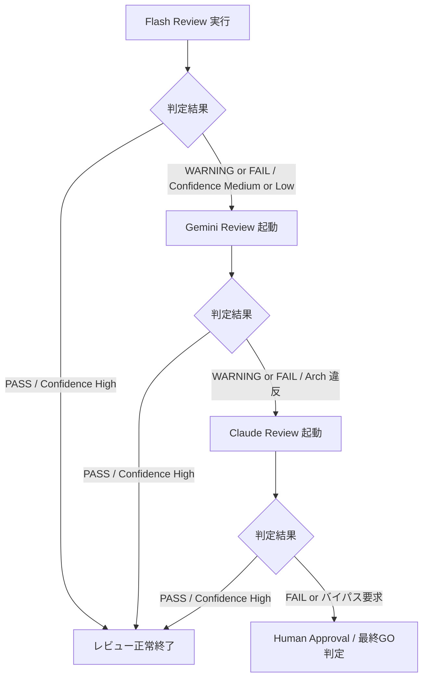

# AIOS Multi-AI Review Specification (多層AI協調レビュー定義規範)

Version: 1.0.0
Phase: Phase 115 (Multi-AI Review Foundation)
Status: Active

---

## 1. 目的 (Purpose)
本仕様書は、AIOS (Artificial Intelligence Operating System) におけるコード品質および開発ガバナンスを高度に統制するため、FLASH (開発AI)、GEMINI_PRO (設計AI)、OPUS (監査AI)、および HUMAN (人間管理者) からなる多層的で段階的なレビュー連携プロセス（Multi-AI Collaborative Review）の責任境界、エスカレーション条件、競合解決、およびAPIコスト最適化ポリシーを規定します。

---

## 2. 多層AIレビューアーキテクチャ (Multi-AI Review Architecture)
レビューシステムは、個々のAIモデルの特性（コスト、コンテキスト長、推論能力）に合わせて責任を分離し、下位の検証レイヤーで問題を早期フィルタリングする「多層防御 (Defense-in-Depth)」構造を採ります。

```
[Layer 1: Flash Self Review]  ← 常時実行 (高速・極小コストでの構文・形式チェック)
        │
    (警告 / 確信度低下 / 指定例外)
        ▼
[Layer 2: Gemini Design Review] ← 設計整合性・データモデル整合性の確認
        │
    (アーキテクチャ規律違反 / 警告)
        ▼
[Layer 3: Claude Governance Audit] ← 長文コンテキスト・不変履歴・規律の厳格監査
        │
    (最終判定・バイパス申請)
        ▼
[Layer 4: Human Approval]     ← 人間の管理者による最終承認 (GO / NO-GO)
```

---

## 3. レビューレイヤー定義 (Review Layers)

### 3.1 Layer 1: Flash Self Review
* **役割**: 高速・低コストの第一防衛ライン。
* **主な検証領域**: 構文チェック、デッドコード排除、タイポ、基本的な命名規約、 walkthough/handover/task ドキュメントの網羅・同期状態の確認。

### 3.2 Layer 2: Gemini Design Review
* **役割**: 高度な設計およびデータモデルの適合性検証。
* **主な検証領域**: DTO設計、Managerのステートレス性、データ辞書（Data Dictionary）との型・用語適合性、依存関係マップの整合性。

### 3.3 Layer 3: Claude Governance Audit
* **役割**: 最上位のガバナンス統制およびアーキテクチャ一貫性監査。
* **主な検証領域**: `DevelopmentOS`, `AuditOS` 原則への適合、不変監査履歴（Audit History）やインシデント（RCA）との長期コンテキスト照合、設計仕様書と実装コードの乖離監査。

### 3.4 Layer 4: Human Approval (最終ゲート)
* **役割**: プロセス適用および進行判定の最終意思決定者。
* **主な検証領域**: 全体の進行可否、AIレビュー警告のオーバーライド、最終的な `main` ブランチへのリリース（GO/NO-GO判定）。

---

## 4. レビュー責任マトリクス (Review Responsibility Matrix)
各アクターが検証・責任を持つレビュー項目（主担当：◯、補助：△、対象外：✕）。

| レビュー項目 | Flash (Layer 1) | Gemini (Layer 2) | Claude (Layer 3) | Human (Layer 4) |
|---|---|---|---|---|
| **Code Style / Naming** | ◯ | △ | ✕ | ✕ |
| **Duplicate / Dead Code** | ◯ | △ | ✕ | ✕ |
| **DTO / Manager Design** | △ | ◯ | ✕ | ✕ |
| **Data Dictionary適合** | △ | ◯ | △ | ✕ |
| **Architecture Consistency**| ✕ | ◯ | ◯ | ✕ |
| **Governance Rule Audit** | ✕ | △ | ◯ | ✕ |
| **Documentation Match** | ◯ | ◯ | ◯ | ✕ |
| **Final Release Decision** | ✕ | ✕ | ✕ | ◯ |

---

## 5. エスカレーションルール & トリガー条件 (Escalation Rules)

### 5.1 昇格エスカレーションフロー
判定結果、確信度（Confidence）、および重要度（Severity）が以下の条件を満たした場合、上位レイヤーへ自動的に昇格（Escalation）されます。



### 5.2 API 起動・昇格判定トリガー値
* **Gemini Pro 起動条件**:
  * Flash 判定が `WARNING / FAIL` である場合。
  * Flash レビュー確信度（Confidence）が `Medium / Low / Unknown` の場合。
  * 変更ファイルに `DTO`、`Manager`、`specification` が含まれる場合（Severity: Major 以上）。
* **Claude Opus 起動条件**:
  * Gemini 判定が `WARNING / FAIL` である場合。
  * `RuleRegistry` (SIN-003) において `Critical` 指定されたルールに違反している場合。
  * 設計仕様書（kebab-case）の大幅な変更が含まれる場合。
* **Human Approval 起動条件**:
  * Claude 判定が `FAIL` である場合。
  * 監査ルール警告に対するオーバーライド申請が開発AIから提出された場合。
  * リリース（mainブランチへのマージ）前段階の最終確認時。

---

## 6. 競合解決ポリシー (Conflict Resolution)
AIOS では、レビューAI同士で判定が衝突した場合、以下のポリシーを適用します。

* **多層 FAIL 制約 (Multi-Layer Fail Constraint)**:
  * 下位エージェントが `PASS` と判定しても、上位エージェント（Gemini, Claude）のいずれか1つでも `FAIL` または重大な `WARNING` を出力した場合は、最終判定結果は **`FAIL`** として扱われます。
* **手動査読エスカレーション (Conflict to Human Review)**:
  * 判定が分裂した場合（例: Flash: `PASS`, Gemini: `WARNING`, Claude: `FAIL`）、レビューエンジンは自動進行をロックし、結果を `Review Required` として人間（岩佐CEO）の判断に委ねます（Conflict Resolution to Human）。

---

## 7. コスト最適化ポリシー (Review Cost Policy)
高価な上位モデルのAPIトークン消費を最小化するため、以下のコスト削減ルールを強制適用します。

* **早期打ち切り (Early Termination)**:
  * 下位レイヤー（Flash）で致命的エラー（`FAIL`）が検出された場合、後続の Gemini や Claude へのリクエストは行わず、直ちに開発エージェントへ修正を差し戻します。
* **変更差分バイパス (Skip Conditions)**:
  * ドキュメントのタイポ修正（Patch 変更）など、ソースコードやデータ辞書（DataDictionary）に影響を与えない軽微な差分に限り、Gemini/Claude レビューをスキップし、Flash 判定と人間 GO のみでリリースを許可します。

---

## 8. レコード統合とトレーサビリティ (Record Integration)
各レイヤーのレビュー結果は、以下のようにデータ配線されます。

1. **レビュー報告書 (`REV`)**: 各層の AI / 人間レビューログから生成。
2. **意思決定レコード (`DEC`)**: レビュー結果（REV）を証跡（Evidence）として取り込み、承認・却下（GO/NO-GO）の決定を記録。
3. **不変履歴 (`HIS`)**: 意思決定レコードを不変アーカイブとして永続化。
4. **ナレッジベース (`KB`)**: 却下（NO-GO）された意思決定（DEC）の RCA から教訓を抽出・永続化。
5. **Dashboard**: これらのヘルススコア・タイムラインを読み取り専用で一元表示。

---

## 9. 将来の拡張・ trigger ポリシー (Future Trigger Policy)
将来的な Review Orchestrator (Phase 117) への接続を見据え、レビューの起動条件を以下のイベントモデルとして準備します。

* **`Commit Created`**: ローカルコミット生成時に Flash Self Review をフック起動。
* **`Pull Request Created`**: PR作成時に Gemini / Claude 協調レビューを自動起動。
* **`Specification Changed`**: 仕様書（docs/specifications/*.md）更新時に、依存仕様への影響監査（Claude）を起動。
* **`Runtime Changed`**: ランタイムコード（Python等）が変更された場合、DTO/Manager適合監査（Gemini）を起動。
* **`Rule Updated / Incident Detected`**: 新ルール追加またはインシデント検知時に、予防ゲート（Preventive Gate）を介した再レビューを自動起動。
* **`Manual Review Requested`**: 人間が手動でレビューを再トリガーした際に、指定レイヤーをオンデマンドで起動。
