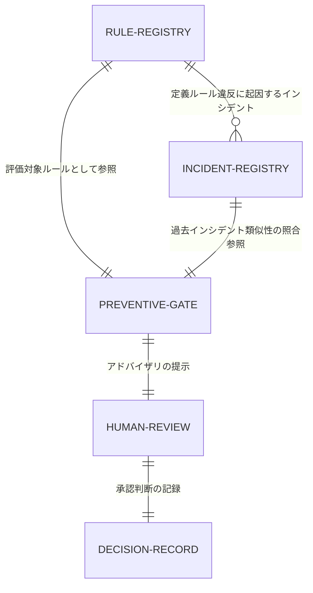
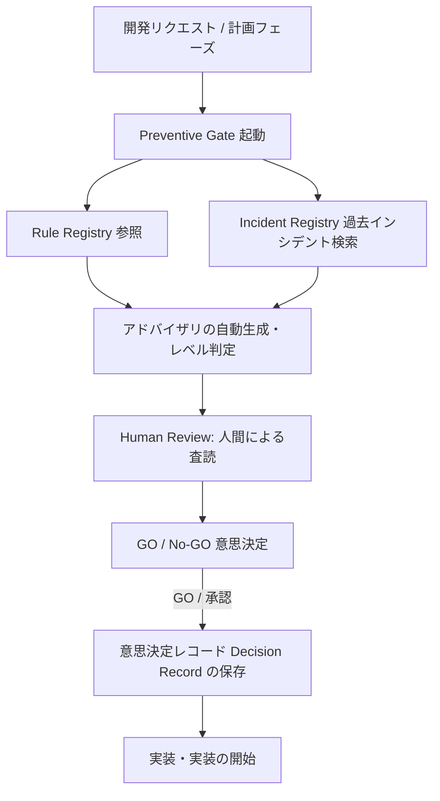

# AIOS Preventive Gate Specification (事前予防ゲート統制規範)

Version: 1.0.0
Phase: Phase 105 (Preventive Gate Foundation)
Status: Active

---

## 1. 目的 (Purpose)
本仕様書は、過去のインシデントおよびルール違反を事前に防ぐためのガバナンス機構である **Preventive Gate** のアーキテクチャおよびワークフローを規定します。
Preventive Gate は、開発リクエスト発生時や実装前に、Rule Registry および Incident Registry に照らして自律的なリスク分析を行い、アドバイザリ（推奨指導）を出力することで、人間（管理者）の承認意思決定 (GO判定) を支援します。

---

## 2. ゲート設計原則 (Gate Principles)
Preventive Gate は、以下の設計思想を厳守して定義されます。

1. **Human Approval First (人間承認優先)**:
   自動監査ゲートの最終的な出力は人間の意思決定を助けるためのものであり、開発工程のゲートを開閉する最終決定権限は常に人間に属します。
2. **Advisory First (アドバイザリ優先)**:
   本フェーズでは開発プロセスを機械的にブロッキングして強制停止することはせず、開発AIや人間に対してガイダンスや警告を提示する「アドバイザリ」動作を基本とします。
3. **Evidence-based Advice (証拠に基づくアドバイス)**:
   ゲートの出力は、過去の登録インシデント情報およびルールマニフェスト（客観的エビデンス）と直接マッピングされていなければなりません。

---

## 3. 関係構造およびデータフロー (Relationship & Workflow)

### 3.1 関係構造図 (Relationship Diagram)
ルール、インシデント、予防ゲート、および承認フローの静的関係は以下の通り規定されます。



### 3.2 ゲートワークフロー (Gate Workflow)
実装前に適用される標準統制フローは以下の通り規定されます。



---

## 4. アドバイザリモード (Advisory Mode)

### 4.1 アドバイザリレベル (Advisory Levels)
インシデントおよびルール違反の検知リスクに応じて、以下のレベルのアドバイザリ警告が出力されます。

* **Information**:
  標準的な開発ガイドラインや命名のヒントなどを提示するログ。開発プロセスへの影響はありません。
* **Recommendation**:
  プラットフォーム標準（後方互換性等）に合わせた推奨される設計・実装構成。従うことが強く推奨されます。
* **Warning**:
  ドキュメントの更新漏れ（HANDOVER等）や、軽微な設計不整合。人間への警告が表示されます。
* **Critical Recommendation**:
  重大な設計原則の不一致、または過去の重大インシデント（例: `INC-2026-0001`）と類似する不整合パターンの検出。強い警告を出力しますが、Advisory Mode であるため、ビルドを強制終了させることはしません。

---

## 5. 意思決定レコード (Preventive Decision Record Schema)
人間がアドバイザリを査読し、実装の開始（GO）を決定した際、将来の Audit History に永続化するための以下のデータレコード（メタデータ）が収集されます。

```json
{
  "decision_record": {
    "decision": "APPROVED",
    "reason": "Phase 105 specification is ready and conforms to the core guidelines.",
    "reviewer": "岩佐CEO",
    "timestamp": "2026-07-01T04:43:00Z",
    "related_incident_ids": [],
    "related_rule_ids": ["SPEC-001"]
  }
}
```

* `decision`: 承認ステータス（`APPROVED` / `REJECTED` 等）。
* `reason`: 承認理由、または Warning 警告をバイパス・オーバーライドする際の技術的合理性のある理由。
* `reviewer`: レビュアー署名。
* `timestamp`: レビュー実行時の日時 (ISO-8601)。

---

## 6. 将来のブロックモードおよび自動化 (Future Roadmap)
* **Block Mode (将来)**:
  安定稼働フェーズ移行後、`Critical` 警告の発生時に Git コミットやプッシュ、CI/CD パイプラインを自動的に拒否してプロセスを強制中断するブロッキング動作の統合を計画します。
* **履歴連携 (Audit History Integration)**:
  `Preventive Decision Record` の不変データを自動記録し、次のフェーズである `Phase 106: Audit History Foundation` で履歴監査証跡として保存できるように配線します。
