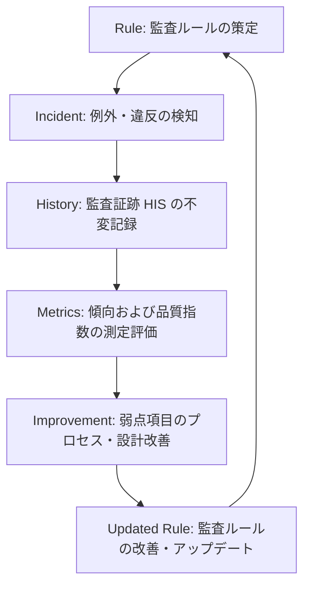

# AIOS Quality Metrics Specification (品質・ガバナンス測定評価規範)

Version: 1.0.0
Phase: Phase 107 (Quality Metrics Foundation)
Status: Active

---

## 1. 目的 (Purpose)
本仕様書は、AIOS (Artificial Intelligence Operating System) における開発ガバナンスの順守率、品質安定性、および予防効果を定量評価するための **Quality Metrics** の測定フレームワーク、指標カタログ、および計算論理を規定します。

---

## 2. メトリクスアーキテクチャ (Metrics Architecture)

### 2.1 指標分類 (Metric Classification)
AIOS で収集・管理されるメトリクスは、その検証領域に応じて以下のように分類されます。

* **Governance (ガバナンス指標)**: プロセス規約（GO承認ポリシー等）の順守度合いを測定。
* **Quality (品質指標)**: ソースコードの設計原則への適合度（不変性、No Context Leak等）を測定。
* **Reliability (信頼性・安定性指標)**: ビルド成功率やインシデントの発生頻度・回復速度を測定。
* **Productivity (生産性指標)**: 各開発フェーズの移行サイクル時間および手戻り発生率を測定。
* **Documentation (ドキュメント指標)**: 仕様書、ハンドオーバー、および検証レポートの記述充足度を測定。
* **Knowledge (ナレッジ指標)**: 再発防止ルール化（RCAからコアルールへの変換率）の度合いを測定。

### 2.2 指標ステータス (Metric Status)
各測定指標は以下の状態を持ち、指標の改善や陳腐化に対応します。

```
[Proposed (提案中)] ──> [Active (測定中)] ──> [Deprecated (非推奨・除外予定)]
```

### 2.3 KGI と KPI の位置づけ (KGI vs. KPI Alignments)
* **KGI (Key Goal Indicator: 重要目標達成指標)**:
  ガバナンスおよび品質の最終目標を示します。
  * *例*: 本番メインブランチにおける Critical 監査違反発生率 0%、および重大インシデント発生件数 0 件。
* **KPI (Key Performance Indicator: 重要業績評価指標)**:
  KGI に至る過程の改善進行度を示します。
  * *例*: 開発フェーズ中の `RCR` (ルール適合率) の維持、および `MTTR` (平均インシデント解決時間) の短縮傾向。

---

## 3. 品質改善サイクル (Quality Improvement Lifecycle)
測定されたメトリクスがルールと予防ゲートへフィードバックされるライフサイクルループは以下の通り規定されます。



---

## 4. 初期定義メトリクスカタログ (Initial Metrics Catalog)

### 1. RCR (Rule Compliance Rate)
* **Metric ID**: `M-RCR`
* **名称**: ルール適合率
* **目的**: 監査実行時に適合（PASS）したルールの割合を測定し、ガバナンスへの順応度を測る。
* **数式**: `(PASSした監査ルール数 / 総監査ルール数) * 100`
* **データソース**: `Audit History` (Outcome, Rule References)
* **解釈**: 100%に近いほど、設計規約への順守率が高い。
* **将来の自動化**: `cie verify` 時に自動計算され、完了時に `HIS` ログへ追記。

### 2. IF (Incident Frequency)
* **Metric ID**: `M-IF`
* **名称**: インシデント発生頻度
* **目的**: 単位期間またはフェーズあたりに発生したインシデント起票数をカウントし、開発の不安定性を捉える。
* **数式**: `特定期間の総インシデント起票数 / 開発フェーズ数`
* **データソース**: `Incident Registry`
* **解釈**: 数値が低いほど安定しており、高い場合は予防ゲートの強化が必要。
* **将来の自動化**: `Incident Registry` の `Status: Detected` の集計により自動追跡。

### 3. MTTR (Mean Time to Resolution)
* **Metric ID**: `M-MTTR`
* **名称**: 平均インシデント解決時間
* **目的**: インシデントの検知から解決（Resolved）に至るまでの平均時間を測定し、復旧効率を測る。
* **数式**: `Σ(インシデント解決日時 - 検知日時) / 解決されたインシデント数`
* **データソース**: `Incident Registry` (Created, Closed)
* **解釈**: 値が短いほど、AIおよび人間の障害復旧能力が高い。
* **将来の自動化**: `Incident Registry` のタイムスタンプ差分から自動算出。

### 4. PGAR (Preventive Gate Advisory Rate)
* **Metric ID**: `M-PGAR`
* **名称**: 予防ゲート助言率
* **目的**: 計画・実装前に予防ゲートウェイから出力されたアドバイザリ警告の発生頻度を測定する。
* **数式**: `(警告が出力されたゲート実行回数 / 総ゲート実行回数) * 100`
* **データソース**: `Preventive Gate Logs`
* **解釈**: 高い場合は、開発AIのコーディング・設計に潜在的な違反リスクが多いことを示す。
* **将来の自動化**: ゲートの実行ログから Warning/Critical 発生比率を算出。

### 5. GDR (GO Decision Rate)
* **Metric ID**: `M-GDR`
* **名称**: GO承認率
* **目的**: 人間による査読時に「GO（承認）」が出された割合を測定。
* **数式**: `(APPROVED判定されたレコード数 / 総意思決定レコード数) * 100`
* **データソース**: `Preventive Decision Record`
* **解釈**: 高いほど、計画書および実装内容が最初から承認基準を満たしていることを意味する。

### 6. NGDR (No-GO Decision Rate)
* **Metric ID**: `M-NGDR`
* **名称**: 却下率
* **目的**: 計画書や監査結果が承認基準を満たさず、差し戻し（REJECTED/No-GO）となった割合。
* **数式**: `(REJECTED判定されたレコード数 / 総意思決定レコード数) * 100`
* **データソース**: `Preventive Decision Record`
* **解釈**: 高い場合は、AIの事前設計（計画書段階）の精度が不十分であることを示す。

### 7. ACR (Audit Completion Rate)
* **Metric ID**: `M-ACR`
* **名称**: 監査完了率
* **目的**: 各開発フェーズで予定されていた監査が完全にクリアされてクローズした割合。
* **数式**: `(完了した監査HIS数 / 予定監査HIS数) * 100`
* **データソース**: `Audit History`

### 8. AC (Audit Coverage)
* **Metric ID**: `M-AC`
* **名称**: 監査カバレッジ
* **目的**: 全体アーキテクチャのうち、自動監査ルールによってカバーされているモジュール（プラグイン等）の割合。
* **数式**: `(自動監査対象のディレクトリ・ファイル数 / 総ファイル数) * 100`
* **データソース**: `cli_audit.py`, `dto_audit.py`

### 9. DC (Documentation Completeness)
* **Metric ID**: `M-DC`
* **名称**: ドキュメント記述充足度
* **目的**: ハンドオーバー文書や検証レポートに必要な規定セクションが網羅されているかを評価。
* **数式**: `(存在する必須項目見出し数 / 規定見出し数) * 100`
* **データソース**: `HANDOVER.md`, `walkthrough.md` の静的構造

### 10. GCS (Governance Compliance Score)
* **Metric ID**: `M-GCS`
* **名称**: 総合ガバナンス適合スコア
* **目的**: ガバナンス全体の適合性を1つのインデックススコアとして統合測定する（KGI）。
* **数式**: `(RCR * 0.4) + (ACR * 0.3) + (DC * 0.3)` などの加重平均
* **データソース**: 上記の各種メトリクス値
* **解釈**: 100点に近いほど、AIOSガバナンスが完全機能していることを示す。

---

## 5. 将来の自動集計ロードマップ (Future Roadmap)
* **自動レポーティング (tools/audit/metrics/)**:
  本仕様に基づき、CIE Platform に `python3 tools/cie.py metrics` コマンドを追加し、`Audit History` から過去の適合率や MTTR トレンドを自動抽出し、`tools/audit/metrics/summary.json` としてエクスポートする仕組みを将来フェーズで統合します。
