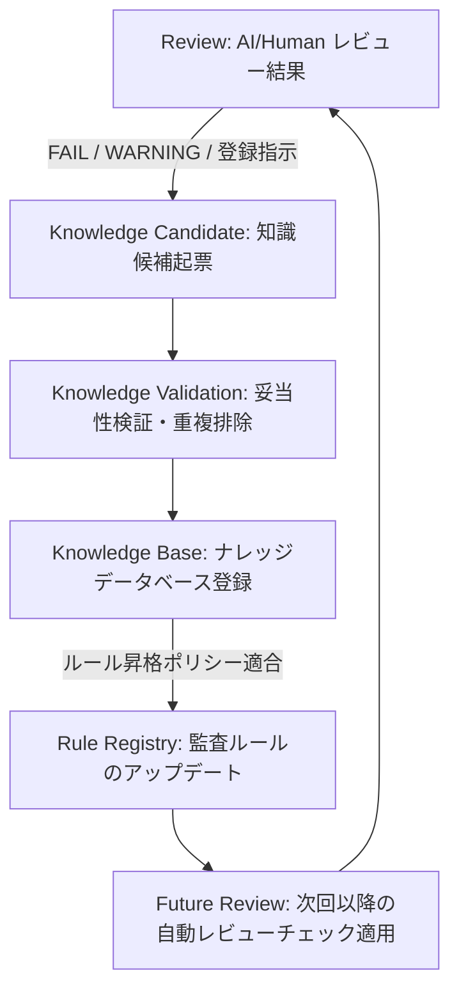
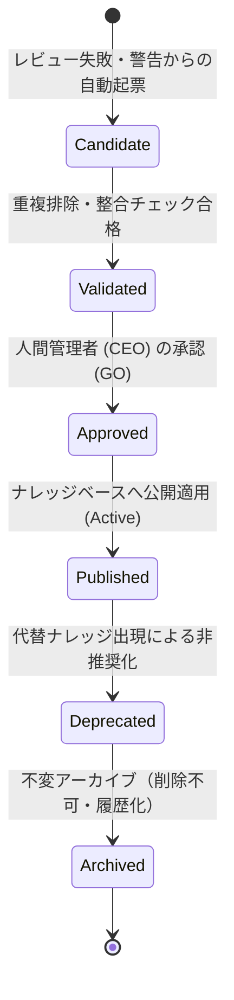

# AIOS Review Knowledge Feedback Specification (レビュー知識フィードバック定義規範)

Version: 1.0.0
Phase: Phase 118 (Review Knowledge Feedback Foundation)
Status: Active

---

## 1. 目的 (Purpose)
本仕様書は、AIOS (Artificial Intelligence Operating System) における品質レビュー結果を蓄積型の知的資産（Knowledge Base）へ自己循環フィードバックさせ、ルール更新（Rule Registry）を経て将来のレビュー（First Line of Defense: Flash Self Review 等）へ自動適用する **Knowledge Feedback Loop (自己改善ループ)** のライフサイクル、判定ロジック、重複検知、および評価メトリクスを規定します。

---

## 2. 知識循環アーキテクチャ (Review Knowledge Architecture)
レビュー結果から得られた教訓をナレッジベースおよびルールカタログへと同期昇格させるプロセス構造は以下の通り定義されます。

---

## 3. 知識候補モデル (Knowledge Candidate Schema)
レビュー結果から一時的に起票される `Knowledge Candidate` の属性構造定義。

* **`KB Candidate ID`**:
  * 一時的な識別ID。フォーマット: `KBC-[西暦4桁]-[連番4桁]` (例: `KBC-2026-0001`)。
* **`Source Review ID`**:
  * 起源となったレビュー報告書ID（`REV-YYYY-NNNN`）。
* **`Severity`**: 重大度（Critical, Warning 等）。
* **`Confidence`**: 確信度。
* **`Related Rule IDs`**: 関連するルールIDリスト。
* **`Related Decision IDs`**: 起源となった意思決定ID（`DEC-YYYY-NNNN`）。
* **`Related Incident IDs`**: 関連するインシデントIDリスト。
* **`Recommendation`**: 開発AIが次回以降注意すべき具体的な推奨/是正アクション。

---

## 4. 知識の分類・ライフサイクル (Classification & Lifecycle)

### 4.1 知識分類 (Knowledge Classification)
抽出されたナレッジは、技術的分類タグを付与して整理されます。
* `Architecture` (レイヤー境界違反)
* `Coding` (デッドコード・重複実装)
* `Documentation` (仕様・ハンドオーバー記述漏れ)
* `Governance` (開発OS、AuditOS、意思決定順守)
* `Runtime` (DTO型、Manager状態性、シリアライズ等)
* `Design` (設計一貫性)
* `Performance` / `Security` / `Testing` / `Operations`

### 4.2 知識ライフサイクル (Knowledge Lifecycle)
知識オブジェクトは以下のライフサイクル状態を辿ります。

---

## 5. 知識抽出ルール (Knowledge Extraction Rules)

### 5.1 抽出対象
* レビュー結果コード (Review Result) が **`FAIL`**、**`WARNING`**、または **`PASS_WITH_COMMENT`** のいずれかである場合、Orchestrator は自動的に `Knowledge Candidate` を起票します。
* レビューが合格（`PASS`）であっても、人間（Human Reviewer）が手動で明示的に知識登録を指示した差分・コミット。

### 5.2 除外対象
* レビュー結果が警告なしの完全合格（**`PASS`**）である場合。

---

## 6. 重複検知ポリシー (Duplicate Detection Policy)
ナレッジベース内のデータの肥大化と重複を防ぐため、以下の判定ルールを適用します。

* **同一エラー・シグネチャ一致**:
  * 検出されたエラー例外メッセージ、スタックトレース、または違反ルールIDが、既存の `Incident Registry` または `Knowledge Base` 内のレコードと同一である場合、新規追加は行わず、既存ナレッジの `Reuse Count` (再利用カウンター) をインクリメントします。
* **類似度判定 (Semantic Similarity)**:
  * 提案された推奨アクション（Recommendation）が、既存のナレッジと文脈的（あるいはセマンティックに）類似していると判定された場合（類似度 0.9 以上）、重複候補として却下（Failed/Duplicate）します。

---

## 7. コアルールへの昇格ポリシー (Rule Update Policy)
蓄積されたナレッジオブジェクト（`KB`）が、強制遮断を伴う正式な監査規約（`Rule`）としてコアカタログへ昇格（Promotion）するための論理条件。

* **条件 1: 再発頻度の超過**:
  * 同一の警告またはインシデント是正策（`KB`）が、異なるフェーズにおいて累計 **5回以上** 再発・検出された場合。
* **条件 2: 人間による昇格承認**:
  * 人間（岩佐CEO）の明示的な「ルール昇格承認」を得ていること。
* **条件 3: ルール重複の不存在**:
  * すでに `RuleRegistry.md` に同一内容のチェックルールが登録されていないこと。

---

## 8. フィードバックメトリクス (Knowledge Metrics)
自己改善サイクルの効果を測定するため、以下のメトリクスが定義されます。

* **`Knowledge Created` (M-KCR)**:
  * 単位期間あたりに自動・手動で起票された知識候補数。
* **`Knowledge Approved` (M-KAP)**:
  * 人間に承認されて Published となった有効ナレッジの割合。
* **`Duplicate Rate` (M-KDR)**:
  * 重複検知ポリシーによって却下された候補の比率。
* **`Reuse Count` (M-KRU)**:
  * 既存ナレッジが再利用（警告の再検知・再参照）された累計回数。
* **`Rule Promotion Count` (M-RPC)**:
  * ナレッジから Rule Registry へ正式昇格したルール数。
* **`Feedback Coverage` (M-FBC)**:
  * 発生した例外・不適合（FAIL）のうち、ナレッジ化による再発防止カバーが完了している割合。

---

## 9. 将来の実行統合ロードマップ (Future Roadmap)
* **自己学習エンジン (tools/specifications/review_knowledge_feedback.json)**:
  将来的に、知識抽出ルール、類似度重複排除の閾値、およびルール昇格カウンターの定義は `review_knowledge_feedback.json` にて定義されます。Orchestrator がレビュー完了イベントを受信するたびに自動でナレッジ抽出処理（Knowledge Engine）をキックし、類似検索（Embedding / Vector DB）を介して重複排除した上で、新規ナレッジ候補を CEO のダッシュボード承認キューへ自動プッシュするパイプラインを実装します。
