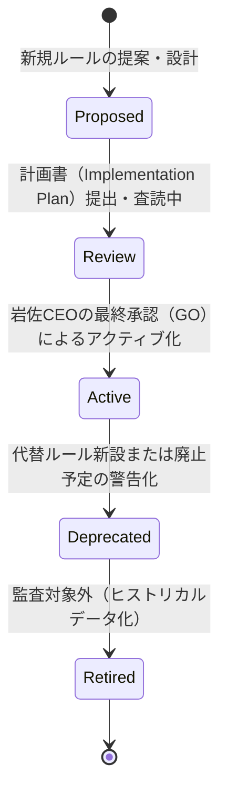

# AIOS Rule Registry Specification (監査ルールカタログ管理規範)

Version: 1.0.0
Phase: Phase 103 (Rule Registry Foundation)
Status: Active

---

## 1. 目的 (Purpose)
本仕様書は、AuditOS がコード品質、設計適合性、および開発プロセスの順守率を機械的に検証する際に使用する「監査ルール」を標準カタログ化し、一元管理する **Rule Registry** のアーキテクチャおよびメタデータスキーマを規定します。

---

## 2. ルールメタデータスキーマ (Rule Metadata Schema)
すべての監査ルールは、将来的に `rule_registry.json` へダイレクトにマッピング可能な以下のスキーマ定義を完全に保持して定義されなければなりません。

| 属性名 (Field) | 型 (Type) | 説明 (Description) |
|---|---|---|
| `Rule ID` | String | ルールの一意な識別コード。`カテゴリ-連番` の命名規則に従う。例: `CLI-001` |
| `Title` | String | ルールの簡潔で直感的な名称。 |
| `Category` | Enum | ルールが対象とする監査領域（`CLI`, `JSON`, `Specification`, `Documentation`, `Git Workflow`, `Development Process`, `Audit`）。 |
| `Severity` | Enum | 違反時の重大度。`Critical`（コミット/プッシュの強制遮断） / `Warning`（警告表示） / `Info`（ログ記録のみ）。 |
| `Status` | Enum | 状態（`Proposed` / `Review` / `Active` / `Deprecated` / `Retired`）。 |
| `Version` | String | ルールのセマンティックバージョン（例: `1.0.0`）。 |
| `Owner` | String | ルールの作成・保守担当部署（例: `Quality Control`）。 |
| `Created` | DateTime | ルール作成日時 (ISO-8601 形式)。 |
| `Updated` | DateTime | ルール最終更新日時 (ISO-8601 形式)。 |
| `References` | List[String] | 関連する仕様・URL・設計文書のリンク（例: `AGENTS.md` 等）。 |
| `Description` | String | ルールが検証する目的および詳細な確認項目。 |
| `Expected Result` | String | 監査合格時（正常系）の期待されるコードや振る舞いの状態。 |
| `Failure Example` | String | 監査違反時（異常系）のコードや構成の具体例。 |
| `Resolution Guidance` | String | 違反が検出された際に、開発AIや人間がどのように修正すべきかの具体的な手順・ガイド。 |

---

## 3. ルール・ライフサイクル (Rule Lifecycle)
各ルールは、追加から廃止に至るまで以下のライフサイクル状態を辿ります。

1. **Proposed (提案中)**: 新規ルールが計画され、検証パラメータが設計中の状態。
2. **Review (査読中)**: 計画書が提出され、承認を待っている状態。
3. **Active (有効)**: 監査エンジンによる実際の検証に対象として組み込まれている状態。
4. **Deprecated (非推奨)**: 将来廃止予定であり、Warning レベルに格下げされた状態。
5. **Retired (廃止済)**: 監査実行からは除外され、履歴アーカイブ化された状態。

---

## 4. 初期定義コア監査ルール (Predefined Core Rules)
本仕様に伴い、初期レジストリとして登録されるコアルールは以下の通りです。

### 4.1 CLI-001: CLI Command Integrity
* **Rule ID**: `CLI-001`
* **Title**: CLIコマンド完全性
* **Category**: `CLI`
* **Severity**: `Critical`
* **Status**: `Active`
* **Version**: `1.0.0`
* **Owner**: `Quality Control`
* **Created**: `2026-07-01T00:00:00Z`
* **Updated**: `2026-07-01T00:00:00Z`
* **References**: `tools/cie.py`
* **Description**: `tools/cie.py` 内の定数 `COMMANDS` リストに、引数パーサー (`subparsers.add_parser`) を通じて定義されたすべてのサブコマンドが完全かつ重複なく記述されているかを検証する。
* **Expected Result**: `COMMANDS` に登録されたリストと、定義されているサブコマンドが1対1で完全一致すること。
* **Failure Example**: 新規コマンド `runtime-execution-milestone-audit` をパーサーに追加したにも関わらず、定数 `COMMANDS` にその値が未登録である状態。
* **Resolution Guidance**: `tools/cie.py` の冒頭にある `COMMANDS` リストに、対象のコマンド名文字列を追加してください。

### 4.2 CLI-002: Platform Version Consistency
* **Rule ID**: `CLI-002`
* **Title**: プラットフォームバージョン整合性
* **Category**: `CLI`
* **Severity**: `Critical`
* **Status**: `Active`
* **Version**: `1.0.0`
* **Owner**: `Quality Control`
* **Created**: `2026-07-01T00:00:00Z`
* **Updated**: `2026-07-01T00:00:00Z`
* **References**: `tools/cie.py`
* **Description**: `tools/cie.py` 内の `PLATFORM_VERSION` が現在の開発フェーズと完全に一致しているかを検証する。
* **Expected Result**: `PLATFORM_VERSION` 定数の代入値が、現在の対象フェーズ（例: `"Phase103"`) と完全に一致すること。
* **Failure Example**: 現在のフェーズが Phase 103 であるにも関わらず、`PLATFORM_VERSION = "Phase99"` のまま放置されている状態。
* **Resolution Guidance**: `tools/cie.py` の `PLATFORM_VERSION` の値を正しいフェーズ番号に更新してください。

### 4.3 JSN-001: JSON Artifact Completeness
* **Rule ID**: `JSN-001`
* **Title**: JSON成果物一覧の実在性
* **Category**: `JSON`
* **Severity**: `Critical`
* **Status**: `Active`
* **Version**: `1.0.0`
* **Owner**: `Quality Control`
* **Created**: `2026-07-01T00:00:00Z`
* **Updated**: `2026-07-01T00:00:00Z`
* **References**: `tools/cie.py`
* **Description**: `JSON_ARTIFACTS` リストに定義されたすべてのJSON成果物ファイルが実在し、かつ文法エラーのない有効なJSONであることを検証する。
* **Expected Result**: 定義されたすべてのJSONファイルがパス上に存在し、`json.loads()` による読み込みに成功すること。
* **Failure Example**: `plugins/runtime_execution_milestone_audit.json` ファイルがまだ存在しない、または空ファイル（壊れたJSON）である状態。
* **Resolution Guidance**: 関連するCLIサブコマンドを実行して成果物JSONを正しく再生成するか、またはJSONの文法エラーを修正してください。

### 4.4 DOC-001: Handover Integrity
* **Rule ID**: `DOC-001`
* **Title**: ハンドオーバー整合性
* **Category**: `Documentation`
* **Severity**: `Warning`
* **Status**: `Active`
* **Version**: `1.0.0`
* **Owner**: `Quality Control`
* **Created**: `2026-07-01T00:00:00Z`
* **Updated**: `2026-07-01T00:00:00Z`
* **References**: `HANDOVER.md`
* **Description**: コミット対象に何らかのコード変更が含まれる場合、`HANDOVER.md` の completed 項目および現在地がインクリメントされているかを検証する。
* **Expected Result**: `HANDOVER.md` 内の `- **Completed**:` が現在の完了フェーズに更新されていること。
* **Failure Example**: Phase 103 の変更をコミットしようとしているにも関わらず、`HANDOVER.md` が `Completed: Phase102` のままである状態。
* **Resolution Guidance**: `HANDOVER.md` の位置情報セクション（📍 1. Current Location）を最新の開発ステータスに合わせて書き換えてください。

### 4.5 DEV-001: Explicit GO Policy Adherence
* **Rule ID**: `DEV-001`
* **Title**: 明示的GOポリシー順守
* **Category**: `Development Process`
* **Severity**: `Critical`
* **Status**: `Active`
* **Version**: `1.0.0`
* **Owner**: `Quality Control`
* **Created**: `2026-07-01T00:00:00Z`
* **Updated**: `2026-07-01T00:00:00Z`
* **References**: `docs/specifications/DevelopmentOS.md`
* **Description**: 計画フェーズ（Waiting for GO）において、岩佐CEOからの明示的な「GO」の受領なしで、仕様ファイルやランタイムに変更が加えられていないかを検証する。
* **Expected Result**: 計画ステージ中に変更差分が発生しないこと。
* **Failure Example**: 計画書のレビュー期間中（GO指示前）に、AIエージェントが自律的にソースコードの修正およびコミットを実行する状態。
* **Resolution Guidance**: 変更を直ちに `git reset --hard` で破棄し、岩佐CEOからの承認「GO」を待ってから作業を再開してください。

### 4.6 AUD-001: DTO No Context Leak Adherence
* **Rule ID**: `AUD-001`
* **Title**: コンテキスト漏洩防止検証
* **Category**: `Audit`
* **Severity**: `Critical`
* **Status**: `Active`
* **Version**: `1.0.0`
* **Owner**: `Quality Control`
* **Created**: `2026-07-01T00:00:00Z`
* **Updated**: `2026-07-01T00:00:00Z`
* **References**: `AGENTS.md`
* **Description**: 新規および既存の DTO、Manager、変数名、ソースコメントにおいて、不適切な `Context` という用語の混入がないかを検証する。
* **Expected Result**: 許可されたインポート指定部（`runtime_context` 等）を除き、すべてのソースシンボルに `Context` が含まれていないこと。
* **Failure Example**: `plugin_platform/plugin/runtime_execution_milestone_audit/milestone_audit.py` 内で `execution_context` という変数が宣言されている状態。
* **Resolution Guidance**: `Context` という表現を `Runtime` または `Definition` に置き換えてください。

---

## 5. 将来の拡張性 (Future Extension Points)
* **自動生成形式の確立 (tools/audit/rule_registry.json)**:
  本仕様に基づき、各ルールのメタデータを JSON 形式にエクスポートした `rule_registry.json` を将来のフェーズで構築し、監査エンジンが実行時にルールの重大度（Severity）や期待結果メッセージを動的にインポートできるように配線します。
