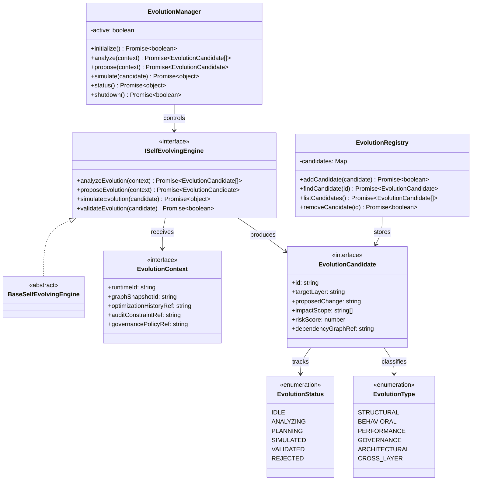

# Self-Evolving AIOS Core Specification (自己進化コア定義規範)

Version: 1.0.0
Phase: Phase 135 (Self-Evolving AIOS Core Foundation)
Status: Active

---

## 1. 目的 (Purpose)
本仕様書は、AIOS (Artificial Intelligence Operating System) における自己進化コア（Self-Evolving Core）の構造・型・契約定義（Blueprint）を規定します。
最適化エンジン（Autonomous Optimization Engine）の提案出力や自己修復結果に基づき、各レイヤー自体のインターフェースや接続構造を安全に変更するための「進化提案（Evolution Candidate）」および進化のシミュレーション・検証ルールを設計します。

---

## 2. 関係性ダイアグラム (Relationship Diagram)



---

## 3. 進化フローモデル (Evolution Flow Model)

```
Audit → Healing → Optimization → Evolution Planning → Evolution Proposal → (No Execution)
```

---

## 4. 進化ライフサイクル (Evolution Lifecycle)

```
[ IDLE ] ──> [ ANALYZING ] ──> [ PLANNING ] ──> [ SIMULATED ] ──> [ VALIDATED ]
                                                    │
                                                    └──> [ REJECTED ]
```

---

## 5. 統合モデル (Integration Model)

### 5.1 Graph Integration (グラフ統合)
自己進化の構造提案（Evolution Proposal）は、実稼働中の `ExecutionGraph` に直接干渉せず、グラフの `Snapshot` 上でシミュレーションされ検証されます。ランタイム変更は一切発生しません。

### 5.2 Optimization & Healing Integration
* **最適化依存**: 最適化エンジンの出力をトリガーとして進化の必要性を検知します。
* **自己修復依存**: 修復不可能な障害や、繰り返し発生する不整合パターンに対する構造的解決策として進化候補が生成されます。

### 5.3 Audit & Governance Constraint (監査とガバナンスの制約)
ガバナンスポリシーおよび監査レイヤーが、実行計画された進化パス（Evolution Plan）が安全基準を満たしているかを検証（`validateEvolution`）します。

---

## 6. 将来の統合ロードマップ (Future Roadmap)
* **Autonomous Meta-Governance (Phase 136 予定)**: 意思決定自体のポリシーをメタレベルで変更するエンジンの追加。
* **Self-Modifying Kernel (Phase 137 予定)**: シミュレーションされた進化計画に基づき、実カーネルを安全に書き換えるセルフモディファイアの定義。
