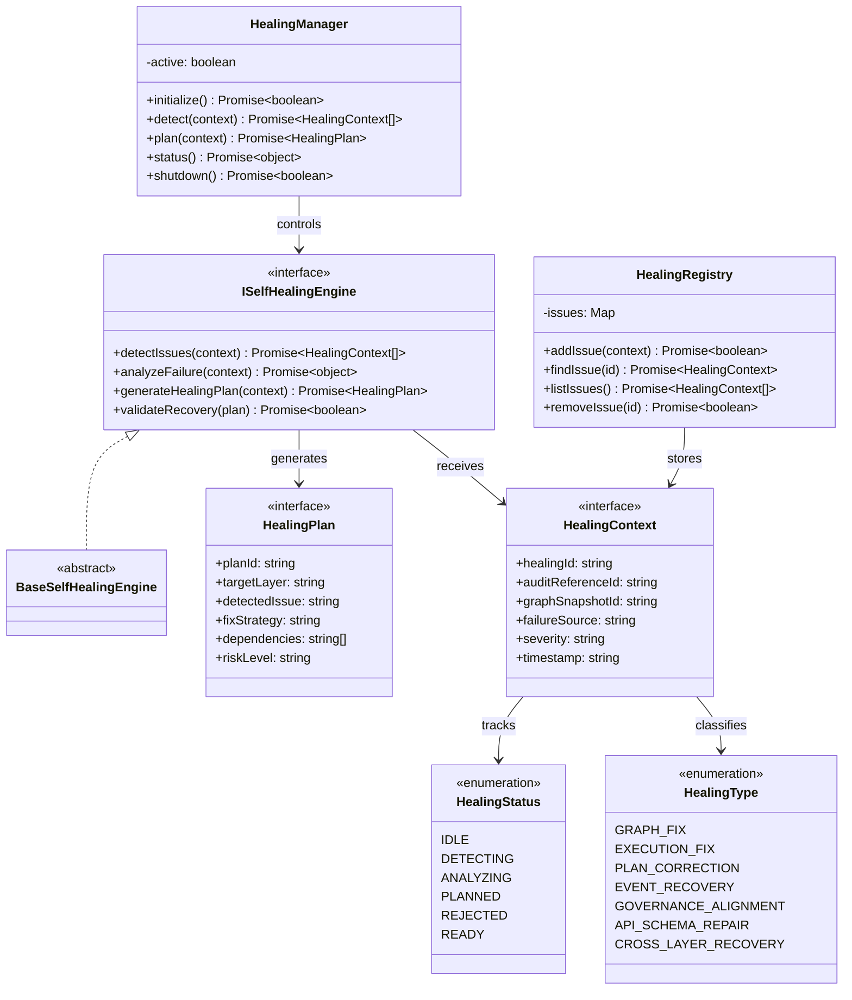

# Self-Healing Engine Specification (自己修復エンジン定義規範)

Version: 1.0.0
Phase: Phase 133 (Self-Healing Engine Foundation)
Status: Active

---

## 1. 目的 (Purpose)
本仕様書は、AIOS (Artificial Intelligence Operating System) における自己修復エンジン（Self-Healing Engine）の構造・型・契約定義（Blueprint）を規定します。
横断的監査レイヤー（Autonomous Audit Layer）が検出した不整合・違反・破損・異常状態に対し、システムを回復可能な正常状態へ遷移させるための「修復計画（Healing Plan / Fix Intent）」を策定・構造化する設計モデルを提供します。

---

## 2. 関係性ダイアグラム (Relationship Diagram)



---

## 3. 修復ライフサイクル (Healing Lifecycle)

```
[ IDLE ] ──> [ DETECTING ] ──> [ ANALYZING ] ──> [ PLANNED ] ──> [ READY ]
                                                    │
                                                    └──> [ REJECTED ]
```

---

## 4. 統合モデル (Integration Model)

### 4.1 Audit Layer Integration
`AuditResult` をトリガーとして `HealingContext` を生成し、監査によって検出された具体的な破損・異常状態を受け取ります。

### 4.2 Graph Layer Integration
不整合ノードまたは切断されたエッジなどのグラフ構造異常を修復対象（`RecoveryGraph`）として識別し、依存関係に悪影響を及ぼさない修復プランを策定します。

### 4.3 Execution Isolation (実行分離)
* **注意**: 本セルフヒーリングエンジンは、修復実行（実行処理）そのものは一切行いません。
* 策定された `HealingPlan` と `FixIntent`（意図情報）はオーケストレーターに提供される前段階の「修復意図定義」に留まります。

---

## 5. 将来の統合ロードマップ (Future Roadmap)
* **Autonomous Optimization Engine (Phase 134 予定)**: 修復データの統計情報から、AIOS全体の稼働効率を最適化するエンジンを定義。
* **Self-Evolving Core (Phase 135 予定)**: 自身のシステム規則やデータインターフェース自体を自律進化させるコア設計。
